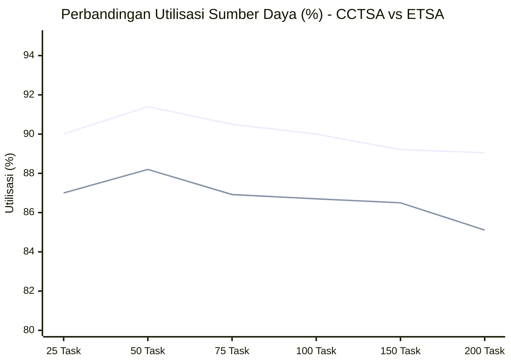

# Cost and Completion Time based Sufferage Algorithm for Task Scheduling in Cloud Environment

---

## 📌 1. Metadata Dokumen & Referensi Ilmiah

| Atribut | Informasi Detail |
| :--- | :--- |
| **Judul Lengkap** | *Cost and Completion Time based Sufferage Algorithm for Task Scheduling in Cloud Environment* |
| **Penulis** | H. Krishnaveni¹, Dr. D. I. George Amalarethinam², Dr. V. Sinthu Janita³ |
| **Afiliasi Penulis** | ¹'³ Department of Computer Science, Cauvery College for Women, Tiruchirappalli, India<br>² Department of Computer Science, Jamal Mohamed College, Tiruchirappalli, India |
| **Publikasi** | *International Journal of Research in Electronics and Computer Engineering (IJRECE)*, A Unit of I2OR |
| **Volume & Waktu Terbit**| Vol. 7, Issue 2, Halaman 2807–2812 (April–Juni 2019) |
| **ISSN** | 2393-9028 (Print) \| 2348-2281 (Online) |
| **Kata Kunci (Keywords)**| *Cloud computing, Task scheduling, Cost, Resource utilization, Makespan, Sufferage algorithm* |
| **Nama Algoritma Usulan** | **CCTSA** (*Cost and Completion Time based Sufferage Algorithm*) |
| **Algoritma Pembanding** | **ETSA** (*Execution Time based Sufferage Algorithm* - Krishnaveni & Sinthu Janita, Springer 2019) |
| **Relevansi Mata Kuliah** | **Strategi Optimasi Komputasi Awan (SOKA)** — Heuristik & Penjadwalan Berbasis Biaya/Ekonomi |

---

## 🧭 2. Ringkasan Eksekutif (Executive Summary untuk AI Agent)

Paper ini menyajikan inovasi algoritma penjadwalan tugas heuristik statis bernama **CCTSA (Cost and Completion Time based Sufferage Algorithm)** untuk lingkungan komputasi awan heterogen. 

### Intisari Masalah & Solusi (*Core Insights*):
1. **Kelemahan Sufferage Standar & Algoritma Tradisional**:
   - Algoritma konvensional (Min-Min, Max-Min, dan Sufferage standar) umumnya hanya berorientasi pada kecepatan waktu komputasi (*completion time* atau *makespan*).
   - Pada model bisnis cloud *pay-per-use*, penugasan tugas hanya ke mesin tercepat mengakibatkan **biaya finansial sewa yang sangat mahal (*over-priced*)** dan mesin berkecepatan rendah menjadi menganggur (*idle/underutilized*).
2. **Inovasi CCTSA (Dual Sufferage Metric)**:
   - CCTSA memodifikasi konsep *Sufferage* dengan memperhitungkan **dua nilai penderitaan sekaligus**:
     1. Nilai Sufferage Waktu (*Completion Time Sufferage Value - SVCT*): Selisih antara waktu selesai tercepat kedua dan tercepat pertama.
     2. Nilai Sufferage Biaya (*Cost Sufferage Value - SVC*): Selisih antara biaya maksimum pertama dan kedua.
   - Tugas dipilih dan dipetakan ke sumber daya yang menghasilkan perpaduan optimal antara waktu penyelesaian dan efisiensi biaya.
3. **Hasil Kunci Eksperimen (CloudSim 3.0)**:
   - **Biaya Eksekusi (Cost)**: CCTSA berhasil memangkas biaya finansial hingga **~17.3%** lebih murah dibanding ETSA (misal 21.30 Rs vs 25.76 Rs).
   - **Utilisasi Sumber Daya (Resource Utilization)**: CCTSA mencapai tingkat utilisasi lebih tinggi (**91.40%** vs **88.98%** pada ETSA).
   - **Trade-off Makespan**: *Makespan* CCTSA sedikit lebih panjang dibanding ETSA (4.172 detik vs 3.915 detik), yang merupakan *trade-off* wajar karena task tidak ditumpuk pada mesin berbiaya mahal.

---

## 💡 3. Latar Belakang & Motivasi Penelitian

### 3.1 Model Ekonomi Cloud Computing & Kebutuhan Penjadwalan
- Menurut NIST, komputasi awan menyediakan model akses jaringan *on-demand* ke sumber daya bersama yang dapat dikonfigurasi secara elastis dengan model pembayaran berbasis pemakaian (*pay-per-use / pay by the drink*).
- Dua penyedia layanan komputasi awan terkemuka (CSPs) seperti **Amazon EC2** (tipe instans *micro, small, medium, large, extra-large*) dan **Google Compute Engine** menerapkan skema tarif sewa per jam/menit yang berbeda berdasarkan kapasitas komputasi (MIPS, memori, bandwidth).
- **Dilema Pelanggan vs Penyedia (Trade-off Biaya vs Kecepatan)**:
  - Pelanggan (*Consumers*): Menginginkan layanan berkualitas tinggi dengan harga semurah mungkin sesuai anggaran.
  - Penyedia (*Providers*): Menginginkan pemanfaatan sumber daya (*resource utilization*) maksimal agar tidak ada server fisik yang terbuang percuma, sambil tetap mempertahankan harga yang kompetitif.
- Jika tugas bervolume besar namun sederhana dialokasikan ke mesin berspesifikasi tinggi, biaya komputasi menjadi terlalu mahal (*over-priced*). Sebaliknya, tugas kompleks pada mesin murah akan mengalami keterlambatan. Oleh karena itu, diperlukan **algoritma penjadwalan cerdas yang sadar-biaya (*cost-aware scheduling*)**.

---

## 📐 4. Formulasi Matematis Model CCTSA

CCTSA menggunakan input berupa dua matriks utama:
1. **Expected Time to Compute Matrix (ETC)**: Matriks ukuran $N \times M$ yang menyatakan perkiraan waktu komputasi task $i$ pada sumber daya $j$.
2. **Expected Cost to Compute Matrix (ECC)**: Matriks ukuran $N \times M$ yang menyatakan perkiraan biaya eksekusi task $i$ pada sumber daya $j$.

### 4.1 Rumus Perhitungan Biaya Penyelesaian (Completion Cost)
Biaya total penyelesaian task $i$ pada sumber daya $j$ dihitung menggunakan Persamaan (1):
$$\text{Completion Cost}_{ij} = \text{Cost}_{ij} + RC_j$$

*Keterangan:*
- $\text{Cost}_{ij}$: Biaya eksekusi task $i$ pada sumber daya $j$.
- $RC_j$: *Ready cost* dari sumber daya $j$ (biaya dasar kesiapan sumber daya).

### 4.2 Rumus Perhitungan Waktu Eksekusi (Execution Time)
Waktu eksekusi memperhitungkan durasi pemrosesan CPU dan durasi transfer data melalui jaringan, dirumuskan dalam Persamaan (2):
$$\text{Execution Time}_{ij} = \left( \frac{MI_i}{MIPS_j} \right) + \left( \frac{Mb_i}{Mbps_j} \right)$$

*Keterangan Unit:*
- **MI (*Million Instructions*)**: Ukuran panjang beban instruksi task $i$.
- **MIPS (*Million Instructions per Second*)**: Kecepatan pemrosesan unit CPU pada sumber daya $j$.
- **Mb (*Mega Bits*)**: Ukuran data input/output task $i$.
- **Mbps (*Mega Bits per Second*)**: Bandwidth transfer jaringan pada sumber daya $j$.

### 4.3 Rumus Perhitungan Biaya Eksekusi (Execution Cost)
Biaya sewa prosesor dihitung berdasarkan durasi siklus instruksi terhadap tarif prosesor, dirumuskan dalam Persamaan (3):
$$\text{Execution Cost}_{ij} = MI_i \times \text{Cost of Processor}_j \text{ (INR)}$$

---

## 🔄 5. Alur Logika & Pseudo-Code Algoritma CCTSA

### 5.1 Mekanisme Dual Sufferage Value
Untuk setiap task $T_i$ yang belum dijadwalkan:
1. **Sufferage Waktu ($SVCT_i$)**:
   - Cari waktu selesai minimum pertama ($FMICT_i$) dan waktu selesai minimum kedua ($SMICT_i$).
   $$SVCT_i = SMICT_i - FMICT_i$$
   *(Merepresentasikan "kerugian waktu" jika task $T_i$ tidak mendapatkan mesin tercepatnya).*
2. **Sufferage Biaya ($SVC_i$)**:
   - Cari nilai biaya maksimum pertama ($FMXC_i$) dan biaya maksimum kedua ($SMXC_i$).
   $$SVC_i = FMXC_i - SMXC_i$$
   *(Merepresentasikan selisih variasi tarif biaya komputasi antar-mesin).*
3. **Kriteria Seleksi Task Terpilih ($Ch\_Task$)**:
   Sebuah task $T_i$ dipilih untuk dijadwalkan jika memenuhi kondisi logika ganda:
   $$\text{Kondisi Seleksi: } (SVCT_i > FMICT_i) \quad \mathbf{AND} \quad (SVC_i < FMXC_i)$$
4. **Penugasan Sumber Daya**:
   Task terpilih ($Ch\_Task$) ditugaskan ke sumber daya $j$ yang memberikan waktu selesai dan biaya minimum yang sesuai, lalu daftar status sumber daya (*Ready Time, Completion Time, Completion Cost*) diperbarui.

---

### 5.2 Pseudo-Code Formal CCTSA

```text
ALGORITMA: Cost and Completion Time based Sufferage Algorithm (CCTSA)
INPUT    : Expected Cost to Compute (ECC) Matrix, Expected Time to Compute (ETC) Matrix
OUTPUT   : Jadwal Pemetaan Task ke Sumber Daya (Scheduled Tasks)

1.  While (Unassigned_Task_Count > 0)
2.      For each task Ti
3.          For each resource Rj
4.              Calculate completion time and completion cost
5.          End For
6.      End For
7.      
8.      For each task Ti
9.          Find First Minimum Completion Time (FMICT_i) and Second Minimum Completion Time (SMICT_i)
10.         Find First Maximum Cost Value (FMXC_i) and Second Maximum Cost Value (SMXC_i)
11.         SVCT_i = SMICT_i - FMICT_i   // Hitung nilai sufferage waktu penyelesaian
12.         SVC_i  = FMXC_i - SMXC_i    // Hitung nilai sufferage biaya
13.     End For
14.     
15.     Ch_Task = null                  // Inisialisasi task terpilih
16.     For i = Unassigned_Task_Count down to 0
17.         If (SVCT_i > FMICT_i && SVC_i < FMXC_i) then
18.             Ch_Task = Ti
19.             break;
20.         Else
21.             Ch_Task = Tn
22.         End If
23.     End For
24.     
25.     Assign Ch_Task (selected Task) ke resource Rj yang memberikan minimum completion time & cost,
26.     serta pastikan task tersebut cocok (suitable) untuk resource Rj.
27.     
28.     Remove Ch_Task dari daftar Unassigned_Task.
29.     Update Ready time dari resource Rj.
30.     Update completion time dan completion cost.
31.     Compute makespan dan total cost.
32. End While
33. Compute Resource Utilization.
```

---

## 🔬 6. Konfigurasi Parameter Eksperimen

Eksperimen disimulasikan menggunakan toolkit **CloudSim 3.0** dengan rincian parameter input berikut:

### Tabel I: Spesifikasi Sumber Daya (Resources / VMs)
| ID Sumber Daya | Processing Speed (MIPS) | Bandwidth Jaringan (Mbps) | Biaya Prosesor (Cost in INR / Rs) |
| :---: | :---: | :---: | :---: |
| **R1** | 50 MIPS | 100 Mbps | 0.03 INR |
| **R2** | 100 MIPS | 200 Mbps | 0.12 INR |
| **R3** | 200 MIPS | 250 Mbps | 0.24 INR |

### Tabel II: Spesifikasi 10 Sampel Tugas Pengujian (Tasks / Cloudlets)
| ID Task | Beban Instruksi (MI) | Ukuran Data Transfer (Mb) |
| :---: | :---: | :---: |
| **T1** | 206 MI | 44 Mb |
| **T2** | 50 MI | 95 Mb |
| **T3** | 128 MI | 64 Mb |
| **T4** | 69 MI | 30 Mb |
| **T5** | 118 MI | 59 Mb |
| **T6** | 112 MI | 47 Mb |
| **T7** | 21 MI | 39 Mb |
| **T8** | 200 MI | 61 Mb |
| **T9** | 90 MI | 23 Mb |
| **T10** | 45 MI | 23 Mb |

---

## 📊 7. Hasil Eksperimen, Perbandingan Kinerja, dan Analisis Data

Hasil pengujian algoritma usulan **CCTSA** dibandingkan secara langsung terhadap algoritma dasar **ETSA (Execution Time based Sufferage Algorithm)**:

### 7.1 Tabel III: Perbandingan Keseluruhan Metrik Evaluasi
| Algoritma Penjadwalan | Makespan (detik) | Biaya Total Eksekusi (Cost in Rs) | Utilisasi Sumber Daya (%) |
| :--- | :---: | :---: | :---: |
| **CCTSA (Proposed)** | **4.172** | **21.30** | **91.40%** |
| **ETSA (Existing)** | **3.915** | **25.76** | **88.98%** |
| *Evaluasi Kinerja* | *+6.5% lebih lama* | *🔥 17.3% LEBIH HEMAT* | *🔥 +2.42% LEBIH TINGGI* |

> **Analisis Penulis**: CCTSA secara meyakinkan mengungguli ETSA dalam aspek penghematan biaya finansial dan efisiensi utilisasi sumber daya. Sedikit kenaikan pada *makespan* disebabkan oleh tingginya heterogenitas task, di mana CCTSA sengaja tidak menumpuk seluruh pekerjaan ke resource tercepat yang berbiaya mahal.

---

### 7.2 Analisis Skalabilitas pada Berbagai Variasi Beban Kerja

Pengujian diperluas dengan menskalakan jumlah tugas dari **25 hingga 200 tasks** dan jumlah sumber daya dari **5 hingga 14 resources**:

#### Tabel IV: Evaluasi Makespan (Waktu Penyelesaian Total)
| Jumlah Task | Jumlah Resource | Makespan CCTSA Usulan (detik) | Makespan ETSA Eksisting (detik) | Selisih Makespan |
| :---: | :---: | :---: | :---: | :---: |
| **25** | 5 | 10.23 | 8.90 | +1.33 s |
| **50** | 7 | 27.51 | 22.40 | +5.11 s |
| **75** | 8 | 48.30 | 46.10 | +2.20 s |
| **100** | 10 | 74.50 | 67.90 | +6.60 s |
| **150** | 12 | 122.40 | 113.70 | +8.70 s |
| **200** | 14 | 153.80 | 137.80 | +16.00 s |

#### Tabel V: Evaluasi Biaya Eksekusi Total (Total Cost dalam Rs)
| Jumlah Task | Jumlah Resource | Biaya CCTSA Usulan (Rs) | Biaya ETSA Eksisting (Rs) | Penghematan Biaya Finansial |
| :---: | :---: | :---: | :---: | :---: |
| **25** | 5 | **30.1** | 33.3 | **Hemat 3.2 Rs (9.6%)** |
| **50** | 7 | **54.7** | 59.5 | **Hemat 4.8 Rs (8.1%)** |
| **75** | 8 | **82.5** | 93.9 | **Hemat 11.4 Rs (12.1%)** |
| **100** | 10 | **111.6** | 123.0 | **Hemat 11.4 Rs (9.3%)** |
| **150** | 12 | **143.4** | 162.8 | **Hemat 19.4 Rs (11.9%)** |
| **200** | 14 | **171.2** | 190.6 | **Hemat 19.4 Rs (10.2%)** |

#### Tabel VI: Evaluasi Tingkat Utilisasi Sumber Daya (Resource Utilization %)
| Jumlah Task | Jumlah Resource | Utilisasi CCTSA Usulan (%) | Utilisasi ETSA Eksisting (%) | Peningkatan Efisiensi |
| :---: | :---: | :---: | :---: | :---: |
| **25** | 5 | **90.01%** | 87.00% | **+3.01%** |
| **50** | 7 | **91.40%** | 88.20% | **+3.20%** |
| **75** | 8 | **90.50%** | 86.92% | **+3.58%** |
| **100** | 10 | **90.00%** | 86.70% | **+3.30%** |
| **150** | 12 | **89.21%** | 86.50% | **+2.71%** |
| **200** | 14 | **89.05%** | 85.11% | **+3.94%** |

---

## 📈 8. Visualisasi Grafik Komparasi Kinerja

Berikut adalah grafik visualisasi data yang diambil langsung dari paper dan file lampiran [`table_and_fig.png`](file:///home/reiziqzip/Documents/SOKA/Algoritma%20Heuristik/table_and_fig.png):

```mermaid
xychart-beta
    title "Perbandingan Biaya Total Eksekusi (Cost dalam Rs) - CCTSA vs ETSA"
    x-axis ["25 Task", "50 Task", "75 Task", "100 Task", "150 Task", "200 Task"]
    y-axis "Total Biaya (Rs)" 0 --> 200
    bar [30.1, 54.7, 82.5, 111.6, 143.4, 171.2]
    bar [33.3, 59.5, 93.9, 123.0, 162.8, 190.6]
```





---

## 💻 9. Analisis Lingkungan Implementasi (NetBeans & CloudSim)

Berdasarkan bukti tangkapan layar pada file lampiran [`Implementation_Window.png`](file:///home/reiziqzip/Documents/SOKA/Algoritma%20Heuristik/Implementation_Window.png), berikut adalah detail arsitektur kode program pengujian CCTSA:


### Rincian Proyek Perangkat Lunak:
- **IDE**: NetBeans IDE 7.0.1
- **Simulator**: CloudSim Toolkit 3.0 (`org.cloudbus.cloudsim.*`)
- **Nama Proyek**: `Cost CTSA Scheduling`
- **Struktur Package (`cost`)**:
  - `CostCTSA.java`: Kelas utama implementasi algoritma CCTSA (menggunakan `ListMultimap<Integer, TaskTime>` dari library Google Guava untuk pemetaan alokasi).
  - `ETSA.java`: Kelas implementasi algoritma pembanding berbasis waktu eksekusi murni.
  - `Sufferage.java`: Kelas implementasi Sufferage klasik.
  - `Pso.java` & `GA.java`: Algoritma metaheuristik pembanding tambahan dalam satu repositori.
  - `Details.java`, `TaskTime.java`, `ReadTask.java`, `ScheduleTask.java`: Kelas utilitas pembacaan data instruksi dan manajemen waktu.
- **Log Keluaran Eksekusi (*Console Output*)**:
  ```text
  ------------------------------------
  R_Id    MI    BW    Cost
  R1      50    100   0.03
  R2      100   200   0.12
  R3      200   250   0.24
  ------------------------------------
  Starting CloudSim
  Initializing...
  Data Center Created
  VM 1 is Created with 50 (mips) and 100 (bw)
  VM 2 is Created with 100 (mips) and 200 (bw)
  VM 3 is Created with 200 (mips) and 250 (bw)
  Readytime of machine [0.0, 0.0, 0.0]
  Remaining tasks: [0, 1, 2, 3, 4, 5, 6, 7, 8, 9]
  ```

---

## 🎯 10. Relevansi Strategis untuk Proyek SOKA Kelompok 4

Paper ini memberikan wawasan fundamental yang sangat aplikatif untuk tugas dan proyek kelompok:
1. **Bukti Hubungan Terbalik (*Inverse Relationship*)**: Waktu penyelesaian (*completion time*) dan biaya sewa (*cost*) berbanding terbalik. Jika hanya mengejar makespan cepat, biaya akan melonjak drastis. CCTSA membuktikan bahwa kompromi cerdas (*trade-off*) mampu menghemat biaya sebesar 17% dengan hanya sedikit mengorbankan makespan.
2. **Kesesuaian dengan Arsitektur Heterogen**: Konsep pemetaan CCTSA sangat relevan untuk arsitektur 3-lapis (Device-Fog-Cloud). Task-task yang tidak terburu-buru (*computation-intensive*) sebaiknya tidak dipaksakan ke VM termahal, melainkan dialokasikan ke VM berbiaya rendah/sedang agar utilisasi merata.
3. **Peluang Hibridisasi Masa Depan**: Sebagaimana disimpulkan oleh penulis pada bagian penutup paper, algoritma heuristik seperti CCTSA dapat dijadikan **tahap inisialisasi awal (*initial mapping*)** yang kemudian dioptimalkan lebih lanjut menggunakan algoritma metaheuristik (seperti **PSO Hibrida**) untuk mencapai konvergensi solusi multi-objektif global.

---

## 📚 11. Format Sitasi Standar (BibTeX)

```bibtex
@article{krishnaveni2019cost,
  title={Cost and Completion Time based Sufferage Algorithm for Task Scheduling in Cloud Environment},
  author={Krishnaveni, H. and George Amalarethinam, D. I. and Sinthu Janita, V.},
  journal={International Journal of Research in Electronics and Computer Engineering (IJRECE)},
  volume={7},
  number={2},
  pages={2807--2812},
  year={2019},
  issn={2393-9028},
  publisher={I2OR}
}
```
