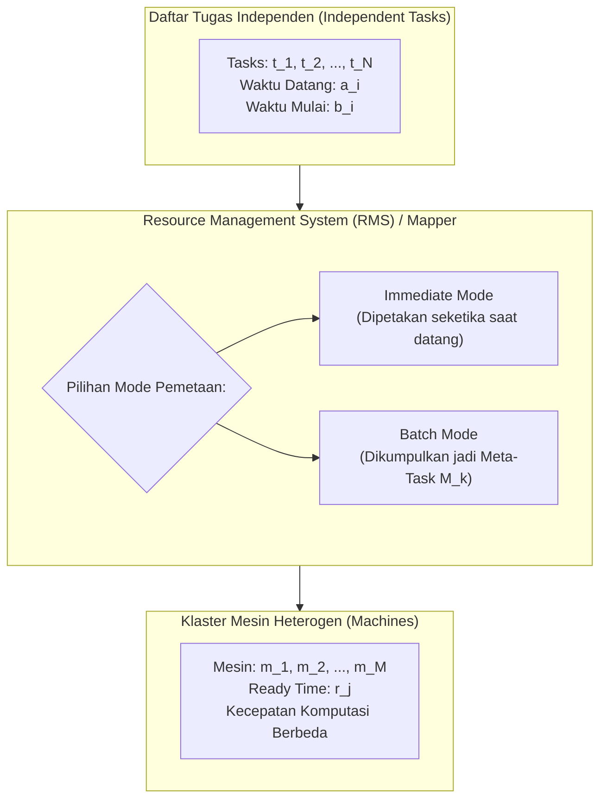
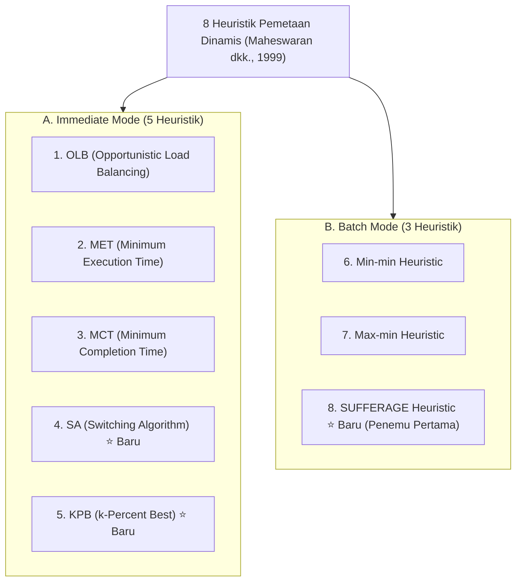
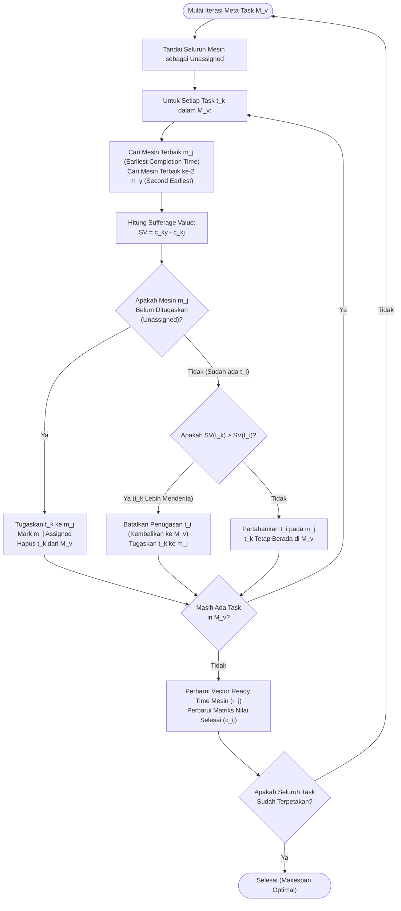
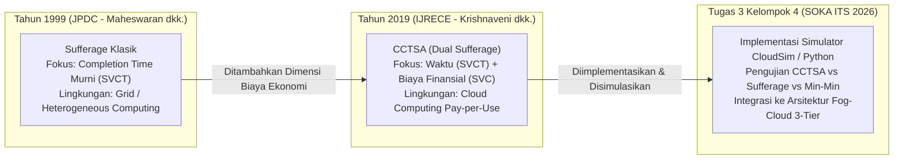

# Dynamic Mapping of a Class of Independent Tasks onto Heterogeneous Computing Systems

---

## 📌 1. Metadata Dokumen & Referensi Ilmiah

| Atribut | Informasi Detail |
| :--- | :--- |
| **Judul Lengkap** | *Dynamic Mapping of a Class of Independent Tasks onto Heterogeneous Computing Systems* |
| **Penulis** | Muthucumaru Maheswaran¹, Shoukat Ali², Howard Jay Siegel², Debra Hensgen³, Richard F. Freund⁴ |
| **Afiliasi Penulis** | ¹ Department of Computer Science, University of Manitoba, Winnipeg, MB, Canada<br>² School of Electrical and Computer Engineering, Purdue University, West Lafayette, IN, USA<br>³ Department of Computer Science, Naval Postgraduate School (NPS), Monterey, CA, USA<br>⁴ NOEMIX Inc., San Diego, CA, USA |
| **Publikasi** | *Journal of Parallel and Distributed Computing (JPDC)*, Academic Press (Elsevier) |
| **Edisi & Waktu Terbit**| Vol. 59, No. 2, Halaman 107–131, Juni 1999 (Special Issue on Software Support for Distributed Computing) |
| **DOI / URI** | [https://hdl.handle.net/10945/35384](https://hdl.handle.net/10945/35384) \| DOI: 10.1006/jpdc.1999.1581 |
| **Status Paper** | **Seminal / Foundational Paper (Paper Induk Penemu Algoritma SUFFERAGE)** |
| **Kata Kunci (Keywords)**| *Batch mode mapping, dynamic mapping, mapping heuristics, meta-task mapping, immediate mode mapping, heterogeneous computing, sufferage heuristic* |
| **Relevansi Tugas 3 SOKA** | **Landasan Teoretis Fundamental**: Paper yang pertama kali menciptakan algoritma **Sufferage** yang kemudian dimodifikasi menjadi **CCTSA** (Krishnaveni dkk., 2019) pada Tugas 3 Kelompok 4. |

---

## 🧭 2. Ringkasan Eksekutif (Executive Summary untuk AI Agent)

Paper klasik karya **Maheswaran, Siegel, dkk. (JPDC 1999)** ini merupakan salah satu karya paling berpengaruh dalam sejarah sistem terdistribusi dan komputasi awan. Paper ini secara komprehensif mengkaji, memformalkan, dan membandingkan **delapan algoritma heuristik pemetaan dinamis (*dynamic mapping heuristics*)** untuk tugas-tugas independen (*independent tasks*) pada lingkungan komputasi heterogen (*Heterogeneous Computing - HC*).

### Poin Kunci Esensial (*Core Scientific Takeaways*):
1. **Kelahiran Algoritma SUFFERAGE**:
   - Paper ini adalah literatur ilmiah pertama di dunia yang merumuskan konsep **Sufferage Heuristic**.
   - **Filosofi Sufferage**: Suatu tugas yang akan **"paling menderita" (*suffer most*)** dalam hal pembengkakan waktu penyelesaian jika tidak dialokasikan ke mesin terbaik pertamanya, harus diprioritaskan untuk mendapatkan mesin tersebut.
   - Nilai *Sufferage Value* ($SV_i$) dihitung dari selisih waktu selesai tercepat kedua dikurangi waktu selesai tercepat pertama:
     $$SV_i = \text{Second Earliest Completion Time} - \text{Earliest Completion Time}$$
2. **Taksonomi Mode Pemetaan Dinamis**:
   - **Immediate Mode (5 Algoritma)**: Setiap tugas langsung dipetakan ke mesin seketika saat tiba di antrean mapper (*OLB, MET, MCT, SA, KPB*).
   - **Batch Mode (3 Algoritma)**: Tugas-tugas dikumpulkan ke dalam himpunan *meta-task* dan dipetakan secara serentak pada titik waktu tertentu (*Min-min, Max-min, Sufferage*).
3. **Pilar Model Heterogenitas ETC (*Expected Time to Compute*)**:
   - Merumuskan model pembangkitan matriks ETC berdimensi tiga (16 variasi lingkungan uji): *Task Heterogeneity* (Tinggi/Rendah), *Machine Heterogeneity* (Tinggi/Rendah), dan *Consistency* (Konsisten, Tidak Konsisten, Semi-Konsisten).
4. **Temuan Kinerja Utama**:
   - Pada mode batch, **Sufferage secara konsisten mengungguli Min-min dan Max-min** dalam meminimalkan *makespan*, khususnya pada lingkungan dengan heterogenitas tinggi (*High-Task High-Machine Inconsistent Heterogeneity*).
   - Mode batch (Sufferage & Min-min) terbukti jauh lebih unggul dibanding mode immediate saat laju kedatangan tugas tinggi (*high arrival rates*) karena memiliki cakupan informasi global (*lookahead knowledge*) atas seluruh anggota *meta-task*.

---

## ⚙️ 3. Model Matematis & Formulasi Masalah (Problem Formulation)

Sistem komputasi heterogen (*Heterogeneous Computing Systems - HC*) terdiri atas sekumpulan mesin dengan kapabilitas arsitektur berbeda yang dihubungkan melalui jaringan interkoneksi.



### 3.1 Notasi & Definisi Variabel
- **Himpunan Mesin**: $\mathcal{M} = \{m_1, m_2, \dots, m_M\}$, di mana $M$ adalah total jumlah mesin dalam sistem.
- **Himpunan Tugas**: $\mathcal{K} = \{t_1, t_2, \dots, t_N\}$, kumpulan tugas independen yang harus dipetakan.
- **Waktu Kedatangan ($a_i$)**: Waktu kedatangan tugas $t_i$ ke sistem mapper.
- **Waktu Mulai Eksekusi ($b_i$)**: Waktu aktual saat tugas $t_i$ mulai dijalankan pada mesin yang ditugaskan ($b_i \ge a_i$).
- **Waktu Kesiapan Mesin ($r_j$)**: Waktu jam dinding (*ready time*) saat mesin $m_j$ menyelesaikan seluruh tugas yang telah dialokasikan sebelumnya dan siap menerima tugas baru.

### 3.2 Matriks Waktu Eksekusi (Expected Execution Time — $e_{ij}$)
$e_{ij}$ adalah waktu yang dibutuhkan mesin $m_j$ untuk mengeksekusi tugas $t_i$ dari awal sampai selesai dengan asumsi mesin $m_j$ dalam keadaan kosong (*idle*). Nilai ini mencakup waktu transfer kode dan data dari sumber ke mesin $m_j$.

### 3.3 Waktu Penyelesaian (Expected Completion Time — $c_{ij}$)
Waktu jam dinding saat mesin $m_j$ menyelesaikan eksekusi tugas $t_i$:
$$c_{ij} = b_i + e_{ij}$$
Jika mesin $m_j$ mengeksekusi tugas secara serial tanpa interupsi (*non-preemptive*), maka $b_i = \max(a_i, r_j)$. Pada kondisi antrean telah menunggu, $c_{ij}$ dapat dinyatakan sebagai:
$$c_{ij} = r_j + e_{ij}$$

### 3.4 Metrik Kinerja Utama: Makespan
Waktu tuntas dari seluruh jadwal tugas, merepresentasikan batas atas waktu kerja sistem (*throughput metric*):
$$\text{Makespan} = \max_{t_i \in \mathcal{K}} (c_i)$$
di mana $c_i$ adalah waktu selesai aktual tugas $t_i$ pada mesin yang terpilih.

---

## 🔄 4. Taksonomi 8 Heuristik Pemetaan Dinamis

Paper ini mengklasifikasikan heuristik ke dalam dua paradigma operasional:



---

### 4.1 Kategori A: Immediate Mode Heuristics (5 Algoritma)

Dalam *immediate mode*, setiap tugas dipetakan satu per satu seketika saat tiba di mapper dan pemetaan tidak dapat diubah lagi.

#### 1. Opportunistic Load Balancing (OLB)
- **Mekanisme**: Memetakan tugas yang baru tiba ke mesin mana pun yang berikutnya menjadi kosong/menganggur (*next idle machine*), tanpa memedulikan nilai waktu eksekusi $e_{ij}$.
- **Keunggulan**: Menjaga semua mesin tetap sibuk dan memaksimalkan *load balancing*.
- **Kelemahan**: Menghasilkan *makespan* yang sangat buruk karena sering menugaskan tugas lambat ke mesin yang tidak cocok.

#### 2. Minimum Execution Time (MET)
- **Mekanisme**: Memetakan tugas ke mesin yang menghasilkan waktu eksekusi terbaik murni ($m_j = \arg\min_j e_{ij}$), tanpa memedulikan waktu kesiapan mesin ($r_j$).
- **Keunggulan**: Memastikan tugas berjalan pada perangkat keras terbaiknya.
- **Kelemahan**: Menyebabkan ketimpangan beban (*severe load imbalance*); mesin tercepat mengalami penumpukan antrean masif sementara mesin lambat menganggur.

#### 3. Minimum Completion Time (MCT)
- **Mekanisme**: Memetakan tugas ke mesin yang menghasilkan waktu penyelesaian tercepat ($m_j = \arg\min_j c_{ij} = \arg\min_j (r_j + e_{ij})$).
- **Karakteristik**: Menggabungkan keuntungan OLB dan MET secara seimbang.

#### 4. Switching Algorithm (SA) — *Algoritma Usulan Baru*
- **Mekanisme**: Beralih dinamis antara algoritma MET dan MCT berdasarkan dua nilai ambang batas beban antrean ($r_{\text{low}}$ dan $r_{\text{high}}$):
  - Sistem mulai memetakan tugas menggunakan MET.
  - Jika utilisasi mesin melebihi batas atas $r_{\text{high}}$, algoritma beralih ke MCT untuk meratakan beban.
  - Jika beban kembali turun di bawah batas bawah $r_{\text{low}}$, algoritma kembali menggunakan MET.

#### 5. k-Percent Best (KPB) — *Algoritma Usulan Baru*
- **Mekanisme**: Memilih mesin hanya dari subset $(k \times M / 100)$ mesin terbaik yang memiliki waktu eksekusi $e_{ij}$ terendah untuk tugas tersebut. Dari subset mesin terbaik tersebut, tugas dialokasikan ke mesin dengan waktu selesai ($c_{ij}$) paling awal.
- **Karakteristik**: Mencegah tugas terkonsentrasi hanya pada 1 mesin tercepat saja, sekaligus menghindari penugasan ke mesin-mesin yang performanya terlalu buruk.

---

### 4.2 Kategori B: Batch Mode Heuristics (3 Algoritma)

Dalam *batch mode*, tugas-tugas yang datang tidak langsung dipetakan, melainkan dikumpulkan ke dalam himpunan tugas yang disebut **Meta-Task ($M_k$)**. Pemetaan dilakukan secara serentak pada titik waktu terjadwal (*mapping events*).

#### Strategi Penjadwalan Mapping Event:
1. **Regular Time Interval Strategy**: Pemetaan batch dieksekusi secara berkala setiap interval waktu tetap $\Delta t$ (misal setiap 10 detik).
2. **Fixed Count Strategy**: Pemetaan batch dieksekusi begitu jumlah tugas dalam antrean telah mencapai kuota tertentu $\kappa$.

---

#### 6. Min-min Heuristic
- **Konsep**: Menemukan mesin tercepat untuk setiap tugas dalam *meta-task*, kemudian memilih tugas yang memiliki **waktu selesai minimum paling kecil di antara semuanya**, dan mengalokasikannya terlebih dahulu.
- **Karakteristik**: Mengutamakan penyelesaian tugas-tugas berdurasi pendek terlebih dahulu.
- **Kelemahan**: Dapat menyebabkan tugas-tugas berdurasi panjang mengalami penundaan ekstrim (*starvation*).

#### 7. Max-min Heuristic
- **Konsep**: Serupa dengan Min-min, namun setelah menemukan mesin tercepat untuk setiap tugas, algoritma memilih tugas yang memiliki **waktu selesai maksimum** untuk dialokasikan terlebih dahulu.
- **Karakteristik**: Memberikan prioritas kepada tugas-tugas berdurasi panjang agar dapat berjalan paralel berdampingan dengan tugas-tugas pendek berikutnya.

---

### 🏆 4.3 Algoritma SUFFERAGE: Inovasi & Pseudo-Code Lengkap

Algoritma **Sufferage** diusulkan oleh Maheswaran dkk. untuk mengatasi keterbatasan Min-min dan Max-min.



#### Logika Pseudo-Code Asli Sufferage (Gambar 2 Paper Maheswaran 1999):
```text
(1)  for all tasks tk in meta-task Mv (in an arbitrary order)
(2)      for all machines mj (in a fixed arbitrary order)
(3)          ckj = ekj + rj
(4)  do until all tasks in Mv are mapped
(5)      mark all machines as unassigned
(6)      for each task tk in Mv
(7)          find machine mj that gives the earliest completion time
(8)          sufferage value = second earliest completion time - earliest completion time
(9)          if machine mj is unassigned then
(10)             assign tk to machine mj, delete tk from Mv, mark mj assigned
(11)         else
(12)             if sufferage value of task ti already assigned to mj is less than 
                 the sufferage value of task tk then
(13)                 unassign ti, add ti back to Mv,
                     assign tk to machine mj, delete tk from Mv
(14)     endfor
(15)     update the vector r based on the tasks that were assigned to the machines
(16)     update the c matrix
(17) enddo
```

---

## 🧪 5. Model Simulasi Heterogenitas ETC (16 Variasi Pengujian)

Untuk menguji performa heuristik secara adil dan menyeluruh, paper ini merancang kerangka kerja pembangkitan matriks **ETC (*Expected Time to Compute*)** berdimensi 3:

| Dimensi Heterogenitas | Kategori | Keterangan & Makna Sistem |
| :--- | :--- | :--- |
| **1. Heterogenitas Tugas (*Task Heterogeneity*)** | **High Task (Hi)**<br>**Low Task (Lo)** | • *High*: Beban kerja tugas bervariasi drastis dalam orde besaran.<br>• *Low*: Beban kerja tugas relatif homogen dan seimbang. |
| **2. Heterogenitas Mesin (*Machine Heterogeneity*)** | **High Machine (Hi)**<br>**Low Machine (Lo)** | • *High*: Spesifikasi komputasi prosesor antar-mesin sangat berbeda jauh.<br>• *Low*: Spesifikasi komputasi mesin mendekati setara. |
| **3. Konsistensi Matriks (*Consistency Structure*)** | **Consistent**<br>**Inconsistent**<br>**Semi-Consistent** | • **Consistent**: Jika mesin $m_x$ lebih cepat dari $m_y$ untuk tugas $t_a$, maka $m_x$ selalu lebih cepat untuk seluruh tugas lainnya.<br>• **Inconsistent**: Suatu mesin bisa lebih cepat untuk tugas tertentu tetapi jauh lebih lambat untuk tugas tipe lain.<br>• **Semi-Consistent**: Menggabungkan sub-klaster konsisten dan inkonsisten. |

Kombinasi paling menantang dan realistis untuk dunia komputasi modern adalah **Inconsistent HiHi** (*High Task, High Machine Heterogeneity*).

---

## 📊 6. Temuan Eksperimen & Hasil Analisis Komparatif

1. **Keunggulan Mutlak Sufferage dalam Batch Mode**:
   - Pada pengujian heterogenitas tinggi (*Inconsistent HiHi* dengan interval 10 detik), **algoritma Sufferage menghasilkan nilai *makespan* terendah**, mengungguli Min-min dan jauh mengungguli Max-min.
   - Max-min menghasilkan performa buruk karena penugasan tugas terpanjang di awal menyebabkan lonjakan *ready time* mesin yang terlalu drastis, sehingga tugas-tugas lain kehilangan kesempatan dieksekusi pada mesin terbaiknya.
2. **KPB Unggul pada Immediate Mode**:
   - Untuk mode pemetaan langsung (*immediate*), heuristik **KPB (*k-Percent Best*)** terbukti paling tangguh karena mencegah penumpukan tugas secara membabi-buta pada satu mesin unggulan.
3. **Batch Mode vs Immediate Mode**:
   - Saat laju kedatangan tugas tinggi (*high arrival rates*), **Batch Mode (Sufferage) jauh lebih superior dibanding Immediate Mode (MCT / KPB)**. Waktu tunggu yang singkat untuk mengumpulkan *meta-task* terbayar lunas oleh keputusan alokasi global yang jauh lebih cerdas.
   - Immediate mode hanya kompetitif jika laju kedatangan tugas sangat rendah (*low arrival rates*) di mana mesin-mesin komputasi berada dalam status menganggur.

---

## 🔗 7. Hubungan Historis & Relevansi Langsung dengan Tugas 3 SOKA

Bagaimana paper Maheswaran (1999) ini terhubung secara langsung dengan proyek dan tugas kelompok Anda?



### Sintesis Relevansi untuk Tugas 3:
1. **Validitas Algoritma Pembanding (*Baseline Engine*)**:
   Modul baseline `sufferage.py` dan `minmin.py` pada repositori simulator Tugas 3 Anda dibangun dengan mengacu langsung pada pseudo-code baris-per-baris dari paper Maheswaran ini (Figure 1 dan Figure 2).
2. **Justifikasi Nilai Akademis di Hadapan Dosen Pengampu**:
   Di dalam slide presentasi dan laporan Tugas 3, Kelompok 4 dapat memaparkan bahwa inovasi **CCTSA** bukan sekadar algoritma yang muncul tiba-tiba, melainkan **evolusi ilmiah selama 20 tahun** (1999 $\rightarrow$ 2019) dari heuristik Sufferage Maheswaran yang diadaptasi untuk menjawab tantangan ekonomi model bisnis *pay-per-use* komputasi awan.

---

## 📚 8. Format Sitasi Standar (BibTeX)

```bibtex
@article{maheswaran1999dynamic,
  title={Dynamic mapping of a class of independent tasks onto heterogeneous computing systems},
  author={Maheswaran, Muthucumaru and Ali, Shoukat and Siegel, Howard Jay and Hensgen, Debra and Freund, Richard F.},
  journal={Journal of Parallel and Distributed Computing},
  volume={59},
  number={2},
  pages={107--131},
  year={1999},
  publisher={Academic Press},
  doi={10.1006/jpdc.1999.1581}
}
```
