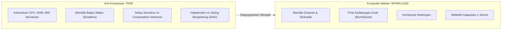
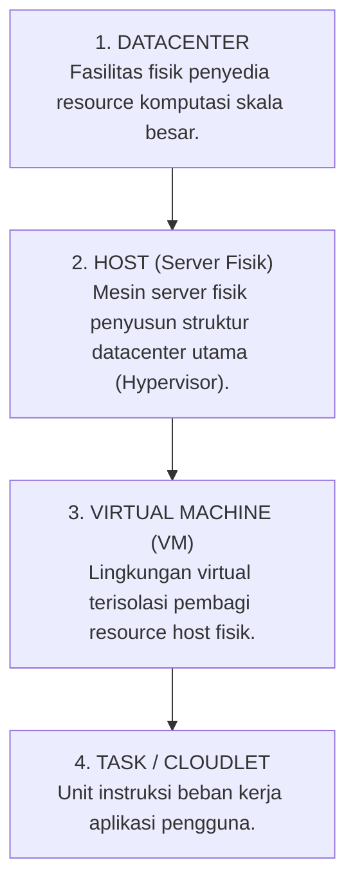
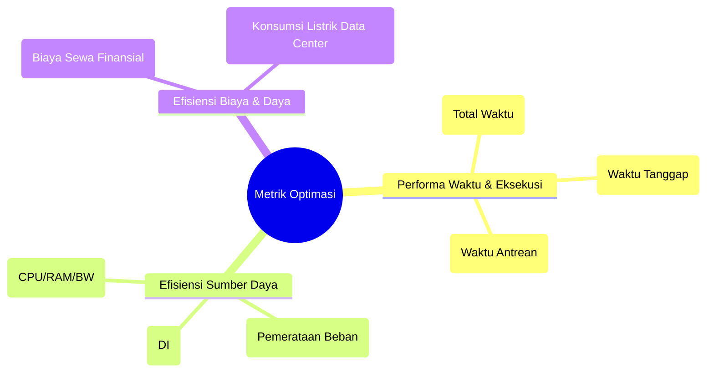

# Tugas 2A: Cloud Task Scheduling — Desain Awal & Karakteristik Sistem

---

## 📌 1. Metadata Dokumen & Identitas Tim

| Atribut | Informasi Detail |
| :--- | :--- |
| **Mata Kuliah** | **Strategi Optimasi Komputasi Awan (SOKA)** — Kelas C |
| **Dosen Pengampu** | **Dr. Ir. Henning Titi Ciptaningtyas, S.Kom., M.Kom.** |
| **Institusi** | Institut Teknologi Sepuluh Nopember (ITS), Surabaya — 2026 |
| **Judul Presentasi** | Tugas 2A (SOKA Week 3): *Cloud Task Scheduling: Karakteristik, Fungsi Objektif, dan Draft Desain Awal Project* |
| **Format Asli** | Slide Presentasi Canva (21 Slide) — Penulis: Ahmad Wildan Fawwaz |
| **Paper Rujukan Utama** | Aryan Rahimikhanghah dkk., *Resource Scheduling Methods in Cloud and Fog Computing Environments*, Cluster Computing (Springer 2022) |
| **Anggota Kelompok 4** | 1. **I Dewa Made Satya Raditya** (NRP: 5027231051)<br>2. **Ahmad Wildan Fawwaz** (NRP: 5027241001)<br>3. **Muhammad Rakha Hananditya Rauf** (NRP: 5027241015)<br>4. **Theodorus Aaron Ugraha** (NRP: 5027241056)<br>5. **M. Hikari Reiziq Rakhmadinta** (NRP: 5027241079) |

---

## 🧭 2. Ringkasan Eksekutif (Executive Summary untuk AI Agent)

Dokumen ini merepresentasikan **slide presentasi materi evaluasi Minggu 3 (Tugas 2A)** dari Kelompok 4. Dokumen ini merangkum:
1. **Pondasi Konseptual**: Membedah definisi formal dan karakteristik dari *Task*, *Workload*, serta 4 komponen infrastruktur komputasi awan (*Datacenter, Host, Virtual Machine, Cloudlet*).
2. **Dinamika Sumber Daya**: Analisis komparatif antara infrastruktur komputasi awan **Homogen** vs **Heterogen**.
3. **Fungsi Objektif & Optimasi Multi-Kriteria**: Perbedaan *Single-Objective* vs *Multi-Objective Optimization*, prinsip *trade-off*, dan konsep solusi **Pareto-Optimal**.
4. **Parameter Kuantitatif Draft Desain Proyek**: Memuat angka konfigurasi riil simulasi (*2 Datacenter, 20 Host, 1.000 VM alokasi, 1.000 Cloudlet*).
5. **Rencana Pengujian Algoritma**: Menguji performa **Greedy-PSO** terhadap **Round Robin (RR)** dan model energi **GRANITE**.

---

## 🧩 3. Karakteristik Task dan Workload



### A. Karakteristik Task
Task merupakan satu unit pekerjaan diskret yang dijalankan di cloud (misalnya satu proses komputasi analitik atau satu permintaan layanan mikro):
- **Variasi Kebutuhan Sumber Daya**: Setiap task memerlukan spesifikasi CPU (MIPS), alokasi memori RAM, dan kapasitas bandwidth jaringan yang berbeda-beda.
- **Tenggat Waktu (*Deadline*)**: Memiliki batas waktu penyelesaian yang wajib dipatuhi sesuai Service Level Agreement (SLA).
- **Sensitivitas Keterlambatan**:
  - *Delay-Sensitive*: Data sensor IoT atau sistem interaktif yang tidak boleh mengalami latensi.
  - *Delay-Tolerant*: Pemrosesan data batch yang dapat ditunda selama kapasitas komputasi padat.
- **Intensitas Komputasi**: Rentang beban dari tugas ringan (*lightweight*) hingga tugas berat intensif (*computation-intensive*).
- **Relasi Antar-Task**: Dapat berdiri sendiri (*independent tasks*) atau memiliki dependensi struktural (*dependent tasks* berbasis graf DAG).

### B. Karakteristik Workload
Workload adalah agregasi kumpulan task beserta volume dan pola kedatangannya dalam kurun waktu tertentu:
- **Dinamis Sepanjang Waktu**: Volume permintaan berfluktuasi secara kontinyu mengikuti aktivitas pengguna.
- **Pola Kedatangan Sulit Diprediksi**: Mengalami kondisi jam sibuk (*peak hours / burst*) dan jam lengang (*idle periods*).
- **Komposisi Heterogen**: Campuran aneka ragam task dengan karakteristik yang saling bertolak belakang.
- **Kebutuhan Distribusi**: Total beban kerja melampaui kapasitas satu server fisik tunggal, sehingga mutlak memerlukan pembagian (*dispatching*) ke klaster Mesin Virtual (VM).

---

## 🏛️ 4. Komponen Infrastruktur Fisik ke Virtual

Hierarki sistem komputasi awan dimodelkan ke dalam 4 entitas utama:



1. **Datacenter**: Infrastruktur fisik berskala besar yang menaungi fasilitas daya, pendingin (*CRAC*), rak server, dan perangkat jaringan inti.
2. **Host**: Mesin komputasi fisik (*bare-metal server*) yang menjalankan hypervisor untuk mengelola dan mengalokasikan sumber daya perangkat keras.
3. **Virtual Machine (VM)**: Lingkungan komputasi tervirtualisasi yang menyediakan unit eksekusi terisolasi (vCPU, vRAM, vDisk).
4. **Task / Cloudlet**: Representasi paket instruksi kerja komputasi aplikasi yang dieksekusi di dalam VM.

---

## ⚖️ 5. Sumber Daya: Homogen vs Heterogen

| Aspek Komparasi | Sumber Daya Homogen | Sumber Daya Heterogen |
| :--- | :--- | :--- |
| **Definisi Spesifikasi** | Seluruh node/server memiliki spesifikasi perangkat keras yang identik atau setara (CPU, RAM, Bandwidth sama). | Node/server memiliki kemampuan perangkat keras yang bervariasi (kecepatan CPU MIPS, kapasitas memori, dan arsitektur berbeda). |
| **Manajemen Beban** | Sangat mudah diprediksi karena waktu penyelesaian suatu instruksi pada setiap server relatif seragam. | Sangat menantang; task yang sama akan menghasilkan durasi eksekusi dan konsumsi energi yang berbeda drastis antar-node. |
| **Algoritma Penjadwalan** | Cukup menggunakan algoritma konvensional atau statis (seperti Round Robin standar atau FCFS). | Memerlukan algoritma cerdas/metaheuristik (seperti PSO, GA, atau Greedy adaptif) untuk memetakan beban secara proporsional. |
| **Fokus Efisiensi Energi** | Standar; penurunan daya bergantung pada pemadaman server secara seragam. | Sangat krusial; algoritma harus mampu memprediksi dan memilih server yang paling hemat daya (*Most-Efficient-Server-First*). |
| **Penerapan di Dunia Nyata** | Terbatas pada sub-klaster tradisional atau pusat data khusus berskala terbatas. | Merupakan bawaan alami dari ekosistem modern yang menggabungkan perangkat IoT, Edge, Fog, dan Cloud. |

---

## 🎯 6. Konsep Fungsi Objektif & Optimasi Multi-Kriteria

### A. Definisi Fungsi Objektif
Fungsi objektif adalah fungsi matematis yang menentukan arah dan tujuan akhir dari proses penjadwalan. Fungsi ini memberikan nilai numerik kuantitatif (*fitness value*) terhadap suatu jadwal kandidat agar algoritma dapat membandingkan dan memilih solusi yang paling optimal.

### B. Empat Tujuan Utama Cloud Task Scheduling:
1. **Memperkecil Makespan**: Meminimalkan waktu yang dibutuhkan sampai seluruh task selesai dieksekusi.
2. **Mengurangi Biaya (Execution Cost)**: Menekan pengeluaran finansial sewa sumber daya infrastruktur cloud.
3. **Menghemat Konsumsi Energi**: Mengurangi pemakaian daya listrik di data center selama pemrosesan.
4. **Meningkatkan Efisiensi Sumber Daya**: Memaksimalkan utilisasi CPU/RAM dan meratakan beban (*load balancing*).

### C. Single-Objective vs Multi-Objective Optimization
- **Single-Objective Optimization**: Hanya memprioritaskan satu tujuan tunggal (misalnya hanya mengejar *makespan* terpendek). Akibatnya, solusi sering kali mengorbankan parameter penting lain (menyebabkan pemborosan daya dan biaya sewa yang membengkak).
- **Multi-Objective Optimization (Lebih Diprioritaskan)**: Mempertimbangkan dua atau lebih fungsi objektif secara simultan karena tujuan-tujuan tersebut saling bertentangan (*conflicting trade-offs*).

```
Trade-off Fundamental:
Performa Lebih Cepat (Makespan Turun) ⟷ Peningkatan Konsumsi Daya Listrik & Biaya Finansial
```

- **Solusi Pareto-Optimal**: Dalam multi-objektif, tidak ada satu solusi tunggal mutlak yang sempurna di semua dimensi. Oleh karena itu, diterapkan konsep **Pareto-Optimal**, yaitu himpunan solusi di mana perbaikan performa pada satu fungsi objektif tidak dapat dilakukan tanpa menurunkan kualitas fungsi objektif lainnya (*Pareto Front*).

---

## 📊 7. Matriks Metrik Optimasi Komputasi Awan

Slide mengelompokkan metrik pengujian ke dalam 3 dimensi utama:



---

## ⚠️ 8. Batasan Sistem & Dampak Operasional (*Constraints & Impacts*)

| Batasan Utama Cloud Scheduling | Dampak Operasional Jika Penjadwalan Buruk |
| :--- | :--- |
| **Kompleksitas Pemetaan Tugas** | Penjadwalan yang buruk menyebabkan ketimpangan beban kerja, memicu degradasi performa keseluruhan. |
| **Lonjakan Beban Tiba-Tiba (*Burst Requests*)** | Server dapat mengalami *under-utilization* (sumber daya terbuang percuma) atau *over-utilization* (server macet dan *crash*). |
| **Trade-off Kecepatan vs Konsumsi Energi** | Data center mengalami *thermal throttling*, panas berlebih, dan membengkaknya tagihan listrik fasilitas pendingin. |
| **Skalabilitas Infrastruktur** | Kesalahan estimasi alokasi (*over-provisioning* atau *under-provisioning*) meningkatkan latensi dan biaya operasional. |
| **Respon terhadap Kegagalan Node/Jaringan** | Waktu respons yang lambat akibat sistem kelebihan beban memicu pelanggaran perjanjian layanan (**SLA Violations**). |

---

## 📐 9. Spesifikasi Kuantitatif Draft Desain Proyek (Simulasi Kelompok 4)

Berikut adalah parameter konfigurasi numerik yang dirancang oleh Kelompok 4 untuk eksperimen simulasi:

### A. Infrastruktur Fisik Data Center & Host
- **Jumlah Datacenter**: 2 lokasi terdistribusi geografis.
- **Jumlah Host Fisik**: 10 server fisik per lokasi (**Total = 20 Host fisik**).
- **Prosesor Host**: 16 Core komputasi per server fisik.
- **Kapasitas Memori (RAM)**: 64 GB per server fisik (**Total = 1.280 GB RAM**).
- **Kapasitas Bandwidth**: 10 Gbps antar jaringan data center.

### B. Alokasi Virtual Machine (VM)
- **Rasio VM per Host**: 50 VM per Host fisik (**Total = 1.000 VM** terdistribusi).
- **Kapasitas Pemrosesan vCPU**: 4 vCPU per VM.
- **Memori RAM Virtual**: 8 GB RAM per VM.
*(Catatan Arsitektur: Konfigurasi ini mendemonstrasikan penerapan teknik **Resource Over-commitment** di tingkat vCPU/vRAM untuk memaksimalkan densitas komputasi).*

### C. Karakteristik Cloudlet (Workload Tugas)
- **Total Volume Task**: 1.000 unit cloudlet.
- **Panjang Instruksi Komputasi**: 50.000 MI (*Million Instructions*) per task.
- **Ukuran File Masukan (Input Size)**: 300 MB file data per task.
- **Ukuran File Luaran (Output Size)**: 100 MB file hasil pemrosesan per task.

---

## 🔬 10. Metrik Pengujian & Algoritma Pembanding Proyek

### A. Algoritma yang Dibandingkan dalam Pengujian
1. **Greedy-PSO (Algoritma Usulan)**:
   - Tahap 1: Algoritma Greedy melakukan pemetaan awal (*initial mapping*) task ke VM tercepat.
   - Tahap 2: *Particle Swarm Optimization* (PSO) mengeksplorasi ruang pencarian untuk memperbaiki pemetaan awal dan menghindari lokal optimum.
2. **Round Robin (Baseline Pembanding)**: Algoritma statis konvensional yang membagi task secara bergiliran tanpa memandang bobot task atau kapasitas VM.
3. **Model GRANITE**: Model alokasi berbasis konsumsi energi linier dan penonaktifan server *idle*.

### B. Formula Matematis Metrik yang Diuji

#### 1. Makespan & Konsistensi
Dihitung dari saat pemrosesan tugas pertama dimulai hingga tugas terakhir tuntas:
$$\text{Makespan} = \max_{j} \left( T_j^{\text{finish}} \right)$$
Pengujian diulang beberapa kali untuk menghasilkan **Nilai Rata-rata (*Average*)** dan **Standar Deviasi (*Standard Deviation*)** guna mengukur kecepatan dan stabilitas algoritma.

#### 2. Biaya Eksekusi (Execution Cost)
$$\text{Cost} = \sum_{j=1}^{m} \left( \text{Durasi Tagihan VM}_j \times \text{Tarif Sewa}_j \right)$$
Penjadwalan berbiaya rendah dicari secara iteratif hingga batas kompromi waktu penyelesaian tercapai.

#### 3. Konsumsi Energi (Model Linier)
Menggunakan model daya linier proporsional terhadap utilisasi CPU:
$$P(u) = P_{\text{idle}} + (P_{\text{max}} - P_{\text{idle}}) \times u$$
Penghematan energi diukur saat mekanisme *shutdown* atau *sleep mode* pada host fisik diaktifkan.

#### 4. Pemerataan Beban (Degree of Imbalance — DI)
Mengukur disparitas beban kerja antar-VM berdasarkan total waktu eksekusi:
$$DI = \frac{T_{\max} - T_{\min}}{T_{\text{avg}}}$$
- $T_{\max}$: Total waktu eksekusi tertinggi di antara seluruh VM.
- $T_{\min}$: Total waktu eksekusi terendah di antara seluruh VM.
- $T_{\text{avg}}$: Rata-rata waktu eksekusi seluruh VM.
*(Semakin kecil nilai $DI$, semakin merata pembagian beban kerja)*.

#### 5. Waktu Antrean (Waiting Time)
$$\text{Waiting Time} = T_{\text{mulai eksekusi}} - T_{\text{waktu kedatangan task}}$$

#### 6. Batasan SLA dan Anggaran (Budget)
- **Kapasitas Resource**: Memvalidasi kesesuaian kebutuhan task terhadap kapasitas host dan VM sebelum dialokasikan.
- **Deadline & SLA**: Membandingkan waktu tuntas aktual setiap task terhadap batas waktu (*deadline*). Task yang melewati batas waktu dicatat sebagai kegagalan SLA.
- **Batas Anggaran (*Budget Constraint*)**: Memastikan alokasi VM tidak melampaui plafon biaya yang telah ditetapkan pengguna.
