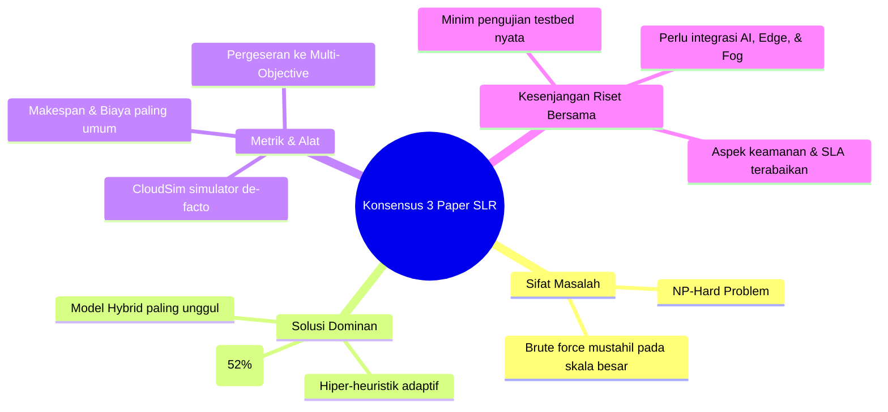
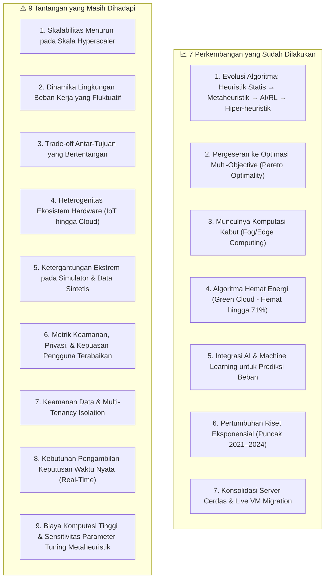

# Tugas 1: Cloud Task Scheduling dengan Systematic Literature Review

---

## 📌 1. Metadata Dokumen & Identitas Tim

| Atribut | Informasi Detail |
| :--- | :--- |
| **Mata Kuliah** | **Strategi Optimasi Komputasi Awan (SOKA)** — Kelas C |
| **Dosen Pengampu** | **Dr. Ir. Henning Titi Ciptaningtyas, S.Kom., M.Kom.** |
| **Institusi** | Institut Teknologi Sepuluh Nopember (ITS), Surabaya — 2026 |
| **Judul Tugas** | Tugas Minggu 1: *Cloud Task Scheduling dengan Systematic Literature Review (SLR)* |
| **Format Asli Dokumen** | Dokumen Laporan A4 (10 Halaman) |
| **Anggota Kelompok 4** | 1. **I Dewa Made Satya Raditya** (NRP: 5027231051) 2. **Ahmad Wildan Fawwaz** (NRP: 5027241001) 3. **Muhammad Rakha Hananditya Rauf** (NRP: 5027241015) 4. **Theodorus Aaron Ugraha** (NRP: 5027241056) 5. **M. Hikari Reiziq Rakhmadinta** (NRP: 5027241079) |

---

## 📚 2. Kompilasi Tiga Artikel Ilmiah Utama (Tinjauan SLR)

Kelompok 4 menganalisis tiga artikel *Systematic Literature Review* (SLR) bereputasi internasional di bidang penjadwalan tugas dan alokasi sumber daya komputasi awan:

| No | Judul Artikel Ilmiah | Penulis | Penerbit / Jurnal | Tautan / DOI |
| :-: | :--- | :--- | :--- | :--- |
| **1** | *Multi-Objective Optimization Techniques in Cloud Task Scheduling: A Systematic Literature Review* | Olanrewaju L. Abraham, Md Asri Bin Ngadi, Johan Bin Mohamad Sharif, Mohd Kufaisal Mohd Sidik | **IEEE Access**, 2025 | [IEEE Xplore: 10843235](https://ieeexplore.ieee.org/document/10843235) |
| **2** | *Resource scheduling methods in cloud and fog computing environments: a systematic literature review* | Aryan Rahimikhanghah, Melika Tajkey, Bahareh Rezazadeh, Amir Masoud Rahmani | **Springer** (*Cluster Computing*), 2022 | [Springer: 10.1007/s10586-021-03467-1](https://link.springer.com/article/10.1007/s10586-021-03467-1) |
| **3** | *Resource allocation strategies and task scheduling algorithms for cloud computing: A systematic literature review* | Waleed Kareem Awad, Khairul Akram Zainol Ariffin, Mohd Zakree Ahmad Nazri, Esam Taha Yassen | **De Gruyter** (*Journal of Intelligent Systems*), 2025 | [De Gruyter: 10.1515/jisys-2024-0441](https://www.degruyterbrill.com/document/doi/10.1515/jisys-2024-0441/) |

---

## 🔍 3. Rangkuman Mendalam Tiga Artikel Ilmiah

### 3.1 Artikel 1: Multi-Objective Optimization Techniques in Cloud Task Scheduling (Abraham dkk., 2025)
- **Cakupan & Metodologi**: Melakukan SLR teknik optimasi multi-objektif (*Multi-Objective Optimization* / MOO) untuk penjadwalan tugas cloud rentang tahun **2010 hingga Oktober 2024**. Dari 15.843 artikel awal pada 6 database besar (Springer 54%, IEEE 22%, Elsevier 17%, Wiley, MDPI, Nature), proses seleksi PRISMA menyaring **59 artikel primer**.
- **Klasifikasi Teknik**: Dibagi ke dalam 4 paradigma:
  1. *Heuristic* (Min-Min, Max-Min, Shortest Job First, Round Robin).
  2. *Meta-heuristic* (Evolusioner, *Swarm Intelligence*, dan *Nature-Inspired*).
  3. *Hybrid* (Menggabungkan kekuatan beberapa algoritma sekaligus).
  4. *Learning-Based* (Machine Learning / Deep Reinforcement Learning).
- **Temuan Kunci**: Pendekatan metaheuristik paling banyak diterapkan, dipimpin oleh **Artificial Bee Colony (ABC)**, **Grey Wolf Optimization (GWO)**, **Genetic Algorithm (GA)**, dan **Cuckoo Search**. Pendekatan hibrida terbukti paling unggul dalam menyeimbangkan eksplorasi global dan eksploitasi lokal.
- **Tujuan & Evaluasi**: Tujuan penjadwalan terpopuler adalah *makespan*, biaya eksekusi (*cost*), *resource utilization*, dan konsumsi energi. **CloudSim** menjadi simulator paling dominan. Dataset tolok ukur meliputi Google Cloud Jobs (GoCJ), NASA Workload, HPC2N, dan dataset sintetis. Evaluasi memanfaatkan metrik statistik parametrik/non-parametrik serta metrik sebaran Pareto (*spacing, span, hypervolume*).
- **Keterbatasan**: Masih didominasi lingkungan simulasi sintetis dan belum banyak membahas implementasi cloud privat, hybrid cloud, serta ekosistem komputasi edge/fog.

---

### 3.2 Artikel 2: Resource Scheduling Methods in Cloud and Fog Computing Environments (Rahimikhanghah dkk., 2022)
- **Cakupan & Metodologi**: Menelaah metode penjadwalan sumber daya pada lingkungan sinergis *Cloud-Fog* rentang **2015 hingga 2021** pada 6 database (IEEE, Elsevier, Springer, Wiley, ACM, Taylor & Francis). Dari 81 studi, terpilih **71 studi primer**.
- **Motivasi Inti**: Komputasi awan tradisional lambat merespons permintaan perangkat IoT berlatensi rendah. Komputasi *fog* hadir sebagai pelengkap untuk mendekatkan komputasi ke pengguna akhir guna memangkas *delay*.
- **Dual-Level Scheduling**: Penjadwalan beroperasi pada dua tingkatan:
  1. Penempatan dan konsolidasi Mesin Virtual (VM) ke server fisik (*host*).
  2. Penjadwalan tugas (*cloudlet*) ke VM yang tersedia.
- **Taksonomi 5 Kategori Fokus**:
  1. *Performance* (30 studi / 42.3%).
  2. *Performance & Energy Efficiency* (15 studi / 21.1%).
  3. *Performance & Resource Utilization* (14 studi / 19.7%).
  4. *Energy Efficiency* (7 studi / 9.9%).
  5. *Resource Utilization* (5 studi / 7.0%).
- **Evaluasi & Arah Masa Depan**: **CloudSim** dipakai oleh 26 studi, diikuti oleh **iFogSim** dan MATLAB. Empat tantangan besar dipetakan: *network dynamicity*, kepuasan pengguna (*QoS/SLA*), toleransi kesalahan (*fault tolerance*), dan optimasi multi-faktor. Arah riset berfokus pada otomatisasi berbasis AI/ML, kebijakan dinamis stokastik, dan pengujian dunia nyata.

---

### 3.3 Artikel 3: Resource Allocation Strategies and Task Scheduling Algorithms for Cloud Computing (Awad dkk., 2025)
- **Cakupan & Metodologi**: Mengulas strategi alokasi sumber daya dan penjadwalan tugas cloud periode **2019 hingga 2023** berpedoman pada PRISMA 2020 di 5 database (ScienceDirect, Web of Science, Springer, IEEE Xplore, Scopus) dengan 921 artikel awal hingga menyaring **100 artikel primer**.
- **Taksonomi Tiga Pilar Baru**:
  1. **Pendekatan Matematis (22%)**: ILP, *nonlinear programming*, *dynamic programming*, dan *game theory*. Menjamin solusi optimal mutlak namun memiliki kendala skalabilitas (*NP-hard* pada skala besar).
  2. **Pendekatan Heuristik & Metaheuristik (52%)**: Berbasis aturan empiris dan pencarian iteratif (*Single-based, Population-based, Hybrid*). Algoritma dominan: PSO, GA, ACO.
  3. **Pendekatan Hiper-Heuristik (26%)**: Beroperasi di ruang pencarian aturan/heuristik (*search space of heuristics*). Secara otomatis memilih atau membangkitkan heuristik tingkat rendah via *online* atau *offline learning*.
- **Temuan Kunci**: 55% studi berfokus pada penjadwalan tugas (*task scheduling*), 35% pada alokasi sumber daya (*resource allocation*), dan 10% mengintegrasikan keduanya. Sebanyak 75% studi menggunakan simulasi (**CloudSim mendominasi 53%**). Metrik paling banyak diuji: *makespan*, utilisasi sumber daya, biaya, dan energi. Metrik keamanan, privasi, dan kepuasan pengguna masih minim disentuh.

---

## ⚖️ 4. Sintesis Komparatif & Konsensus Ketiga Paper

Ketiga artikel ilmiah menunjukkan konsensus akademik yang sangat kuat pada beberapa isu krusial:

1. **Kompleksitas Komputasi (NP-Hard)**: Penjadwalan tugas komputasi awan terbukti secara matematis sebagai masalah *NP-hard*. Pencarian solusi eksak (*brute force*) tidak fisibel untuk data center skala besar, sehingga metode aproksimasi cerdas mutlak dibutuhkan.
2. **Dominasi Metaheuristik & Hybrid**: Algoritma metaheuristik berbasis populasi (PSO, GA, ACO) dan kerangka kerja *Hybrid* menjadi solusi yang paling banyak diteliti karena mampu menemukan solusi mendekati optimal (*near-optimal*) dalam waktu polinomial yang wajar.
3. **Standar Evaluasi Simulator**: Pengujian kinerja di seluruh dunia masih sangat didominasi oleh lingkungan simulasi perangkat lunak dengan **CloudSim** sebagai alat paling populer.
4. **Pergeseran ke Optimasi Multi-Objektif**: Terdapat pertentangan alami (*trade-off*) antar tujuan (misal kecepatan vs biaya dan energi), yang mendorong riset meninggalkan optimasi kriteria tunggal.
5. **Kesenjangan Riset Bersama (*Shared Research Gaps*)**: Ketiga studi sepakat bahwa riset saat ini minim validasi pada infrastruktur komputasi fisik riil, belum merata dalam menangani aspek keamanan/privasi data, serta memerlukan integrasi erat dengan arsitektur terdesentralisasi (*Edge/Fog*) dan kecerdasan buatan (*Machine Learning*).

---

## ❓ 5. Jawaban Tiga Pertanyaan Kunci Komputasi Awan

### 5.1 Pertanyaan 1: Apa itu Cloud Task Scheduling?

**Definisi Sintesis Ketiga Artikel**:
Cloud Task Scheduling adalah proses matematis dan terprogram untuk memetakan, mengurutkan, dan menugaskan sekumpulan tugas (*tasks/cloudlets*) yang masuk ke sumber daya komputasi tervirtualisasi (VM) yang tersedia secara optimal guna memenuhi kriteria performa tertentu.

- **Perbedaan Alokasi Sumber Daya vs Penjadwalan Tugas** (Artikel 3 - Awad dkk.):
  - **Resource Allocation**: Proses penyediaan dan pendistribusian kapasitas fisik (vCPU, RAM, Storage, Bandwidth) ke dalam bentuk mesin virtual (*VM provisioning*).
  - **Task Scheduling**: Proses penugasan dan penentuan urutan eksekusi tugas-tugas pengguna pada sumber daya yang telah dialokasikan tersebut.
- **Tujuan Utama Task Scheduling**:
  1. *Peningkatan Efisiensi dan Utilisasi*: Menghindari server menganggur (*idle*) atau pemborosan sumber daya (*resource wastage*).
  2. *Minimalisasi Waktu (Makespan)*: Mempercepat waktu penyelesaian total sekumpulan tugas.
  3. *Pencapaian Quality of Service (QoS)*: Memastikan eksekusi mematuhi batas waktu (*deadline*) dan perjanjian tingkat layanan (SLA) pengguna.

#### Komparasi Dataset & Alat Simulasi yang Digunakan:
- **Dataset Acuan**:
  - *Paper 1 (Abraham dkk.)*: Google Cloud Jobs (GoCJ), NASA Dataset, HPC2N Workload Dataset, Dataset Sintetis.
  - *Paper 2 (Rahimikhanghah dkk.)*: 6 Database ilmiah publikasi, Intel Lab Data, traces sintetis.
  - *Paper 3 (Awad dkk.)*: PlanetLab CPU usage traces, Amazon EC2 Big Dataset.
- **Alat Simulasi (Simulation Tools)**:
  - *Paper 1*: CloudSim (dominan).
  - *Paper 2*: CloudSim (26 studi), iFogSim, MATLAB, CloudAnalyst, Linpack.
  - *Paper 3*: CloudSim (53%), MATLAB (24%), WorkflowSim, Java kustom.

---

### 5.2 Pertanyaan 2: Perkembangan dan Tantangan Komputasi Awan

---

### 5.3 Pertanyaan 3: Mayoritas Jenis Metode yang Digunakan

Berdasarkan telaah taksonomi dari ketiga artikel, metode optimasi penjadwalan dikelompokkan ke dalam **lima kategori utama**:

| No | Kategori Metode | Pangsa Riset / Popularitas | Algoritma Representatif | Karakteristik Utama |
| :-: | :--- | :--- | :--- | :--- |
| **1** | **Heuristik Tradisional / Statis** | ~12% – 15% | Min-Min, Max-Min, FCFS, Round Robin, SJF, Sufferage | Cepat dan deterministik; sangat kaku dan menghasilkan utilisasi timpang pada beban dinamis. |
| **2** | **Metaheuristik Berbasis Alam/Populasi** | **~47% – 52% (Mendominasi)** | PSO, GA, ACO, ABC, GWO, Cuckoo Search, WOA | Menghasilkan solusi mendekati optimal untuk ruang pencarian besar; rentan konvergensi dini jika parameter tidak tepat. |
| **3** | **Pendekatan Hibrida (Hybrid Methods)** | **~36% (Kinerja Terbaik)** | OWPSO (WOA+PSO), FPSO-GA, MPSO+MCSO (NBIHA), ACO+ASDA | Menggabungkan kekuatan eksplorasi global metaheuristik dengan kecepatan eksploitasi lokal heuristik/AI. |
| **4** | **Pendekatan Matematis & AI Pembelajaran** | ~5% – 22% | ILP, Mixed Integer Programming, Game Theory, DRL (A3C, DQN, PER) | Menjamin optimalitas mutlak (matematis) atau adaptabilitas proaktif adaptif (pembelajaran mesin). |
| **5** | **Hiper-Heuristik (Hyper-Heuristic)** | ~26% (Riset Baru) | HHRL, MOABCQ, GPHH (Heuristic Selection & Generation) | Beroperasi di ruang aturan heuristik; memilih atau membangkitkan aturan alokasi terbaik secara otomatis (*online/offline learning*). |

---

## 🎯 6. Implikasi Strategis untuk Proyek SOKA Kelompok 4

Temuan dari Tugas Minggu 1 ini menjadi dasar mengapa Kelompok 4:
1. **Memilih Arsitektur Heterogen 3-Lapis**: Memadukan perangkat IoT dengan node Fog lokal (mengikuti rekomendasi paper Rahimikhanghah dkk.) untuk memangkas latensi data sensor time-series.
2. **Menerapkan Algoritma Greedy-PSO Hibrida**: Mengambil jalan tengah terbaik antara kecepatan heuristik Greedy dan kekuatan optimasi global PSO (mengikuti rekomendasi paper Abraham dkk. dan Awad dkk.).
3. **Mengadopsi Evaluasi Multi-Objektif**: Mengukur *makespan*, konsumsi daya pendingin/server, biaya finansial, dan *Degree of Imbalance* secara terpadu.
4. **Menggunakan Dataset Hibrida**: Menggabungkan *Intel Lab Data* dan *Google Cloud Jobs (GoCJ)* dengan *workload sintetis* untuk menghilangkan bias simulasi murni.
