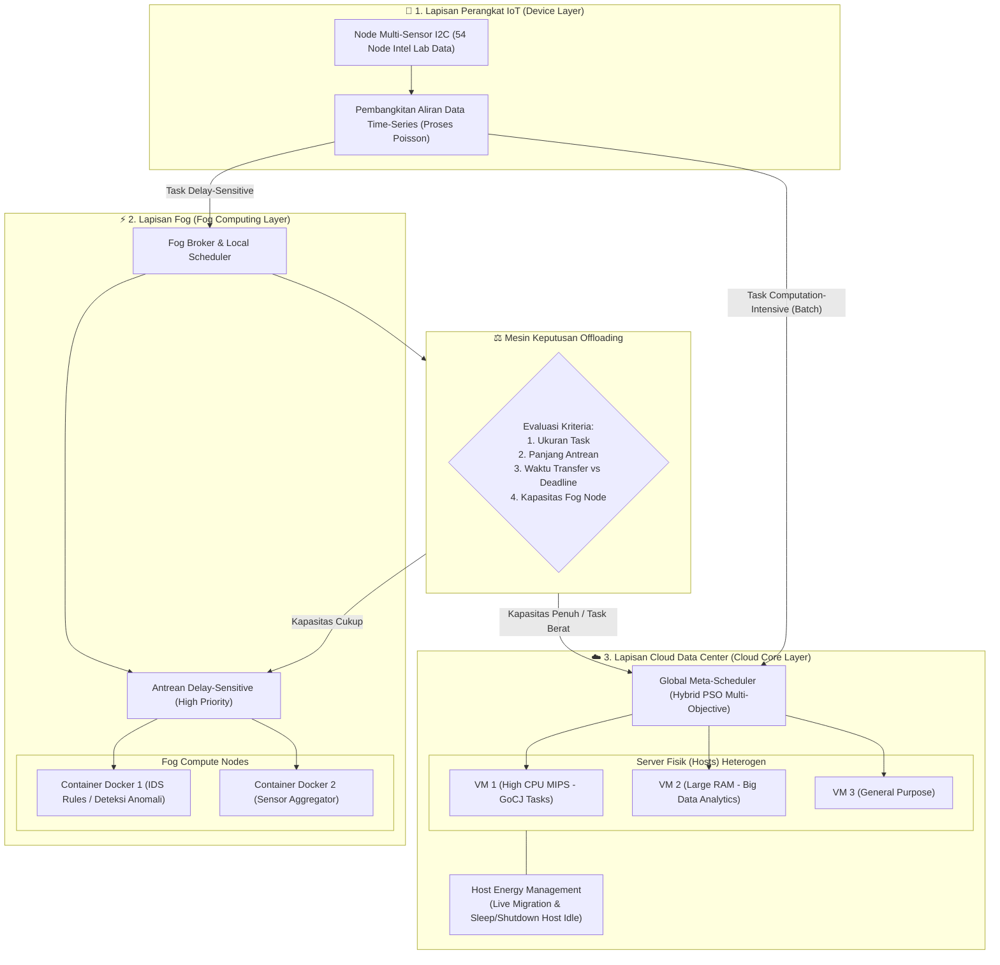

# Tugas 3: Desain Proyek Strategi Optimasi Komputasi Awan (Kelompok 4)

---

## 📌 1. Metadata Proyek & Informasi Akademik

| Atribut | Informasi Detail |
| :--- | :--- |
| **Mata Kuliah** | **Strategi Optimasi Komputasi Awan (SOKA)** — Kelas C |
| **Dosen Pengampu** | **Dr. Ir. Henning Titi Ciptaningtyas, S.Kom., M.Kom.** |
| **Institusi** | Institut Teknologi Sepuluh Nopember (ITS), Surabaya — 2026 |
| **Judul Tugas** | Tugas Minggu 2 / Tugas 3: *Rancangan Konsep Desain Proyek Strategi Optimasi Komputasi Awan* |
| **Paper Rujukan Utama** | `s10586-021-03467-1.pdf` (*Resource scheduling methods in cloud and fog computing environments: a systematic literature review*, Springer 2022) |
| **Anggota Kelompok 4** | 1. **I Dewa Made Satya Raditya** (NRP: 5027231051)<br>2. **Ahmad Wildan Fawwaz** (NRP: 5027241001)<br>3. **Muhammad Rakha Hananditya Rauf** (NRP: 5027241015)<br>4. **Theodorus Aaron Ugraha** (NRP: 5027241056)<br>5. **M. Hikari Reiziq Rakhmadinta** (NRP: 5027241079) |

---

## 🧭 2. Ringkasan Eksekutif Desain Proyek (Executive Summary)

Dokumen ini memuat **rancangan arsitektur dan strategi optimasi komputasi awan** yang dirumuskan oleh Kelompok 4 berbasiskan temuan *Systematic Literature Review* (SLR). 

### Intisari Rancangan (*Core Architectural Blueprint*):
1. **Arsitektur Kolaboratif 3-Lapis (*Three-Tier Hierarchy*)**: Mengintegrasikan **Lapisan Perangkat IoT**, **Lapisan Fog Node** (untuk komputasi lokal berlatensi rendah), dan **Lapisan Cloud Data Center** (untuk pemrosesan analitik batch skala masif).
2. **Dukungan Task Terkotak (*Bifurcated Independent Tasks*)**:
   - *Delay-Sensitive Tasks*: Ber-deadline ketat dan prioritas tinggi, dieksekusi di *fog nodes*.
   - *Computation-Intensive Tasks*: Berbeban instruksi tinggi dan deadline longgar, dialihkan (*offloading*) ke VM di *cloud*.
3. **Beban Kerja Stokastik Dinamis**: Menggunakan **Proses Poisson (*Poisson Process*)** untuk merepresentasikan pola kedatangan tugas acak dan lonjakan beban (*burst arrivals*).
4. **Dataset Hibrida**: Menggabungkan dataset fisik riil (**Intel Lab Data** untuk fog dan **Google Cloud Jobs / GoCJ** untuk cloud) dengan **Workload Sintetis** guna menghilangkan bias simulasi.
5. **Eksekusi Ringan Berbasis Kontainer**: Menjalankan kontainer **Docker** di dalam VM sebagai unit eksekusi *cloudlet* yang lincah dengan overhead minimal.
6. **Strategi Efisiensi Energi & Alokasi**: Menerapkan *initial VM placement*, *live migration*, *shutdown* host *idle*, serta *resource over-commitment* yang diawasi batas SLA.
7. **Best Practice Algoritma**: Mengadopsi **Hybrid-Metaheuristic** (kombinasi PSO dengan *local search* / *machine learning*) dalam kerangka kerja **Multi-Objective Optimization** (menyeimbangkan *makespan*, biaya, dan konsumsi energi).

---

## 🏗️ 3. Diagram Arsitektur Sistem Terintegrasi

Berikut adalah visualisasi aliran data, penjadwalan, dan hierarki infrastruktur sistem yang dirancang:



---

## 📋 4. Karakteristik Task, Workload, dan Dataset Ujicoba

### 4.1 Jenis Task yang Dipilih
Sesuai taksonomi literatur komputasi *fog-cloud*, proyek mengimplementasikan model **Independent Tasks** (tugas-tugas independen tanpa dependensi antar-tugas langsung) yang dibagi menjadi dua kelas fungsional:

1. **Task *Delay-Sensitive* (Sensitif terhadap Keterlambatan)**:
   - **Karakteristik**: Ukuran instruksi komputasi relatif kecil/menengah, namun memiliki batas waktu (*deadline*) ketat dan prioritas tertinggi (*High Priority*).
   - **Contoh Riil**: Pembacaan aliran data sensor IoT lingkungan (*time-series multi-sensor* I2C: suhu, kelembapan, voltase) serta aturan penyaringan paket inspeksi jaringan (*Intrusion Detection System / IDS rules*).
   - **Lokasi Penempatan**: Wajib dialokasikan ke **Fog Node** terdekat agar pemrosesan terjadi di dekat sumber data guna memangkas latensi transmisi jaringan (*propagation delay*).

2. **Task *Computation-Intensive* (Intensif Komputasi)**:
   - **Karakteristik**: Memerlukan siklus instruksi CPU tinggi (jutaan hingga miliaran instruksi / *Million Instructions - MI*), memori besar, dengan toleransi keterlambatan (*deadline*) yang lebih longgar.
   - **Contoh Riil**: Pengolahan analitik data historis secara *batch*, pelatihan/inferensi model *Machine Learning*, dan deteksi anomali agregasi log masif.
   - **Lokasi Penempatan**: Dialokasikan langsung ke **Virtual Machine (VM) pada Cloud Data Center** yang memiliki spesifikasi komputasi tinggi.

> **Catatan Pengembangan**: Fokus awal pada *independent tasks* bertujuan memastikan keakuratan dan evaluasi murni performa algoritma penjadwal. Arsitektur tetap disiapkan untuk mendukung *dependent tasks* menggunakan pemodelan **Directed Acyclic Graph (DAG)** jika di kemudian hari terdapat tahapan pemrosesan berjenjang.

---

### 4.2 Karakteristik Workload yang Disimulasikan
- **Pola Kedatangan Dinamis & Stokastik**: Kedatangan tugas pengguna di dunia nyata tidak pernah konstan. Proyek ini memodelkan laju kedatangan acak menggunakan **Proses Stokastik Poisson (*Poisson Process*)** dengan parameter inter-arrival time acak.
- **Heterogenitas Atribut Task**:
  - Ukuran komputasi beban: Dinyatakan dalam satuan **MI (Million Instructions)**.
  - Ukuran transfer data: Ukuran berkas input dan output (*file size in KB/MB*).
  - Kebutuhan unit pemroses: Jumlah *Processing Elements* (PE/vCPU).
  - Parameter QoS: Batas waktu (*deadline*), *arrival timestamp*, dan penalti SLA.
- **Variasi Kepadatan Beban (Load Density Variations)**:
  - Menguji algoritma pada berbagai spektrum beban: **Beban Ringan (Underload)**, **Beban Normal (Medium Load)**, dan **Beban Puncak / Lonjakan Tiba-Tiba (*Burst Arrivals*)** guna menguji ketangguhan penjadwal dari risiko *queue saturation*.

---

### 4.3 Dataset Ujicoba (Benchmark Datasets)
Guna mengatasi kelemahan banyak studi sebelumnya yang hanya mengandalkan data buatan, evaluasi proyek ini memadukan **dua dataset publik dunia nyata** ditambah **satu generator sintetis**:

| Nama Dataset | Jenis & Sumber Data | Peran dalam Proyek | Keunggulan Metodologis |
| :--- | :--- | :--- | :--- |
| **1. Intel Lab Data** | Data time-series riil dari 54 sensor node (suhu, kelembapan, cahaya, tegangan) dengan >2 juta rekaman data. | Sumber beban kerja *Task Delay-Sensitive* pada lapisan Fog. | Menyediakan *timestamp* kedatangan riil dari sensor fisik, menjamin simulasi fog berlatensi realistis. |
| **2. Google Cloud Jobs (GoCJ)** | Data ukuran pekerjaan riil dari klaster pusat data Google yang diturunkan melalui simulasi Monte Carlo. | Sumber beban kerja *Task Computation-Intensive* pada lapisan Cloud. | Format data siap pakai untuk CloudSim, memodelkan heterogenitas ukuran instruksi cloud nyata. |
| **3. Workload Sintetis** | Beban acak parameterik yang digenerasikan langsung melalui generator simulator. | Pengujian stres (*stress test*) dan analisis skalabilitas saat *burst arrivals*. | Memberikan fleksibilitas penuh untuk menguji kondisi batas ekstrem yang tidak tercakup dalam dataset riil. |

#### Alasan & Justifikasi Pemilihan Dataset:
- **Kompatibilitas Standar Industri**: Format dataset selaras langsung dengan format masukan kelas `Cloudlet` pada simulator **CloudSim** dan **iFogSim**.
- **Mitigasi Bias Sintetis**: Mengombinasikan data riil dan sintetis menjawab kritik utama tinjauan literatur (SLR) mengenai ketergantungan berlebih akademisi pada beban kerja artifisial.
- **Transparansi & Reproduktibilitas**: Keduanya merupakan dataset publik terbuka (*open-access*) yang telah diakui secara luas dalam riset komputasi terdistribusi internasional.

---

## 🏢 5. Data Center, Host, VM, dan Task/Cloudlet

### 5.1 Topologi Hierarki Jaringan Tiga Lapis (*Three-Tier Network*)
1. **Lapisan Perangkat (Device Layer)**: Berisi ribuan node sensor IoT, gawai cerdas, dan perangkat tepi yang memproduksi data mentah secara kontinu.
2. **Lapisan Kabut (Fog Layer)**: Terdiri atas *Fog Nodes* (komputer mikro, *edge gateways*, atau mini server lokal) yang dilengkapi komponen *Local Scheduler* cerdas untuk memproses *task* secara langsung di tepi jaringan.
3. **Lapisan Awan (Cloud Layer)**: Terdiri atas satu atau beberapa *Data Center* terpusat berskala besar (*hyperscale*) dengan ribuan *Physical Hosts* yang menjalankan *Virtual Machines* (VM).

### 5.2 Strategi Manajemen Mesin Virtual (VM) & Host Fisik
Untuk mencapai efisiensi energi tanpa melanggar perjanjian tingkat layanan (*Service-Level Agreement / SLA*):
- **Penempatan VM Awal (*Initial VM Placement*)**: Menempatkan VM baru ke server fisik (*host*) menggunakan heuristik pemilihan host paling efisien energi (*Most-Efficient-Server-First*) yang memiliki kapasitas tersisa memadai.
- **Migrasi VM Secara Langsung (*Live VM Migration*)**:
  - Jika host mengalami kelebihan beban (*Overloaded Threshold*, misal utilisasi CPU > 80%), sebagian VM dipindahkan secara dinamis ke host lain untuk mencegah degradasi performa (*SLA violation*).
  - Jika host mengalami beban rendah (*Underloaded Threshold*, misal utilisasi CPU < 20%), seluruh VM yang ada di host tersebut dimigrasikan keluar.
- **Pemadaman Host Idle (*Idle Host Shutdown / Sleep Mode*)**: Host fisik yang telah dikosongkan dari seluruh VM aktif akan dialihkan ke status *sleep* atau *power off* untuk memangkas konsumsi daya pendingin (*CRAC cooling*) dan listrik secara signifikan.

### 5.3 Unit Penjadwalan Berbasis Kontainer & Kebijakan Offloading
- **Virtualisasi Ringan (Docker inside VM)**: Di tingkat host/VM, penjadwalan unit tugas dapat dienkapsulasi menggunakan kontainer ringan (seperti Docker). Kontainer memangkas waktu *booting* dan konsumsi memori dibanding *full virtualization*, memungkinkan eksekusi *cloudlet* dalam orde milidetik.
- **Mesin Keputusan Offloading (*Offloading Decision Engine*)**:
  Keputusan apakah sebuah *task* dieksekusi di Fog atau dikirimkan (*offload*) ke Cloud ditentukan secara otomatis berdasarkan formula multi-faktor:
  $$\text{Keputusan Offloading} = f(\text{Task Size}, \text{Queue Length}, T_{\text{transfer}}, T_{\text{execution}}, \text{Deadline})$$
  - Jika tugas ringan (seperti rules IDS atau filter sensor) dan antrean Fog masih aman $\rightarrow$ **Eksekusi di Fog**.
  - Jika antrean Fog penuh atau tugas membutuhkan komputasi analitik masif $\rightarrow$ **Offload ke Cloud**.

---

## ⚖️ 6. Pengelolaan Sumber Daya Homogen dan Heterogen

### 6.1 Landasan Teori Homogen vs Heterogen
- **Sumber Daya Homogen**: Mesin-mesin fisik/VM yang memiliki spesifikasi setara (kecepatan CPU clock, jumlah PE, memori RAM, dan kartu jaringan yang identik).
- **Sumber Daya Heterogen**: Lingkungan komputasi di mana kapasitas pemrosesan berbeda-beda secara drastis (misal *Fog node* berdaya rendah berbasis ARM versus server *Cloud data center* multi-core Xeon). Perbedaan ini menuntut algoritma alokasi yang mampu menakar kapasitas eksekusi secara proporsional.

### 6.2 Penjadwalan di Lingkungan Heterogen
Strategi yang dirancang menerapkan prinsip:
- **Most-Efficient-Server-First**: Memprioritaskan pengalokasian tugas ke server yang menghasilkan rasio kinerja per Watt tertinggi (*Performance-per-Watt efficiency*).
- **Normalisasi Kapasitas**: Menggunakan metrik ekivalensi MIPS (*Million Instructions Per Second*) untuk memastikan tugas berat tidak dialokasikan ke simpul yang lambat.

### 6.3 Strategi *Resource Over-commitment*
- **Konsep**: Mengalokasikan sumber daya tervirtualisasi (vCPU dan vRAM) melebihi kapasitas fisik riil server fisik induknya ($R_{\text{allocated}} > R_{\text{physical}}$), memanfaatkan kenyataan empiris bahwa mayoritas aplikasi tidak memakai kapasitas puncak secara bersamaan.
- **Manfaat**: Memaksimalkan utilisasi perangkat keras, menekan biaya sewa server, dan mencegah *resource underutilization*.
- **Mitigasi Risiko Kontensi**: Diterapkan sistem pengawasan *threshold* ketat. Bila terjadi lonjakan permintaan serentak yang memicu perebutan sumber daya (*resource contention*), mekanisme *preemptive scheduling* atau *live migration* langsung diaktifkan untuk menjaga stabilitas sistem.

### 6.4 Rancangan Implementasi Algoritma
- **Algoritma Hibrida Metaheuristik (PSO Hibrida)**: Digunakan di tingkat global *Cloud Broker* untuk menghitung penugasan tugas ke VM heterogen dengan mengevaluasi fungsi kesesuaian (*fitness function*) multi-objektif.
- **Round Robin Termodifikasi (*Modified Round Robin*)**: Diterapkan secara lokal di dalam sub-klaster sumber daya yang homogen untuk membagi beban secara merata dengan *overhead* komputasi yang sangat rendah.

---

## 🏆 7. The Best Practice to Implement

Berdasarkan sintesis dari ketiga literatur *Systematic Literature Review* (SLR), Kelompok 4 menyimpulkan bahwa praktik terbaik (*best practice*) yang wajib diimplementasikan adalah:

$$\mathbf{\text{Best Practice}} = \mathbf{\text{Hybrid-Metaheuristic}} + \mathbf{\text{Multi-Objective Optimization}} + \mathbf{\text{Adaptive Learning/AI (Fog-Cloud)}}$$

### Mengapa Pendekatan Ini Merupakan Pilihan Terbaik?

| Pendekatan Tunggal | Kelemahan Fatal Jika Diterapkan Sendiri | Bagaimana Model Hibrida Kami Mengatasinya |
| :--- | :--- | :--- |
| **Heuristik Statis Murni** (FCFS, Min-Min, RR) | Terlalu kaku, deterministik, dan mudah terjebak dalam solusi suboptimal saat beban kerja berfluktuasi tajam. | Model hibrida memanfaatkan kemampuan pencarian global metaheuristik untuk keluar dari jebakan lokal optimum. |
| **Metaheuristik Murni** (PSO, GA, ACO Standar) | Waktu komputasi pencarian iteratif tinggi dan sangat sensitif terhadap *parameter tuning* (laju mutasi, inersia). | Dipadukan dengan aturan heuristik lokal (*local search*) dan peramalan AI, sehingga mempercepat konvergensi solusi (*faster convergence*). |
| **Optimasi Single-Objective** (Hanya Makespan) | Mempercepat waktu eksekusi tetapi menyebabkan pemborosan daya listrik ekstrim dan membengkaknya biaya sewa. | Menggunakan evaluasi **Multi-Objective (Pareto Optimality)** yang menyeimbangkan *makespan*, efisiensi energi, dan biaya secara serentak. |
| **Arsitektur Cloud Murni** | Menimbulkan lonjakan latensi jaringan dan kemacetan *bandwidth* pada data perangkat IoT. | Diintegrasikan dengan konsep **Fog Computing** berjenjang (membawa komputasi mendekat ke pengguna). |

---

## 📐 8. Formulasi Matematis Metrik Kinerja (Evaluation Metrics)

Berikut adalah formula matematis yang akan diukur dalam simulasi pengujian proyek:

### 1. Makespan (Waktu Penyelesaian Total)
Menilai efisiensi waktu penyelesaian seluruh kumpulan tugas:
$$\text{Makespan} = \max_{j \in \{1, 2, \dots, m\}} \left( T_j^{\text{finish}} \right)$$
*(di mana $m$ adalah jumlah seluruh VM/komputasi dan $T_j^{\text{finish}}$ adalah waktu tuntas VM ke-$j$)*.

### 2. Konsumsi Energi Total (*Total Energy Consumption*)
Menilai efisiensi daya komputasi dan pendingin:
$$E_{\text{total}} = \sum_{k=1}^{H} \int_{0}^{\text{Makespan}} P_k(u_k(t)) \, dt + E_{\text{migration}}$$
*(di mana $P_k$ adalah fungsi daya host ke-$k$ pada tingkat utilisasi CPU $u_k(t)$, dan $E_{\text{migration}}$ adalah penalti energi akibat migrasi VM)*.

### 3. Tingkat Ketimpangan Beban (*Degree of Imbalance - DI*)
Menilai kemerataan utilisasi beban kerja antar-sumber daya:
$$DI = \frac{T_{\max} - T_{\min}}{T_{\text{avg}}}$$
*(Semakin nilai $DI$ mendekati 0, semakin seimbang distribusi beban kerja pada sistem)*.

### 4. Rasio Pelanggaran SLA (*SLA Violation Rate*)
Menilai keandalan pemenuhan tenggat waktu tugas:
$$\text{SLAV} = \frac{\sum_{i=1}^{n} \mathbb{I}(T_i^{\text{actual\_finish}} > \text{Deadline}_i)}{n} \times 100\%$$
*(di mana $n$ adalah jumlah total task dan $\mathbb{I}$ adalah fungsi indikator)*.

---

## ⚙️ 9. Panduan Konfigurasi Simulator (CloudSim / iFogSim Implementation Cheatsheet)

Panduan praktis bagi AI Agent atau anggota kelompok saat menerjemahkan konsep ini ke dalam kode program Java:

```java
// 1. Inisialisasi Karakteristik Host Fisik (Heterogeneous Data Center)
int hostId = 0;
int mips = 10000; // Kapasitas CPU Host Cloud
int ram = 32768;  // RAM 32 GB
long storage = 1000000; // Storage 1 TB
int bw = 10000; // Bandwidth 10 Gbps

// 2. Pemodelan Task Delay-Sensitive (Intel Lab Data Mapping)
Cloudlet delaySensitiveTask = new Cloudlet(
    taskId, 
    1500, // Length dalam Million Instructions (Pendek)
    pesNumber, 
    fileSize, 
    outputSize, 
    utilizationModelCpu, 
    utilizationModelRam, 
    utilizationModelBw
);
delaySensitiveTask.setDeadline(currentTimestamp + 2.5); // Deadline Ketat (2.5 detik)

// 3. Pemodelan Task Computation-Intensive (Google Cloud Jobs / GoCJ Mapping)
Cloudlet computeIntensiveTask = new Cloudlet(
    taskId, 
    85000, // Length dalam Million Instructions (Panjang/Berat)
    pesNumber, 
    fileSize, 
    outputSize, 
    utilizationModelCpu, 
    utilizationModelRam, 
    utilizationModelBw
);
computeIntensiveTask.setDeadline(currentTimestamp + 60.0); // Deadline Longgar (60 detik)
```

---

## 📚 10. Daftar Pustaka Rujukan Proyek

1. **Rahimikhanghah, A., Tajkey, M., Rezazadeh, B., & Rahmani, A. M. (2022)**. *Resource scheduling methods in cloud and fog computing environments: A systematic literature review*. Cluster Computing, 25(2), 911–945. https://doi.org/10.1007/s10586-021-03467-1
2. **Abraham, O. L., Ngadi, M. A. B., Sharif, J. B. M., & Sidik, M. K. M. (2025)**. *Multi-Objective Optimization Techniques in Cloud Task Scheduling: A Systematic Literature Review*. IEEE Access, 13, 2025. https://doi.org/10.1109/ACCESS.2025.3529839
3. **Awad, W. K., Zainol Ariffin, K. A., Ahmad Nazri, M. Z., & Yassen, E. T. (2025)**. *Resource allocation strategies and task scheduling algorithms for cloud computing: A systematic literature review*. Journal of Intelligent Systems, 34(1), 20240441. https://doi.org/10.1515/jisys-2024-0441
4. **Bodik, P., Hong, W., Guestrin, C., Madden, S., Paskin, M., & Thibaux, R. (2004)**. *Intel Lab Data*. Intel Berkeley Research Lab.
5. **Hussain, A., & Aleem, M. (2018)**. *GoCJ: Google Cloud Jobs dataset for distributed and cloud computing infrastructures*. Data, 3(4), 38.
