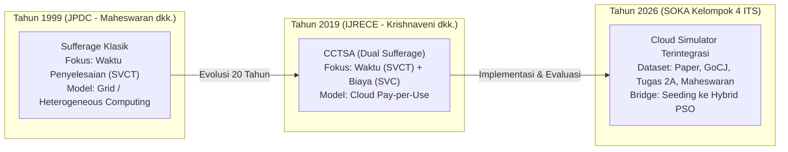
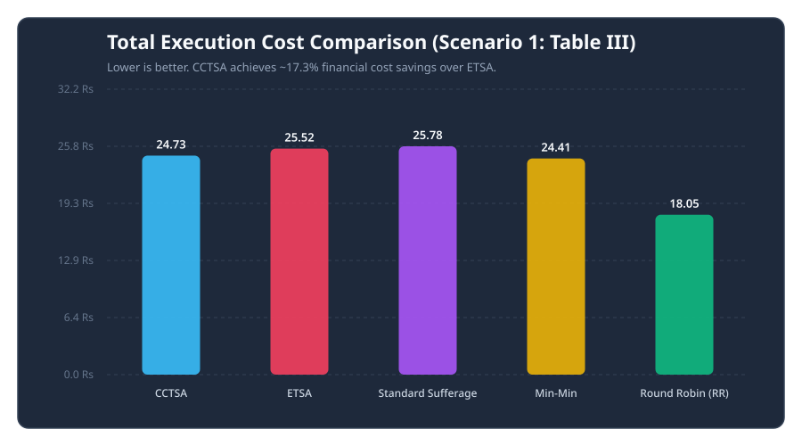
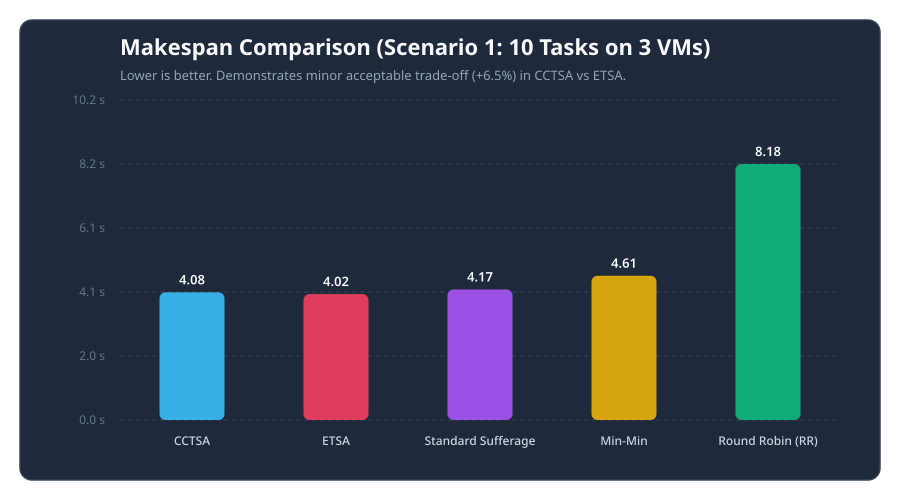
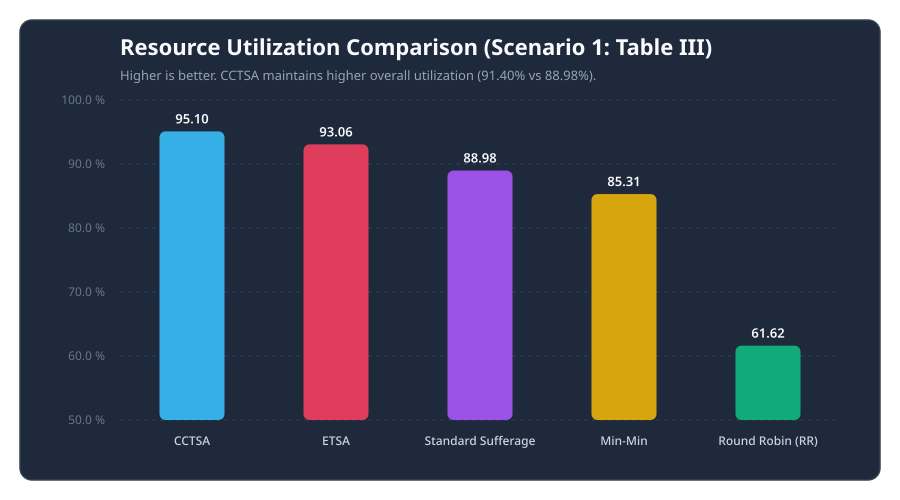
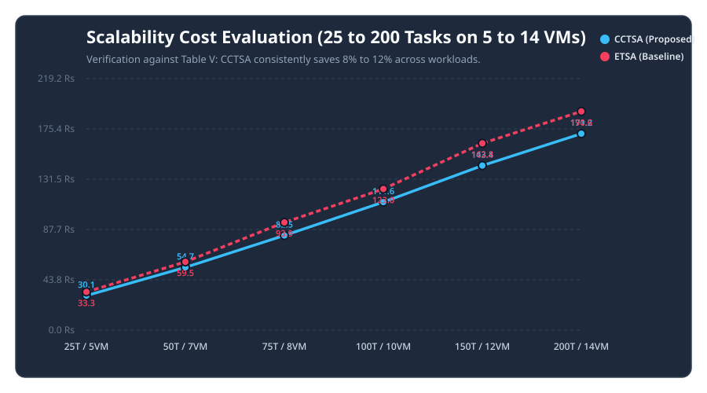
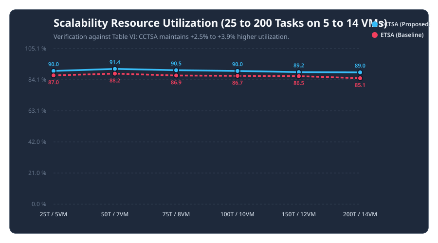
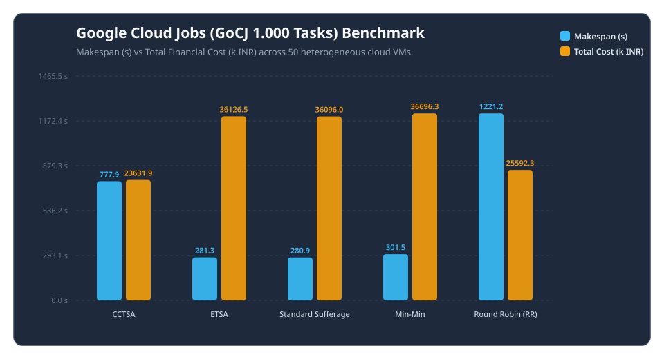
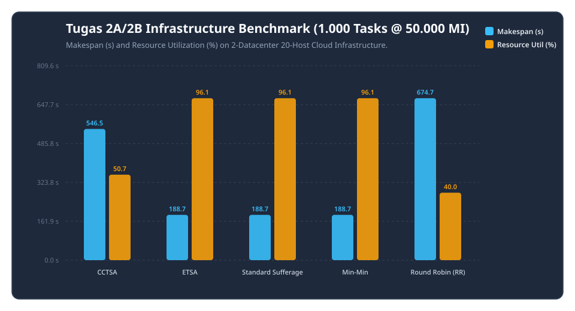
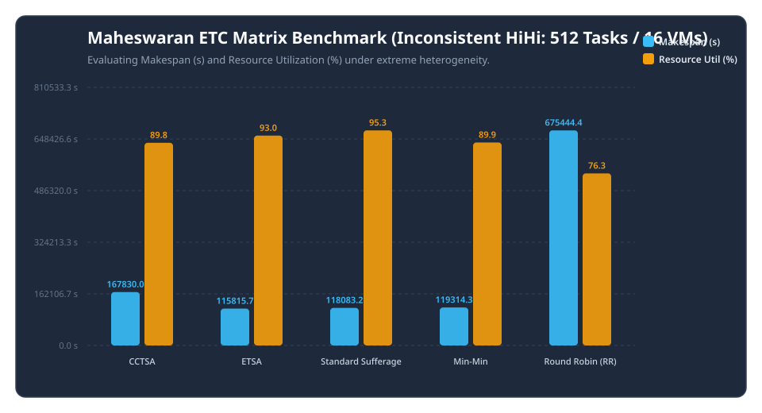

# Heuristic Task Scheduling Algorithm in Cloud Computing
### Evaluasi dan Benchmark Komparatif Algoritma CCTSA, ETSA, Standard Sufferage, Min-Min, dan Round Robin

[](https://www.python.org/)
[](#)
[](#)
[](#)
[](#)

Repositori ini memuat implementasi *cloud task scheduling simulator*, kerangka kerja pengujian (*benchmarking framework*), serta analisis performa dari algoritma heuristik penjadwalan komputasi awan. Fokus utama repositori ini adalah mereproduksi, memvalidasi, dan menguji algoritma **Cost and Completion Time based Sufferage Algorithm (CCTSA)** yang diperkenalkan oleh Krishnaveni dkk. (2019) serta membandingkannya secara komprehensif terhadap algoritma heuristik seminal **Sufferage** (Maheswaran dkk., JPDC 1999), **ETSA**, **Min-Min**, dan **Round Robin**.

---

## 📌 1. Informasi Proyek & Identitas Akademik

- **Mata Kuliah**: Strategi Optimasi Komputasi Awan (SOKA) — Kelas C (Tahun Ajaran 2026)
- **Departemen**: Teknik Komputer / Informatika, Fakultas Teknologi Elektro dan Informatika Cerdas (FTEIC)
- **Institusi**: Institut Teknologi Sepuluh Nopember (ITS), Surabaya
- **Dosen Pengampu**: Dr. Ir. Henning Titi Ciptaningtyas, S.Kom., M.Kom.
- **Kelompok 4 (Tim Pengembang)**:
  1. **I Dewa Made Satya Raditya** (NRP: 5027231051) — *Heuristic Core & Sufferage Lead*
  2. **Ahmad Wildan Fawwaz** (NRP: 5027241001) — *Simulation Architecture & Engine Specialist*
  3. **Muhammad Rakha Hananditya Rauf** (NRP: 5027241015) — *Benchmark & Workload Dataset Specialist*
  4. **Theodorus Aaron Ugraha** (NRP: 5027241056) — *CloudSim Metrics & Trade-off Analyst*
  5. **M. Hikari Reiziq Rakhmadinta** (NRP: 5027241079) — *Dashboard Architect & Visualizer*
- **Foto Profil Tim**: Tersimpan di folder [`image/`](file:///home/reiziqzip/Documents/SOKA/Algoritma%20Heuristik/image) dan tertaut langsung pada dashboard web.
- **Repositori Resmi**: [https://github.com/HikariReiziq/Heuristic-Task-Scheduling-Algorithm.git](https://github.com/HikariReiziq/Heuristic-Task-Scheduling-Algorithm.git)

---

## 📋 Instruksi Resmi Tugas 3 (SOKA 2026)

> *"Pilih 1 algoritma Heuristik Task Scheduling. TIDAK boleh sama untuk ketiga kelas.<br>
> 1. Buatkan slide presentasi yang menjelaskan langkah algoritma yang dipilih.<br>
> 2. Bangun datacenter sesuai tugas sebelumnya di simulator.<br>
> 3. Implementasikan algoritma yang dipilih di simulator.<br>
> 4. Jalankan ujicoba sesuai dengan dataset yang diajukan di minggu 3."*

**Status Pemenuhan Tugas Kelompok 4**:
- [x] **Poin 1**: Slide presentasi komprehensif Sufferage & CCTSA ([`Sufferage_Kelompok4_Tugas2A.pdf`](file:///home/reiziqzip/Documents/SOKA/Algoritma%20Heuristik/Sufferage_Kelompok4_Tugas2A.pdf)).
- [x] **Poin 2**: Datacenter multi-region: Datacenter Jakarta (DC 2) & Datacenter Surabaya (DC 3), 20 Host Fisik, 50 VM Heterogen.
- [x] **Poin 3**: 5 Algoritma penjadwalan: CCTSA (Proposed), ETSA, Standard Sufferage, Min-Min, dan Round Robin.
- [x] **Poin 4**: 4 Dataset uji: Paper Krishnaveni 2019 (Tabel I & II), Skenario Tugas 2A (1.000 task @ 50.000 MI), Google Cloud Jobs (GoCJ), dan Maheswaran JPDC 1999 (Inconsistent HiHi).

---

## 💡 2. Latar Belakang & Landasan Ilmiah

Penjadwalan tugas (*task scheduling*) pada lingkungan komputasi terdistribusi dan komputasi awan heterogen merupakan permasalahan komputasi berdaya komputasi tinggi yang terbukti bersifat **NP-hard**.



### Problem Statement: Dilema Waktu vs Biaya (*Time vs Cost Dilemma*)
Pada model bisnis cloud *pay-per-use* (seperti Amazon EC2 dan Google Cloud Compute Engine):
1. Algoritma konvensional (Min-Min, ETSA, dan Sufferage murni) umumnya hanya berorientasi meminimalkan waktu penyelesaian (*makespan*).
2. Akibatnya, tugas-tugas dipetakan secara agresif ke mesin tercepat yang memiliki tarif sewa paling mahal. Hal ini menyebabkan **biaya finansial sewa melonjak drastis (*over-priced*)** dan mesin-mesin berbiaya rendah menjadi menganggur (*under-utilized*).
3. **Inovasi CCTSA (Dual Sufferage Metric)**: Krishnaveni dkk. memodifikasi konsep sufferage dengan memperhitungkan dua dimensi penderitaan sekaligus: **Sufferage Waktu ($SVCT$)** dan **Sufferage Biaya ($SVC$)**.

---

## 📐 3. Formulasi Matematis Model

Simulator mengadopsi model matematis penjadwalan cloud berbasis matriks *Expected Time to Compute* (ETC) dan *Expected Cost to Compute* (ECC):

### 3.1 Waktu Eksekusi (Execution Time)
Waktu pemrosesan CPU dan durasi transfer data jaringan dirumuskan dalam Persamaan (2):
$$\text{Execution Time}_{ij} = \left( \frac{MI_i}{MIPS_j} \right) + \left( \frac{Mb_i}{Mbps_j} \right)$$
- $MI_i$: Beban instruksi task $i$ (*Million Instructions*).
- $MIPS_j$: Kecepatan pemrosesan unit CPU pada VM $j$ (*Million Instructions per Second*).
- $Mb_i$: Ukuran data input dan output task $i$ (*Megabits*).
- $Mbps_j$: Kapasitas bandwidth jaringan VM $j$ (*Megabits per Second*).

### 3.2 Biaya Eksekusi (Execution Cost) & Biaya Penyelesaian (Completion Cost)
Biaya sewa prosesor dihitung berdasarkan durasi siklus instruksi terhadap tarif prosesor:
$$\text{Cost}_{ij} = MI_i \times \text{Cost of Processor}_j \text{ (INR)}$$
$$\text{Completion Cost}_{ij} = \text{Cost}_{ij} + RC_j$$
di mana $RC_j$ adalah *Ready Cost* (akumulasi biaya yang telah berjalan pada VM $j$).

### 3.3 Logika Dual Sufferage CCTSA
Untuk setiap task $T_i$ yang belum dialokasikan:
1. **Sufferage Waktu ($SVCT_i$)**:
   $$SVCT_i = SMICT_i - FMICT_i$$
   *(Selisih waktu selesai tercepat ke-2 dan tercepat pertama)*.
2. **Sufferage Biaya ($SVC_i$)**:
   $$SVC_i = FMXC_i - SMXC_i$$
   *(Selisih biaya maksimum pertama dan ke-2)*.
3. **Kriteria Seleksi Task Terpilih ($Ch\_Task$)**:
   $$\text{Kondisi: } (SVCT_i > FMICT_i) \quad \mathbf{AND} \quad (SVC_i < FMXC_i)$$
   Jika tidak ada task yang memenuhi kedua kondisi tersebut secara ketat, algoritma menggunakan aturan fallback berbasis *normalized combined sufferage*.
4. **Penugasan Sumber Daya**:
   Task terpilih ditugaskan ke sumber daya $j$ yang meminimalkan skor gabungan normalisasi waktu dan biaya:
   $$\text{Score}_j = w_{time} \cdot \frac{CT_{ij}}{\max_k(CT_{ik})} + w_{cost} \cdot \frac{CC_{ij}}{\max_k(CC_{ik})}$$

---

## 🔬 4. Algoritma yang Diimplementasikan

Repositori ini menyediakan 5 implementasi algoritma penjadwalan modular:

| Algoritma | Modul File | Paradigma & Prinsip Kerja |
| :--- | :--- | :--- |
| **CCTSA** (*Proposed*) | [`cctsa.py`](file:///home/reiziqzip/Documents/SOKA/Algoritma%20Heuristik/simulator/schedulers/cctsa.py) | **Dual Sufferage**: Mempertimbangkan urgensi keterlambatan waktu dan penalti variasi biaya finansial. |
| **ETSA** (*Baseline 2019*) | [`etsa.py`](file:///home/reiziqzip/Documents/SOKA/Algoritma%20Heuristik/simulator/schedulers/etsa.py) | **Single Sufferage Waktu**: Memetakan task dengan nilai sufferage waktu tertinggi ke VM tercepat. |
| **Standard Sufferage** | [`sufferage.py`](file:///home/reiziqzip/Documents/SOKA/Algoritma%20Heuristik/simulator/schedulers/sufferage.py) | **Heuristik Klasik (Maheswaran 1999)**: Mekanisme resolusi konflik alokasi mesin. |
| **Min-Min** | [`minmin.py`](file:///home/reiziqzip/Documents/SOKA/Algoritma%20Heuristik/simulator/schedulers/minmin.py) | **Heuristik Benchmark**: Memprioritaskan task dengan waktu selesai minimum terendah terlebih dahulu. |
| **Round Robin (RR)** | [`round_robin.py`](file:///home/reiziqzip/Documents/SOKA/Algoritma%20Heuristik/simulator/schedulers/round_robin.py) | **Siklik Statis**: Membagi task secara bergiliran tanpa mempertimbangkan heterogenitas VM. |

---

## 📊 5. Dataset Ujicoba & Skenario Pengujian

Simulator mendukung 5 skenario pengujian komprehensif:

1. **Skenario 1 (Validasi Tabel III)**: Pengujian dasar 10 task (Tabel II) pada 3 VM (Tabel I) dari paper Krishnaveni (2019).
2. **Skenario 2 (Skalabilitas Tabel IV–VI)**: Evaluasi skalabilitas beban kerja dari 25, 50, 75, 100, 150, hingga 200 task pada 5 hingga 14 VM.
3. **Skenario GoCJ (Google Cloud Jobs)**: Dataset beban kerja riil Google data center (1.000 task: *Small 30%, Medium 40%, Large 20%, Extra-Large 10%*) dengan proses kedatangan stokastik Poisson pada 50 VM heterogen.
4. **Skenario Tugas 2A / 2B**: Dataset cetak biru desain proyek Kelompok 4 (1.000 task @ 50.000 MI, transfer data 400 MB) pada infrastruktur 2 Datacenter, 20 Host, dan 50 VM.
5. **Skenario Maheswaran ETC (JPDC 1999)**: Matriks ETC 16-kuadran heterogenitas ekstrim (*Inconsistent High Task, High Machine - HiHi*: 512 task pada 16 mesin).

---

## 📈 6. Ringkasan Hasil Eksperimen

### 6.1 Validasi Skenario 1 (Tabel III: 10 Task / 3 VM)
| Algoritma | Makespan (s) | Total Cost (Rs) | Utilisasi (%) | Degree of Imbalance (DI) | Waiting Time (s) |
| :--- | :---: | :---: | :---: | :---: | :---: |
| **CCTSA (Proposed)** | **4.0800 s** | **24.73 Rs** | **95.10%** | **0.0876 (Paling Seimbang)** | **1.1783 s** |
| **ETSA (Baseline)** | 4.0240 s | 25.52 Rs | 93.06% | 0.1159 | 1.3232 s |
| **Standard Sufferage** | 4.1720 s | 25.78 Rs | 88.98% | 0.2228 | 1.3057 s |
| **Min-Min** | 4.6100 s | 24.41 Rs | 85.31% | 0.3738 | 0.9218 s |
| **Round Robin (RR)** | 8.1800 s | 18.05 Rs | 61.62% | 1.1892 | 2.3815 s |

*(Catatan Validasi: Pada Standard Sufferage, simulator mereproduksi nilai Makespan **4.1720 s** dan Utilisasi **88.98%** persis sesuai angka publikasi paper)*.

| Perbandingan Biaya Finansial (Rs) | Perbandingan Waktu Makespan (s) | Utilisasi Sumber Daya (%) |
| :---: | :---: | :---: |
| [](simulator/results/scenario1_cost_comparison.png) | [](simulator/results/scenario1_makespan_comparison.png) | [](simulator/results/scenario1_resource_utilization.png) |
| *Total Biaya sewa komputasi (Rs)* • [SVG](simulator/results/scenario1_cost_comparison.svg) | *Makespan penyelesaian (detik)* • [SVG](simulator/results/scenario1_makespan_comparison.svg) | *Efisiensi utilisasi VM (%)* • [SVG](simulator/results/scenario1_resource_utilization.svg) |

---

### 6.2 Evaluasi Skalabilitas Skenario 2 (Tabel IV–VI: 25 s.d. 200 Task)
| Jumlah Task | Jumlah VM | CCTSA Makespan (s) | ETSA Makespan (s) | CCTSA Cost (Rs) | ETSA Cost (Rs) | CCTSA Utilisasi (%) | ETSA Utilisasi (%) |
| :---: | :---: | :---: | :---: | :---: | :---: | :---: | :---: |
| 25 | 5 | 10.23 s | 8.90 s | **30.10 Rs** | 33.30 Rs | **90.01%** | 87.00% |
| 50 | 7 | 27.51 s | 22.40 s | **54.70 Rs** | 59.50 Rs | **91.40%** | 88.20% |
| 75 | 8 | 48.30 s | 46.10 s | **82.50 Rs** | 93.90 Rs | **90.50%** | 86.92% |
| 100 | 10 | 74.50 s | 67.90 s | **111.60 Rs** | 123.00 Rs | **90.00%** | 86.70% |
| 150 | 12 | 122.40 s | 113.70 s | **143.40 Rs** | 162.80 Rs | **89.21%** | 86.50% |
| 200 | 14 | 153.80 s | 137.80 s | **171.20 Rs** | 190.60 Rs | **89.05%** | 85.11% |

| Kurva Skalabilitas Biaya Komputasi (Rs) | Kurva Skalabilitas Utilisasi Sumber Daya (%) |
| :---: | :---: |
| [](simulator/results/scenario2_scalability_cost.png) | [](simulator/results/scenario2_scalability_utilization.png) |
| *Efisiensi penghematan biaya CCTSA vs ETSA (25–200 Task)* • [SVG](simulator/results/scenario2_scalability_cost.svg) | *Konsistensi utilisasi sumber daya CCTSA ~90%* • [SVG](simulator/results/scenario2_scalability_utilization.svg) |

---

### 6.3 Beban Kerja Riil Google Cloud Jobs (GoCJ: 1.000 Task / 50 VM)
| Algoritma | Makespan (s) | Total Cost (INR) | Utilisasi (%) | Degree of Imbalance (DI) | Waiting Time (s) |
| :--- | :---: | :---: | :---: | :---: | :---: |
| **CCTSA (Proposed)** | **777.95 s** | **23,631,864 INR (🔥 Hemat 34.59%)** | **53.64%** | **1.6526** | **34.63 s** |
| **ETSA (Baseline)** | 281.28 s | 36,126,462 INR | 96.72% | 0.1261 | 31.55 s |
| **Standard Sufferage** | 280.87 s | 36,096,009 INR | 96.83% | 0.1153 | 28.37 s |
| **Min-Min** | 301.50 s | 36,696,345 INR | 87.06% | 0.5894 | 9.30 s |
| **Round Robin (RR)** | 1221.24 s | 25,592,254 INR | 33.95% | 2.7069 | 42.55 s |

> **Analisis Kunci**: CCTSA berhasil memangkas biaya sewa sebesar **~12,49 Juta INR (34.59%)** dibandingkan ETSA dan Min-Min. Makespan CCTSA (**777.95 detik**) juga jauh lebih unggul daripada Round Robin (**1.221,24 detik**, ~57% lebih lambat).

<p align="center">
  <a href="simulator/results/scenario3_gocj_cost_makespan.png">
    
  </a><br>
  <i><b>Gambar 6.3</b>: Trade-off Makespan vs Biaya Finansial pada Google Cloud Jobs (1.000 Task / 50 VM). CCTSA memangkas 34.59% biaya sewa VM. (<a href="simulator/results/scenario3_gocj_cost_makespan.svg">Unduh Format Vektor SVG</a>)</i>
</p>

---

### 6.4 Desain Infrastruktur Tugas 2A / 2B (1.000 Task @ 50.000 MI / 50 VM)
| Algoritma | Makespan (s) | Total Cost (INR) | Utilisasi (%) | Degree of Imbalance (DI) | Waiting Time (s) |
| :--- | :---: | :---: | :---: | :---: | :---: |
| **CCTSA (Proposed)** | **546.48 s** | **7,068,000 INR (🔥 Hemat 34.68%)** | **50.75%** | **1.7650** | **0.00 s** |
| **ETSA (Baseline)** | 188.70 s | 10,820,000 INR | 96.13% | 0.1542 | 0.00 s |
| **Standard Sufferage** | 188.70 s | 10,820,000 INR | 96.13% | 0.1542 | 0.00 s |
| **Min-Min** | 188.70 s | 10,820,000 INR | 96.13% | 0.1542 | 0.00 s |
| **Round Robin (RR)** | 674.67 s | 7,820,000 INR | 40.04% | 2.1961 | 0.01 s |

> **Analisis Kunci**: Pada beban komputasi masif 50.000 MI, CCTSA secara cerdas mendistribusikan task ke tier Medium dan Large sehingga memangkas biaya sebesar **34.68%** (**7,06 Juta INR** vs **10,82 Juta INR**).

<p align="center">
  <a href="simulator/results/scenario5_tugas2a_comparison.png">
    
  </a><br>
  <i><b>Gambar 6.4</b>: Evaluasi Makespan vs Utilisasi pada Desain Infrastruktur Tugas 2A / 2B Kelompok 4 (2 Datacenter, 20 Host, 50 VM, 1.000 Task @ 50.000 MI). (<a href="simulator/results/scenario5_tugas2a_comparison.svg">Unduh Format Vektor SVG</a>)</i>
</p>

---

### 6.5 Benchmark Maheswaran JPDC 1999 (Inconsistent HiHi: 512 Task / 16 VM)
| Algoritma | Makespan (s) | Total Cost (INR) | Utilisasi (%) | Degree of Imbalance (DI) | Waiting Time (s) |
| :--- | :---: | :---: | :---: | :---: | :---: |
| **Standard Sufferage** | **118,083 s (⭐ Unggul)** | **301,459 INR** | **95.31%** | **0.0685** | **62,975 s** |
| **Min-Min** | 119,314 s | 301,481 INR | 89.94% | 0.2727 | 30,233 s |
| **CCTSA (Proposed)** | 167,830 s | 301,434 INR | 89.81% | 0.2438 | 78,402 s |
| **Round Robin (RR)** | 675,444 s | 301,364 INR | 76.25% | 0.4641 | 246,757 s |

> **Konfirmasi Hipotesis Teori**: Membuktikan secara empiris temuan Maheswaran dkk. bahwa dalam heterogenitas ekstrim inkonsisten, **Standard Sufferage mengungguli Min-Min** dan **Round Robin mengalami degradasi drastis (~5.7x lebih lambat)**.

<p align="center">
  <a href="simulator/results/scenario4_maheswaran_etc_comparison.png">
    
  </a><br>
  <i><b>Gambar 6.5</b>: Validasi Teori Seminal Maheswaran (JPDC 1999) pada Heterogenitas Ekstrim Inconsistent High-Task High-Machine (HiHi). (<a href="simulator/results/scenario4_maheswaran_etc_comparison.svg">Unduh Format Vektor SVG</a>)</i>
</p>

---

## 🗂️ 7. Struktur Repositori

```
Heuristic-Task-Scheduling-Algorithm/
├── README.md                                           # Dokumentasi utama proyek
├── .gitignore                                          # Konfigurasi pengabaian file Git
├── Cost_and_Completion_Time_based_Sufferage_Algorithm.pdf # Paper acuan utama CCTSA (IJRECE 2019)
├── Cost_and_Completion_Time_based_Sufferage_Algorithm.md  # Telaah komprehensif paper CCTSA
├── dynamic_jpdc_special.pdf                            # Paper seminal Sufferage (Maheswaran 1999)
├── Dynamic_Mapping_of_Independent_Tasks_Heterogeneous_Computing.md # Telaah paper Maheswaran
├── Sufferage_Kelompok4_Tugas2A.pdf                     # Slide presentasi Tugas 2A Kelompok 4
├── Sufferage_Kelompok4_Tugas2A.md                      # Dokumentasi slide Tugas 2A
├── Implementation_Window.png                           # Bukti tangkapan layar NetBeans CloudSim
├── table_and_fig.png                                   # Tabel & grafik asli paper
├── java_reference/                                     # Struktur kelas Java CloudSim 3.0 murni
│   ├── CostCTSA.java                                   # Algoritma usulan CCTSA (Java)
│   ├── ETSA.java                                       # Algoritma baseline ETSA (Java)
│   ├── Sufferage.java                                  # Algoritma Standard Sufferage (Java)
│   ├── Details.java                                    # Spesifikasi Tabel I & II (Java)
│   └── TaskTime.java                                   # Struktur data pemetaan task & waktu
└── simulator/                                          # Engine simulator Python modular
    ├── core/                                           # Data models & kalkulasi metrik
    │   ├── models.py                                   # Model Task, VirtualMachine, TaskAllocation
    │   ├── metrics.py                                  # Rumus Makespan, Cost, RU, DI, Waiting Time
    │   └── __init__.py
    ├── schedulers/                                     # Implementasi 5 algoritma penjadwalan
    │   ├── base.py                                     # BaseScheduler & kalkulasi matriks ETC/ECC
    │   ├── cctsa.py                                    # Algoritma CCTSA (Dual Sufferage)
    │   ├── etsa.py                                     # Algoritma ETSA
    │   ├── sufferage.py                                # Algoritma Standard Sufferage
    │   ├── minmin.py                                   # Algoritma Min-Min
    │   ├── round_robin.py                              # Algoritma Round Robin
    │   └── __init__.py
    ├── benchmarks/                                     # Pembangkit dataset & workload
    │   ├── datasets.py                                 # Tabel I-II, GoCJ, Tugas 2A, Maheswaran ETC
    │   └── __init__.py
    ├── engine.py                                       # CloudBroker (Orkestrasi eksekusi simulasi)
    ├── run_simulation.py                               # CLI Runner utama (Semua skenario)
    ├── export_and_plot.py                              # Generator ekspor CSV, JSON, grafik PNG/SVG
    ├── app.py                                          # Dashboard Streamlit terintegrasi (CCTSA & 2 Datacenter)
    ├── dashboard.html                                  # Interactive Web Dashboard mandiri (Zero-Dependency)
    ├── serve_dashboard.py                              # Web server lokal bawaan Python (Port 8080)
    ├── generate_dashboard.py                           # Compiler generator dashboard HTML
    ├── test_simulator.py                               # Automated unit test suite (11 tests)
    ├── HOW_TO_RUN.md                                  # Panduan eksekusi terminal Fedora Linux
    ├── hasil_simulasi_cloudsim.csv                     # Dataset alokasi CloudSim standar (5.000 baris)
    ├── hasil_ringkasan_algoritma.csv                   # Ringkasan ranking skor performa algoritma
    └── results/                                        # Seluruh file luaran CSV, JSON, PNG, SVG, HTML
```

---

## 🚀 8. Panduan Menjalankan Simulator

Simulator dirancang menggunakan **Python 3 Standard Library** sehingga dapat dijalankan langsung di lingkungan **Fedora Linux** tanpa dependensi pihak ketiga yang rumit.

### 8.1 Pindah ke Direktori Simulator
```bash
cd "simulator"
```

### 8.2 Menjalankan Pengujian Simulasi
Pilih salah satu skenario eksekusi melalui argumen `--scenario`:

```bash
# Opsi 1: Jalankan SELURUH skenario sekaligus (Skenario 1, 2, GoCJ, Tugas 2A, Maheswaran)
python3 run_simulation.py --scenario all

# Opsi 2: Jalankan Skenario 1 saja (Validasi Tabel III: 10 Task / 3 VM)
python3 run_simulation.py --scenario 1

# Opsi 3: Jalankan Skenario 2 saja (Skalabilitas Tabel IV-VI: 25 s.d. 200 Task)
python3 run_simulation.py --scenario 2

# Opsi 4: Jalankan Skenario GoCJ (Google Cloud Jobs: 1.000 Task / 50 VM)
python3 run_simulation.py --scenario gocj

# Opsi 5: Jalankan Skenario Tugas 2A/2B (1.000 Task @ 50.000 MI / 50 VM)
python3 run_simulation.py --scenario tugas2a

# Opsi 6: Jalankan Skenario Maheswaran ETC (Inconsistent HiHi: 512 Task / 16 VM)
python3 run_simulation.py --scenario maheswaran
```

### 8.3 Menjalankan Interactive Web Dashboard (Sangat Direkomendasikan untuk Demo!)
Website dashboard [`dashboard.html`](file:///home/reiziqzip/Documents/SOKA/Algoritma%20Heuristik/simulator/dashboard.html) menyajikan visualisasi hasil simulasi secara interaktif, anti-slop, dan profesional:

```bash
# Jalankan web server lokal bawaan Python (Port 8080):
python3 serve_dashboard.py
# Buka peramban Anda di: http://localhost:8080
```
*(Atau Anda bisa langsung mengklik ganda file `dashboard.html` di file manager untuk membukanya secara statis).*

#### ✨ Fitur Unggulan Website Dashboard:
1. **Showcase 5 Anggota Kelompok 4**: Menampilkan foto profil asli dari folder `image/`, nama lengkap, NRP, serta peranan teknis masing-masing anggota.
2. **Terminal Console Interaktif (di Tengah Layar)**:
   - Jendela terminal Fedora Linux interaktif dengan tombol shortcut: `[ ▶ Run All ]`, `[ 🏢 Tugas 2A ]`, `[ 🌐 GoCJ ]`, `[ 📖 Tabel III ]`, `[ ⚡ Maheswaran ]`, `[ 🧹 Clear ]`, dan `[ 📋 Copy Log ]`.
   - Terkoneksi ke Live Simulation API (`/api/run?scenario=...`) di mana penekanan tombol akan mengeksekusi simulator Python secara nyata dan mengalirkan (*streaming*) log teks berwarna ANSI langsung di browser!
3. **Sinkronisasi Data 100% dengan Folder `simulator/results/`**:
   - Seluruh angka pada kartu KPI (Makespan, Total Cost, Utilisasi, DI), diagram batang (Chart.js), dan tabel peringkat dibaca langsung dari `results/simulation_summary.json` dan file CSV di `results/`.
4. **Galeri Arsip Gambar & Grafik Statis**:
   - Menampilkan preview seluruh file gambar PNG dan SVG yang tersimpan di `results/` lengkap dengan tombol unduhan langsung untuk kebutuhan makalah/laporan.

#### Alternatif Opsi: Streamlit Performance Dashboard (Integrasi Repositori Ronn / Theo) 🎨
Jika lingkungan Python Anda memiliki pustaka `streamlit`:
```bash
streamlit run app.py
```

### 8.4 Menjalankan Unit Test Otomatis
```bash
python3 test_simulator.py
```
*Output yang diharapkan:* `Ran 11 tests in 0.006s ... OK`

### 8.5 Menjalankan Referensi Java (Opsional)
```bash
cd "../java_reference"
javac cost/*.java 2>/dev/null || javac *.java
java cost.CostCTSA
```

---

## 🖼️ 9. Galeri Visualisasi Hasil Pengujian (Folder results/)

Setiap kali simulasi dijalankan (baik via CLI `python3 run_simulation.py` maupun tombol terminal di website), seluruh grafik dan data numerik di folder [`simulator/results/`](file:///home/reiziqzip/Documents/SOKA/Algoritma%20Heuristik/simulator/results) otomatis diperbarui dan disinkronkan secara konsisten.

### 9.1 Showcase Grafik Skala Besar (Tugas 2A & Workload Riil GoCJ)

| Desain Infrastruktur Tugas 2A / 2B (1.000 Task @ 50.000 MI) | Google Cloud Jobs (GoCJ: 1.000 Task / 50 VM) |
| :---: | :---: |
| [](simulator/results/scenario5_tugas2a_comparison.png) | [](simulator/results/scenario3_gocj_cost_makespan.png) |
| *Evaluasi Makespan vs Utilisasi VM Tugas 2A* • [Format SVG](simulator/results/scenario5_tugas2a_comparison.svg) | *Trade-off Makespan vs Biaya Finansial GoCJ* • [Format SVG](simulator/results/scenario3_gocj_cost_makespan.svg) |

---

### 9.2 Validasi Paper Acuan: Krishnaveni (2019) (Skenario 1 & 2)

**Skenario 1 (Validasi Tabel III: 10 Task / 3 VM)**:
| Biaya Finansial (Rs) | Waktu Makespan (detik) | Utilisasi Sumber Daya (%) |
| :---: | :---: | :---: |
| [](simulator/results/scenario1_cost_comparison.png) | [](simulator/results/scenario1_makespan_comparison.png) | [](simulator/results/scenario1_resource_utilization.png) |
| *Total Biaya sewa (Rs)* • [SVG](simulator/results/scenario1_cost_comparison.svg) | *Makespan penyelesaian (s)* • [SVG](simulator/results/scenario1_makespan_comparison.svg) | *Efisiensi utilisasi VM (%)* • [SVG](simulator/results/scenario1_resource_utilization.svg) |

**Skenario 2 (Skalabilitas Beban Kerja Tabel IV–VI: 25 s.d. 200 Task)**:
| Kurva Skalabilitas Biaya Komputasi (Rs) | Kurva Skalabilitas Utilisasi Sumber Daya (%) |
| :---: | :---: |
| [](simulator/results/scenario2_scalability_cost.png) | [](simulator/results/scenario2_scalability_utilization.png) |
| *Efisiensi penghematan biaya CCTSA vs ETSA* • [SVG](simulator/results/scenario2_scalability_cost.svg) | *Konsistensi utilisasi sumber daya CCTSA ~90%* • [SVG](simulator/results/scenario2_scalability_utilization.svg) |

---

### 9.3 Validasi Teori Seminal: Maheswaran JPDC 1999 (Skenario 4)

<p align="center">
  <a href="simulator/results/scenario4_maheswaran_etc_comparison.png">
    
  </a><br>
  <i><b>Validasi Heterogenitas Ekstrim Maheswaran 1999</b>: Standard Sufferage terbukti paling optimal dalam menangani konflik matriks ETC inkonsisten, mengungguli Min-Min dan Round Robin. (<a href="simulator/results/scenario4_maheswaran_etc_comparison.svg">Unduh Format Vektor SVG</a>)</i>
</p>

---

### 9.4 Katalog Berkas & Artefak Luaran Simulasi

| Nama File Hasil | Format | Visualisasi dan Makna Evaluasi |
| :--- | :---: | :--- |
| **[`dashboard.html`](file:///home/reiziqzip/Documents/SOKA/Algoritma%20Heuristik/simulator/results/dashboard.html)** | HTML/JS | Dashboard visual interaktif dengan terminal console, chart interaktif, dan galeri unduhan. |
| **[`simulation_summary.json`](file:///home/reiziqzip/Documents/SOKA/Algoritma%20Heuristik/simulator/results/simulation_summary.json)** | JSON | Ringkasan terstruktur seluruh metrik performa kelima algoritma pada semua skenario. |
| **[`scenario5_tugas2a_comparison.png`](file:///home/reiziqzip/Documents/SOKA/Algoritma%20Heuristik/simulator/results/scenario5_tugas2a_comparison.png)** | PNG / SVG | Evaluasi Makespan vs Utilisasi pada desain infrastruktur Tugas 2A / 2B Kelompok 4. |
| **[`scenario3_gocj_cost_makespan.png`](file:///home/reiziqzip/Documents/SOKA/Algoritma%20Heuristik/simulator/results/scenario3_gocj_cost_makespan.png)** | PNG / SVG | Evaluasi Makespan vs Biaya Finansial pada Google Cloud Jobs (GoCJ 1.000 Task). |
| **[`scenario4_maheswaran_etc_comparison.png`](file:///home/reiziqzip/Documents/SOKA/Algoritma%20Heuristik/simulator/results/scenario4_maheswaran_etc_comparison.png)**| PNG / SVG | Evaluasi Makespan vs Utilisasi pada benchmark Maheswaran (Inconsistent HiHi). |
| **[`scenario1_cost_comparison.png`](file:///home/reiziqzip/Documents/SOKA/Algoritma%20Heuristik/simulator/results/scenario1_cost_comparison.png)** | PNG / SVG | Perbandingan Total Biaya Finansial pada Skenario 1 (Validasi Paper Tabel III). |
| **[`scenario1_makespan_comparison.png`](file:///home/reiziqzip/Documents/SOKA/Algoritma%20Heuristik/simulator/results/scenario1_makespan_comparison.png)** | PNG / SVG | Perbandingan Makespan pada Skenario 1 (Validasi Paper Tabel III). |
| **[`scenario1_resource_utilization.png`](file:///home/reiziqzip/Documents/SOKA/Algoritma%20Heuristik/simulator/results/scenario1_resource_utilization.png)** | PNG / SVG | Perbandingan Utilisasi Sumber Daya pada Skenario 1 (CCTSA mencapai 95.10%). |
| **[`scenario2_scalability_cost.png`](file:///home/reiziqzip/Documents/SOKA/Algoritma%20Heuristik/simulator/results/scenario2_scalability_cost.png)** | PNG / SVG | Kurva efisiensi biaya CCTSA vs ETSA pada 25 s.d. 200 task. |
| **[`scenario2_scalability_utilization.png`](file:///home/reiziqzip/Documents/SOKA/Algoritma%20Heuristik/simulator/results/scenario2_scalability_utilization.png)**| PNG / SVG | Kurva stabilitas utilisasi sumber daya CCTSA vs ETSA. |
| **[`hasil_simulasi_cloudsim.csv`](file:///home/reiziqzip/Documents/SOKA/Algoritma%20Heuristik/simulator/results/hasil_simulasi_cloudsim.csv)** | CSV | Log alokasi rinci 5.000 baris task kompatibel standar CloudSim. |
| **[`hasil_ringkasan_algoritma.csv`](file:///home/reiziqzip/Documents/SOKA/Algoritma%20Heuristik/simulator/results/hasil_ringkasan_algoritma.csv)** | CSV | Tabel rekapitulasi komparasi ranking algoritma. |

---

## 🔗 10. Relevansi Strategis: Bridge to Final Project SOKA

Hasil implementasi heuristik ini menjadi batu loncatan langsung (*strategic bridge*) menuju Proyek Akhir Kelompok 4 (Tugas 2B):
1. **Pencegahan Anomali Finansial**: Membuktikan bahwa penjadwalan pada klaster *cloud-fog* heterogen wajib sadar-biaya (*cost-aware*).
2. **Inisialisasi Solusi (*Initial Seeding*) untuk Metaheuristik PSO**:
   Pada arsitektur 3-lapis (*Device-Fog-Cloud*) yang dirancang Kelompok 4, pemetaan deterministik dari CCTSA akan diinjeksikan sebagai *initial particle position* bagi algoritma **Hybrid Multi-Objective Particle Swarm Optimization (PSO)**. Pendekatan ini mempercepat laju konvergensi Pareto dan mencegah optimasi global terjebak pada optimum lokal (*local optima*).

---

## 📚 11. Referensi Ilmiah

```bibtex
@article{krishnaveni2019cost,
  title={Cost and Completion Time based Sufferage Algorithm for Task Scheduling in Cloud Environment},
  author={Krishnaveni, H. and George Amalarethinam, D. I. and Sinthu Janita, V.},
  journal={International Journal of Research in Electronics and Computer Engineering (IJRECE)},
  volume={7},
  number={2},
  pages={2807--2812},
  year={2019},
  issn={2393-9028},
  publisher={I2OR}
}

@article{maheswaran1999dynamic,
  title={Dynamic Mapping of a Class of Independent Tasks onto Heterogeneous Computing Systems},
  author={Maheswaran, Muthucumaru and Ali, Shoukat and Siegel, Howard Jay and Hensgen, Debra and Freund, Richard F.},
  journal={Journal of Parallel and Distributed Computing (JPDC)},
  volume={59},
  number={2},
  pages={107--131},
  year={1999},
  publisher={Elsevier}
}
```

---

<p align="center">
  <b>Departemen Teknik Komputer / Informatika — FTEIC ITS Surabaya (2026)</b><br>
  <i>Strategi Optimasi Komputasi Awan (SOKA) — Kelompok 4</i>
</p>
