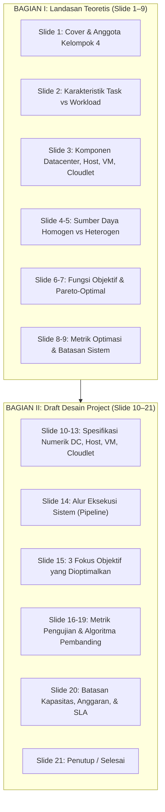
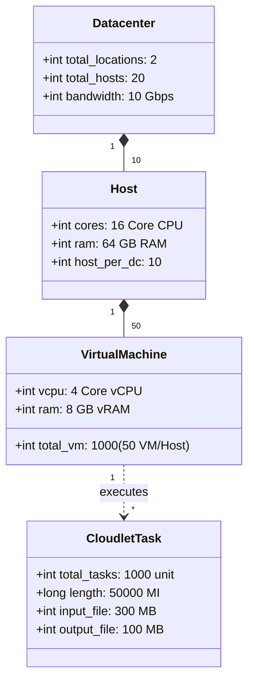

# Slide Presentasi SOKA Tugas 2A: Cloud Task Scheduling & Desain Awal Sufferage

---

## 📌 1. Metadata Dokumen & Identitas Presentasi

| Atribut | Informasi Detail |
| :--- | :--- |
| **Judul Presentasi** | **SOKA WEEK 3 / Tugas 2A**: *Cloud Task Scheduling: Karakteristik, Fungsi Objektif, dan Draft Desain Awal Project* |
| **Lokasi File Asli** | `Algoritma Heuristik/Sufferage_Kelompok4_Tugas2A.pdf` (Identik dengan `Kelompok4_Tugas2A.pdf`) |
| **Identifikasi Berkas** | SHA-256 Checksum: `fb4e0d800b5dbf7e4412b6186082d2aa9db0290ffc51a9a1d3afbe5a821bafc6` |
| **Jumlah Slide** | 21 Slide (Rasio 16:9, Dimensi: 1440 × 810 pts) |
| **Penyusun / Penulis** | Ahmad Wildan Fawwaz (Canva / iLovePDF) |
| **Mata Kuliah** | **Strategi Optimasi Komputasi Awan (SOKA)** — Kelas C |
| **Dosen Pengampu** | **Dr. Ir. Henning Titi Ciptaningtyas, S.Kom., M.Kom.** |
| **Institusi** | Institut Teknologi Sepuluh Nopember (ITS), Surabaya — 2026 |
| **Anggota Kelompok 4** | 1. **I Dewa Made Satya Raditya** (5027231051) 2. **Ahmad Wildan Fawwaz** (5027241001) 3. **Muhammad Rakha Hananditya Rauf** (5027241015) 4. **Theodorus Aaron Ugraha** (5027241056) 5. **M. Hikari Reiziq Rakhmadinta** (5027241079) |
| **Paper Rujukan** | Aryan Rahimikhanghah dkk., *Resource Scheduling Methods in Cloud and Fog Computing Environments*, Cluster Computing (Springer 2022) |

---

## 🧭 2. Ringkasan Eksekutif (Executive Summary untuk AI Agent)

Slide presentasi ini merupakan **laporan presentasi komprehensif Tugas 2A** yang menjembatani konsep teoretis komputasi awan menuju pemilihan algoritma heuristik pada Tugas 3. 

### Kaitan Langsung dengan Algoritma Heuristik Sufferage:
1. **Pondasi Heuristik**: Presentasi ini merumuskan batasan nyata sistem komputasi terdistribusi di mana penjadwal (*scheduler*) harus mengambil keputusan cepat terhadap kumpulan *task* yang heterogen tanpa mengalami kemacetan antrean (*queue congestion*).
2. **Kesesuaian Spesifikasi Simulasi**: Memuat angka spesifikasi arsitektur cloud riil (**2 Datacenter, 20 Host, 1.000 VM, 1.000 Cloudlet**) yang menjadi target pengujian algoritma **Sufferage / CCTSA** pada simulator.
3. **Penyelarasan Algoritma Pembanding**: Menetapkan algoritma pembanding berbasis heuristik dan metaheuristik (**Greedy-PSO vs Round Robin vs Model Energi GRANITE**) yang dievaluasi lintas metrik *Makespan*, *Cost*, *Energy*, *Degree of Imbalance*, dan *Waiting Time*.

---

## 📑 3. Bedah Komprehensif Isi Slide per Bagian (Slide 1–21)

---

### 3.1 Bagian I: Konsep Dasar & Karakteristik Komputasi Awan (Slide 1–9)

#### Slide 2: Karakteristik Task dan Workload
- **Task (Unit Pekerjaan Tunggal)**:
  - Satu unit pekerjaan yang dijalankan di cloud (misal satu proses komputasi atau satu permintaan layanan mikro).
  - Kebutuhan CPU, memori (RAM), dan bandwidth tiap task berbeda-beda.
  - Memiliki batas waktu (*deadline*) ketat yang wajib ditepati.
  - Klasifikasi beban: *Delay-sensitive* (seperti data aliran sensor IoT) vs *Delay-tolerant* (dapat menunggu).
  - Klasifikasi komputasi: Tugas ringan (*lightweight*) vs *computation-intensive* (beban CPU tinggi).
  - Dapat berdiri sendiri (*independent tasks*) atau saling bergantung (*dependent tasks* berbasis graf DAG).
- **Workload (Kumpulan Beban Komputasi)**:
  - Agregasi kumpulan task beserta jumlah dan pola kedatangannya dalam kurun waktu tertentu.
  - Bersifat dinamis karena volume permintaan berubah sepanjang waktu.
  - Pola kedatangan sulit diprediksi (ada jam sibuk / *burst arrivals* dan jam lengang / *idle*).
  - Komposisinya heterogen dan total bebannya melebihi kapasitas satu server fisik, sehingga menuntut distribusi ke banyak VM.

#### Slide 3: Komponen Infrastruktur Fisik ke Virtual
1. **Datacenter**: Fasilitas fisik berskala besar penyedia infrastruktur komputasi, rak server, daya listrik, dan pendingin.
2. **Host**: Mesin server fisik penyusun struktur datacenter utama yang menjalankan hypervisor.
3. **Virtual Machine (VM)**: Lingkungan virtual terisolasi pembagi sumber daya komputasi host fisik.
4. **Task / Cloudlet**: Unit instruksi beban kerja aplikasi pengguna yang dieksekusi di dalam VM.

#### Slide 4 & 5: Sumber Daya Homogen vs Heterogen
- **Sumber Daya Homogen**: Seluruh node/server memiliki spesifikasi perangkat keras yang identik (kecepatan CPU, RAM, bandwidth setara).
  - *Karakteristik*: Manajemen beban mudah diprediksi, algoritma penjadwalan konvensional (Round Robin/FCFS) sudah cukup efektif, umumnya hanya ada pada klaster datacenter tradisional tertentu.
- **Sumber Daya Heterogen**: Node/server memiliki kemampuan perangkat keras yang berbeda-beda.
  - *Karakteristik*: Terbentuk secara alami dari penggabungan perangkat IoT, Edge, Fog, dan Cloud; waktu eksekusi dan konsumsi energi bervariasi drastis antar-node; menuntut algoritma cerdas yang memprioritaskan server hemat daya (*Most-Efficient-Server-First*).

#### Slide 6 & 7: Fungsi Objektif & Pareto Optimality
- **Definisi Fungsi Objektif**: Fungsi matematis yang menentukan kriteria evaluasi numerik terhadap kelayakan suatu solusi penjadwalan.
- **Empat Sasaran Utama**:
  1. Memperkecil *Makespan* (waktu total penyelesaian seluruh task).
  2. Mengurangi biaya pengeluaran (*Execution Cost*) sewa sumber daya cloud.
  3. Menghemat konsumsi energi (*Energy Consumption*) selama pemrosesan.
  4. Meningkatkan efisiensi pemanfaatan kapasitas komputasi (*Resource Utilization*).
- **Single vs Multi-Objective Optimization**:
  - *Single-Objective*: Hanya fokus pada satu tujuan (misal makespan), namun berisiko memicu pemborosan energi dan biaya.
  - *Multi-Objective (Diprioritaskan)*: Menyeimbangkan beberapa kriteria yang saling bertentangan (*conflicting trade-offs*). Peningkatan performa waktu sering kali menaikkan biaya dan konsumsi listrik.
  - *Solusi Pareto-Optimal*: Himpunan solusi di mana peningkatan performa satu fungsi objektif tidak dapat dicapai tanpa mengorbankan performa fungsi objektif lainnya (*Pareto Front*).

#### Slide 8 & 9: Metrik Optimasi & Batasan Sistem
- **Metrik Kinerja Utama**:
  - *Performa Waktu*: Makespan, Response Time, Waiting Time.
  - *Efisiensi Sumber Daya*: Resource Utilization, Load Balancing / Degree of Imbalance.
  - *Efisiensi Finansial & Daya*: Execution Cost, Energy Consumption.
- **Batasan & Risiko Operasional**:
  - Penjadwalan yang buruk memicu pemborosan sumber daya (*under-utilization*) atau kegagalan sistem (*over-utilization*).
  - Kesalahan provisioning (*over-provisioning* vs *under-provisioning*) melipatgandakan biaya sewa.
  - Keterlambatan akibat sistem kelebihan beban memicu pelanggaran Service Level Agreement (**SLA Violations**).

---

### 3.2 Bagian II: Draft Desain Awal Proyek Simulasi (Slide 10–21)

#### Slide 11–13: Spesifikasi Kuantitatif Infrastruktur Simulasi
Kelompok 4 menetapkan angka konfigurasi konkret untuk pengujian simulator:

1. **Datacenter & Host**:
   - 2 Datacenter terdistribusi geografis.
   - 10 Server fisik per lokasi (**Total 20 Host Fisik**).
   - 16 Core prosesor komputasi per host.
   - 64 GB RAM per host (**Total RAM Fisik = 1.280 GB**).
   - Kapasitas jaringan: 10 Gbps antar datacenter.
2. **Virtual Machine (VM)**:
   - 50 VM dialokasikan per Host fisik (**Total = 1.000 VM**).
   - 4 vCPU per VM.
   - 8 GB RAM per VM.
   *(Konfigurasi ini menerapkan prinsip **Resource Over-commitment** vCPU/vRAM untuk memaksimalkan densitas VM).*
3. **Karakteristik Cloudlet / Task**:
   - Total volume: 1.000 unit task.
   - Beban komputasi: 50.000 MI (*Million Instructions*) per task.
   - Ukuran data input: 300 MB per task.
   - Ukuran data output: 100 MB per task.

#### Slide 14: Alur Eksekusi Sistem (Simulation Pipeline)
1. **Datacenter**: Menginisialisasi infrastruktur fisik.
2. **Host**: Menjalankan mesin hypervisor dan mengelola partisi perangkat keras.
3. **VM**: Menyediakan lingkungan komputasi terisolasi untuk eksekusi.
4. **Cloudlet**: Mengeksekusi instruksi aplikasi pengguna sesuai urutan penjadwal.

#### Slide 15: Tiga Fokus Fungsi Objektif Proyek
1. **Minimasi Makespan (*Consumer-centric*)**: Mempercepat total waktu penyelesaian sejak task pertama dikirim hingga seluruh task tuntas agar memenuhi ekspektasi SLA pengguna.
2. **Maksimasi Utilisasi & Pemerataan Beban**: Menekan tingkat ketimpangan (*Degree of Imbalance*) agar beban terbagi adil dan tidak ada mesin yang macet (*overloaded*) sementara yang lain menganggur (*idle*).
3. **Minimasi Konsumsi Energi & Biaya Eksekusi (*Provider-centric*)**: Mengurangi konsumsi daya listrik host dan VM saat idle melalui mekanisme sleep/shutdown, sekaligus memangkas biaya finansial sewa.

#### Slide 16–19: Metrik Pengujian & Algoritma Pembanding
- **Algoritma yang Diuji**:
  1. **Greedy-PSO (Usulan Proyek)**: Heuristik Greedy membentuk pemetaan awal task, dilanjutkan pencarian iteratif metaheuristik PSO untuk memperbaiki jadwal dan keluar dari optimum lokal.
  2. **Round Robin (Baseline Pembanding)**: Membagikan task secara bergiliran untuk menguji batas performa penjadwal statis.
  3. **Model GRANITE**: Membandingkan efisiensi konsumsi daya berbasis model linier dan migrasi VM.
- **Formulasi Metrik yang Diukur**:
  - **Makespan**: Dihitung dari waktu awal pemrosesan hingga task terakhir selesai, diukur rata-rata (*average*) dan standar deviasinya (*standard deviation*).
  - **Biaya Eksekusi (Cost)**:
    $$\text{Cost} = \sum_{j=1}^{m} (\text{Durasi Tagihan VM}_j \times \text{Tarif Sewa}_j)$$
  - **Konsumsi Energi**: Menggunakan model daya linier proporsional terhadap utilisasi CPU, menganalisis penghematan daya dari mekanisme *host sleep/shutdown*.
  - **Pemerataan Beban (Degree of Imbalance — DI)**:
    $$DI = \frac{T_{\max} - T_{\min}}{T_{\text{avg}}}$$
    *(Semakin kecil nilai DI, semakin merata distribusi beban kerja antar-VM)*.
  - **Waktu Antrean (Waiting Time)**:
    $$\text{Waiting Time} = \text{Waktu Mulai Eksekusi} - \text{Waktu Kedatangan Task}$$

#### Slide 20: Batasan Cloud Task Scheduling
1. **Kapasitas Resource**: Memeriksa kapasitas CPU/RAM host sebelum menempatkan VM, dan memeriksa kapasitas VM sebelum mengeksekusi task.
2. **Tenggat Waktu & SLA**: Mencatat setiap task yang melampaui deadline sebagai pelanggaran SLA (*makespan rendah belum tentu bebas dari deadline violation*).
3. **Batas Anggaran (*Budget Constraints*)**: Memastikan total biaya penggunaan VM tidak melebihi alokasi anggaran pengguna.

---

## 🎯 4. Relevansi Strategis Slide Ini dengan Algoritma SUFFERAGE (Tugas 3)

Meskipun slide ini diberi judul *Tugas 2A*, penyimpanan berkas ini dengan nama `Sufferage_Kelompok4_Tugas2A.pdf` di folder `Algoritma Heuristik/` menunjukkan peran pentingnya sebagai:
1. **Blueprint Spesifikasi untuk Heuristik Sufferage/CCTSA**:
   Arsitektur 2 Datacenter, Host heterogen, dan pemetaan task heterogen menjadi lingkungan uji target saat menguji algoritma **Sufferage** (Maheswaran 1999) dan **CCTSA** (Krishnaveni 2019) pada simulator CloudSim / Python.
2. **Harmonisasi Metrik Evaluasi**:
   Formula metrik $DI$, *Waiting Time*, *Makespan*, dan *Cost* yang dipresentasikan di slide ini identik dengan modul metrik pada file simulator yang telah kita bangun (`simulator/core/metrics.py`).
3. **Pondasi Slide Presentasi Tugas 3**:
   Struktur visual, tipografi, dan alur penyampaian 21 slide ini menjadi acuan desain standar bagi Kelompok 4 dalam menyusun materi presentasi Tugas 3.
