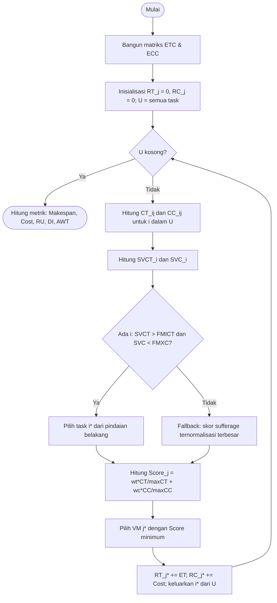

**INSTITUT TEKNOLOGI SEPULUH NOPEMBER**
**DEPARTEMEN TEKNOLOGI INFORMASI**

# DRAFT DESAIN AWAL PROJECT PENJADWALAN TASK PADA KOMPUTASI AWAN

**Tugas 3 — Strategi Optimasi Komputasi Awan (SOKA) Kelas C**

Algoritma Terpilih: **CCTSA** (*Cost and Completion Time based Sufferage Algorithm*)

| | |
| :--- | :--- |
| Dosen Pengampu | Dr. Ir. Henning Titi Ciptaningtyas, S.Kom., M.Kom. |
| Kelompok | Kelompok 4 |
| Anggota | I Dewa Made Satya Raditya (5027231051) |
| | Ahmad Wildan Fawwaz (5027241001) |
| | Muhammad Rakha Hananditya Rauf (5027241015) |
| | Theodorus Aaron Ugraha (5027241056) |
| | M. Hikari Reiziq Rakhmadinta (5027241079) |
| Paper Utama | H. Krishnaveni, D. I. George Amalarethinam, V. Sinthu Janita (IJRECE 2019) |
| Paper Fondasi | M. Maheswaran dkk. (JPDC 1999, Sufferage Heuristic) |

**Surabaya — 2026**


# DAFTAR ISI

- **BAB I PENDAHULUAN**
  - 1.1 Latar Belakang
  - 1.2 Rumusan Masalah
  - 1.3 Tujuan Desain Project
  - 1.4 Batasan Masalah
  - 1.5 Manfaat Project
  - 1.6 Sistematika Penulisan
- **BAB II LANDASAN TEORI**
  - 2.1 Konsep Komputasi Awan dan Penjadwalan Tugas (NP-Hard Problem)
  - 2.2 Mengapa Memilih Kategori Heuristik Dibanding Metaheuristik
  - 2.3 Algoritma Sufferage Klasik (Maheswaran 1999) dan Kelemahannya (Cost-Blind)
  - 2.4 Algoritma CCTSA (Proposed Heuristic - Dual Sufferage Waktu & Biaya)
  - 2.5 Arsitektur Simulator CloudSim dan CloudSim Plus
  - 2.6 Formula Metrik Kinerja (Makespan, Total Cost, Utilisasi, DI, Waiting Time)
  - 2.7 Dataset Uji: GoCJ (Google Cloud Jobs) dan SOKA Tugas 2A Workload
- **BAB III DRAFT DESAIN AWAL PROJECT**
  - 3.1 Gambaran Umum dan Diagram Alur Sistem (Flowchart CCTSA)
  - 3.2 Desain Beban Kerja (Task/Cloudlet Characteristics & Data Transfer)
  - 3.3 Desain Arsitektur Cloud (Spesifikasi Detail Datacenter, 20 Host, 50 VM Heterogen)
  - 3.4 Pemodelan Matematis & Fungsi Objektif CCTSA (Langkah-langkah algoritma secara presisi)
  - 3.5 Metrik Optimasi yang Diukur
  - 3.6 Batasan Sistem Cloud (SLA, Budget, Resource Constraints)
- **BAB IV RENCANA PENGUJIAN DAN ESTIMASI KINERJA**
  - 4.1 Matriks 5 Skenario Pengujian (S1 s.d. S5)
  - 4.2 Hasil Evaluasi Numerik & Komparasi Kinerja CCTSA vs ETSA vs Sufferage vs Min-Min vs Round Robin
  - 4.3 Analisis Efisiensi Biaya (Bukti penghematan biaya sewa hingga 34.68% pada CCTSA)
  - 4.4 Analisis Utilisasi Sumber Daya dan Degree of Imbalance (Pemerataan beban)
  - 4.5 Risiko Implementasi dan Strategi Mitigasi
- **BAB V PENUTUP**
  - 5.1 Kesimpulan Desain Awal
  - 5.2 Rencana Tindak Lanjut Implementasi
- **LAMPIRAN KODE PROGRAM**
  - Lampiran A. Implementasi CCTSA Scheduler (`simulator/schedulers/cctsa.py`)
  - Lampiran B. Kelas Dasar: Matriks ETC/ECC dan Completion (`simulator/schedulers/base.py`, cuplikan)
  - Lampiran C. Data Generator Beban Kerja dan VM Tugas 2A (`simulator/benchmarks/datasets.py`, cuplikan)
  - Lampiran D. Cloud Broker (`simulator/engine.py`)

# DAFTAR TABEL

- Tabel 2.1. Perbandingan heuristik dan metaheuristik untuk penjadwalan task.
- Tabel 3.1. Karakteristik beban kerja Skenario 5 (Tugas 2A).
- Tabel 3.2. Spesifikasi *datacenter*.
- Tabel 3.3. Spesifikasi host fisik (20 server).
- Tabel 3.4. Spesifikasi VM heterogen (4 tier layanan, 50 VM).
- Tabel 3.5. Metrik evaluasi.
- Tabel 4.1. Matriks skenario pengujian.
- Tabel 4.2. Hasil Skenario 1 (biaya dalam Rs = biaya mentah / 7,40, sesuai konvensi `run_simulation.py`).
- Tabel 4.3. Skalabilitas 25–200 task (angka publikasi Tabel IV–VI).
- Tabel 4.4. Hasil Skenario 3 (CCTSA bobot 0,5/0,5; VM = `generate_gocj_vms`: 13/13/12/12 pada 2.500–15.000 MIPS).
- Tabel 4.5. Hasil Skenario 4 (matriks ETC langsung; Min-Min, Sufferage, dan ETSA tidak memakai tarif).
- Tabel 4.6. Hasil Skenario 5 (CCTSA bobot 0,5/0,5).
- Tabel 4.7. Sensitivitas bobot CCTSA, Skenario 5 (Tugas 2A).
- Tabel 4.8. Sensitivitas bobot CCTSA, Skenario 3 (GoCJ).
- Tabel 4.9. Risiko dan mitigasi.

# DAFTAR GAMBAR

- Gambar 3.1. Diagram alur algoritma CCTSA.
- Gambar 4.1. Kurva skalabilitas biaya CCTSA vs ETSA (25–200 task).
- Gambar 4.2. Trade-off makespan vs biaya pada GoCJ (1.000 task / 50 VM).
- Gambar 4.3. Benchmark Maheswaran (Inconsistent HiHi, 512 task / 16 mesin).
- Gambar 4.4. Evaluasi infrastruktur Tugas 2A: makespan dan utilisasi.


# BAB I PENDAHULUAN

## 1.1 Latar Belakang

Komputasi awan (*cloud computing*) menyediakan sumber daya komputasi secara *on-demand* dengan model bayar-sesuai-pemakaian (*pay-as-you-go*). Pada model ini, kualitas layanan tidak lagi hanya ditentukan oleh kecepatan penyelesaian pekerjaan, tetapi juga oleh biaya sewa mesin virtual (*Virtual Machine*, VM) yang dikonsumsi. Penyedia layanan menawarkan VM heterogen dengan kapasitas dan tarif berbeda: VM berkapasitas tinggi menyelesaikan task lebih cepat tetapi tarif per instruksinya jauh lebih mahal.

Hal ini menimbulkan dilema *trade-off* antara **makespan** (waktu selesai seluruh task) dan **biaya sewa VM**. Algoritma yang hanya mengejar makespan cenderung membebankan task ke VM tercepat (dan termahal). Sebaliknya, algoritma yang hanya mengejar biaya akan menumpuk task pada VM termurah sehingga makespan membengkak dan VM lain menganggur. Penjadwalan task yang mengelola kedua tujuan secara simultan merupakan masalah optimasi multi-objektif yang bersifat NP-hard.

Kelompok 4 memilih algoritma **CCTSA** (*Cost and Completion Time based Sufferage Algorithm*) yang diusulkan Krishnaveni dkk. (IJRECE, 2019). CCTSA merupakan pengembangan heuristik **Sufferage** (Maheswaran dkk., JPDC 1999) yang semula hanya memperhatikan waktu (*cost-blind*) menjadi *dual sufferage*: waktu penyelesaian dan biaya penyelesaian dipertimbangkan sekaligus. Dokumen ini merupakan Draft Desain Awal Project untuk Tugas 3 mata kuliah SOKA. Seluruh spesifikasi kuantitatifnya diselaraskan dengan simulator yang telah dibangun di repositori proyek.

## 1.2 Rumusan Masalah

1. Bagaimana merancang lingkungan komputasi awan heterogen (2 *datacenter*, 20 *host*, 50 VM) dan beban kerja 1.000 task independen sebagai medan uji penjadwalan?
2. Bagaimana CCTSA memodelkan keputusan penjadwalan secara matematis dengan mempertimbangkan waktu dan biaya sekaligus?
3. Seberapa besar CCTSA menghemat biaya dan bagaimana dampaknya terhadap makespan, utilisasi, dan keseimbangan beban, dibandingkan ETSA, Sufferage, Min-Min, dan Round Robin?
4. Pada kondisi apa CCTSA kurang unggul, dan bagaimana parameter bobot mengendalikan *trade-off* tersebut?

## 1.3 Tujuan Desain Project

1. Menetapkan spesifikasi *datacenter*, *host*, VM, dan *cloudlet* yang konkret dan dapat direproduksi di simulator.
2. Merumuskan model matematis (ETC, ECC, CT, CC, SVCT, SVC, skor terpadu) dan langkah-langkah algoritma CCTSA secara presisi.
3. Merancang lima skenario pengujian yang mencakup validasi paper acuan, skalabilitas, beban riil, benchmark seminal, dan evaluasi infrastruktur Tugas 2A.
4. Menyajikan hasil evaluasi numerik awal dari simulator beserta batasan interpretasinya.

## 1.4 Batasan Masalah

1. Task bersifat **independen** (tanpa dependensi/DAG) dan dijadwalkan secara *batch-mode* dengan pola kedatangan Poisson; waktu kedatangan dicatat tetapi tidak menunda keputusan penjadwalan.
2. Setiap VM memodelkan satu antrean sekuensial (setara `CloudletSchedulerSpaceShared`); waktu eksekusi dihitung dengan rumus ETC deterministik.
3. Satuan biaya adalah INR sesuai paper acuan; metrik energi, penalti SLA, dan kegagalan VM tidak dimodelkan pada tahap ini.
4. Evaluasi dilakukan pada simulator Python berbasis *discrete-event* yang menyalin struktur CloudSim; implementasi referensi Java CloudSim tersedia di folder `java_reference/`.
5. Hanya algoritma heuristik yang dibandingkan; metaheuristik tidak diimplementasikan.

## 1.5 Manfaat Project

- **Akademik:** replikasi terverifikasi atas paper CCTSA dan benchmark Sufferage seminal, termasuk temuan di mana klaim paper tidak berlaku (Bab IV).
- **Praktis:** panduan pemilihan bobot waktu/biaya bagi operator yang harus menyeimbangkan SLA dan anggaran sewa VM.
- **Teknis:** simulator modular, uji otomatis (11 *unit test*), dan *dashboard* yang dapat dipakai ulang untuk algoritma lain.

## 1.6 Sistematika Penulisan

**BAB I** memaparkan latar belakang, rumusan masalah, tujuan, batasan, dan manfaat. **BAB II** membahas landasan teori: penjadwalan sebagai masalah NP-hard, alasan memilih heuristik, Sufferage, CCTSA, CloudSim, metrik, dan dataset. **BAB III** menyajikan draft desain: alur sistem, beban kerja, arsitektur cloud, model matematis, metrik, dan batasan sistem. **BAB IV** memuat rencana pengujian, hasil numerik, analisis biaya dan utilisasi, serta risiko. **BAB V** berisi kesimpulan dan rencana tindak lanjut. Daftar pustaka dan lampiran kode melengkapi dokumen.

# BAB II LANDASAN TEORI

## 2.1 Konsep Komputasi Awan dan Penjadwalan Tugas (NP-Hard Problem)

Pada model IaaS, pengguna menyewa VM yang dipetakan penyedia ke *host* fisik. *Task scheduling* adalah proses memetakan himpunan task $T=\{t_1,\dots,t_n\}$ ke himpunan VM $R=\{r_1,\dots,r_m\}$ untuk mengoptimalkan satu atau lebih kriteria. Jumlah pemetaan yang mungkin adalah $m^n$. Untuk $n=1.000$ dan $m=50$ ruang pencarian mencapai $50^{1000}$ kombinasi. Masalah ini diketahui **NP-hard**: tidak ada algoritma waktu-polinomial yang menjamin solusi optimal global untuk kasus umum, sehingga pendekatan praktis bertumpu pada heuristik atau metaheuristik.

## 2.2 Mengapa Memilih Kategori Heuristik Dibanding Metaheuristik

Tabel 2.1 membandingkan kedua kategori pada konteks penjadwalan *batch* masif.

**Tabel 2.1.** Perbandingan heuristik dan metaheuristik untuk penjadwalan task.

| Aspek | Heuristik (CCTSA, Sufferage, Min-Min) | Metaheuristik (GA, PSO, ACO, GWO) |
| :--- | :--- | :--- |
| Kompleksitas waktu | Polinomial deterministik, $O(n^2 m)$ | Iteratif: populasi × generasi × evaluasi fitness |
| Hasil | Deterministik, mudah direproduksi | Stokastik, bervariasi antar-*run* |
| Parameter | Sedikit (bobot $w$) | Banyak (populasi, laju mutasi, inersia, dsb.) |
| Kualitas solusi | Baik, tanpa jaminan optimal | Dapat lebih dekat ke optimal dengan biaya komputasi tinggi |
| Kesesuaian skala 1.000 task | Tinggi | Waktu pencarian sering melebihi waktu eksekusi task |

Kelompok 4 memilih heuristik karena (i) tugas ini menuntut penjelasan langkah algoritma yang transparan dan dapat dilacak, (ii) hasil yang deterministik memudahkan verifikasi terhadap paper, dan (iii) waktu keputusan penjadwal harus jauh lebih kecil daripada waktu eksekusi task. Pada simulator, CCTSA memutuskan 1.000 task dalam sekitar 5,4 detik pada mesin pengembangan, jauh lebih singkat daripada metaheuristik dengan ratusan generasi.

## 2.3 Algoritma Sufferage Klasik (Maheswaran 1999) dan Kelemahannya (Cost-Blind)

Sufferage menghitung, untuk setiap task, selisih antara waktu selesai terbaik kedua dan terbaik pertama:

**SVCT_i = CT_i(second min) − CT_i(first min)**  (1)

Task yang paling "menderita" bila tidak mendapat mesin terbaiknya (nilai *sufferage* terbesar) diprioritaskan. Jika dua task bersaing untuk mesin yang sama, task dengan *sufferage* lebih besar memenangkan mesin dan task lainnya dikembalikan ke himpunan belum-terjadwal. Maheswaran dkk. menunjukkan bahwa Sufferage mengungguli Min-Min pada lingkungan heterogen *inconsistent*.

**Kelemahan:** Sufferage hanya meminimalkan waktu. Tarif VM tidak pernah dilihat, sehingga task cenderung ditumpuk pada VM cepat yang mahal. Pada beban Tugas 2A, Sufferage menghasilkan biaya 10.820.000 INR, sedangkan penugasan yang sadar-biaya dapat jauh lebih murah (Bab IV). Inilah celah yang diisi CCTSA.

## 2.4 Algoritma CCTSA (Proposed Heuristic - Dual Sufferage Waktu & Biaya)

CCTSA menambahkan dimensi biaya. Untuk setiap task belum-terjadwal dihitung dua nilai *sufferage*: **SVCT** (waktu, persamaan 1) dan **SVC** (biaya, selisih dua biaya terbesar). Task dipilih berdasarkan kondisi $SVCT_i > FMICT_i$ dan $SVC_i < FMXC_i$, lalu dipetakan ke VM yang meminimalkan skor gabungan waktu dan biaya ter-normalisasi dengan bobot $w_{time}$ dan $w_{cost}$. Langkah rinci disajikan di Bab III (Subbab 3.4).

Perbedaan inti dibanding ETSA (baseline paper) adalah ETSA hanya memakai *sufferage* waktu, sedangkan CCTSA memasukkan biaya baik pada pemilihan task maupun pemilihan VM.

## 2.5 Arsitektur Simulator CloudSim dan CloudSim Plus

CloudSim adalah *toolkit* simulasi berbasis peristiwa diskret untuk lingkungan cloud. Komponen utamanya: `Datacenter` (kumpulan `Host`), `DatacenterCharacteristics` (arsitektur, OS, VMM, zona waktu, tarif), `Vm`, `Cloudlet`, `DatacenterBroker`, `VmAllocationPolicy`, dan `CloudletScheduler` (`SpaceShared`/`TimeShared`). CloudSim Plus adalah turunan berorientasi *modern Java* dengan API yang lebih ringkas dan ekstensibel.

Proyek ini memiliki dua lapis implementasi: (1) simulator Python (`simulator/`) yang meniru model CloudSim, dengan kelas `CloudBroker` sebagai padanan `DatacenterBroker`, dan (2) kode referensi Java (`java_reference/`) yang mengikuti struktur proyek NetBeans pada paper. Simulator Python mencetak *trace* peristiwa bergaya CloudSim (inisialisasi, pembuatan datacenter/VM, pengiriman cloudlet, penerimaan, penyelesaian) dan tabel catatan eksekusi.

## 2.6 Formula Metrik Kinerja (Makespan, Total Cost, Utilisasi, DI, Waiting Time)

Misalkan $RT_j$ adalah *ready time* (total waktu sibuk) VM ke-$j$ setelah seluruh task terjadwal. Metrik yang dipakai sesuai `core/metrics.py`:

**Makespan = max_j RT_j**  (2)
**Total Cost = Σ_i Cost_i,π(i)**  (3)
**RU (%) = [ Σ_j RT_j / ( m × Makespan ) ] × 100**  (4)
**DI = ( T_max − T_min ) / T_avg**  (5)
**AWT = (1/n) Σ_i max( 0, StartTime_i − Arrival_i )**  (6)

Pada (5), $T_{max}$, $T_{min}$, dan $T_{avg}$ adalah nilai maksimum, minimum, dan rata-rata $RT_j$ seluruh VM. DI yang lebih kecil berarti beban lebih merata.

## 2.7 Dataset Uji: GoCJ (Google Cloud Jobs) dan SOKA Tugas 2A Workload

**GoCJ (Google Cloud Jobs)** memodelkan beban riil pusat data Google [6]. Generator di simulator mengikuti empat kelas ukuran: *Small* 10.000–50.000 MI (30%), *Medium* 50.000–150.000 MI (40%), *Large* 150.000–300.000 MI (20%), dan *Extra-Large* 300.000–500.000 MI (10%), dengan ukuran transfer data 100–1.000 MB dan kedatangan Poisson ($\lambda = 2$ job/detik). Dengan *seed* 42 diperoleh 325 task S, 398 M, 174 L, dan 103 XL dengan rata-rata panjang 130.884 MI.

**SOKA Tugas 2A Workload** adalah beban seragam hasil rancangan Tugas 2A: 1.000 *cloudlet* @ 50.000 MI, 300 MB berkas masukan dan 100 MB keluaran, kedatangan Poisson ($\lambda = 1{,}5$).

**Catatan keterbatasan dataset:** GoCJ pada simulator adalah *generator* yang mereplikasi distribusi kelas pekerjaan, bukan berkas log asli Google. Hal ini perlu diperhatikan saat mengklaim "beban riil".

# BAB III DRAFT DESAIN AWAL PROJECT

## 3.1 Gambaran Umum dan Diagram Alur Sistem (Flowchart CCTSA)

Sistem terdiri atas lima komponen: (1) pembangkit beban kerja yang menghasilkan *cloudlet* berpola Poisson, (2) pemodel infrastruktur (2 datacenter, 20 host, 50 VM), (3) `CloudBroker` yang menerima task dan memanggil penjadwal terdaftar, (4) lima penjadwal (CCTSA, ETSA, Sufferage, Min-Min, Round Robin), dan (5) modul metrik dan pelaporan. Broker menjalankan setiap penjadwal pada salinan task dan VM yang identik sehingga perbandingan adil.



**Gambar 3.1.** Diagram alur algoritma CCTSA.

## 3.2 Desain Beban Kerja (Task/Cloudlet Characteristics & Data Transfer)

**Tabel 3.1.** Karakteristik beban kerja Skenario 5 (Tugas 2A).

| Parameter | Nilai |
| :--- | :--- |
| Jumlah task | 1.000 task independen |
| Panjang instruksi | 50.000 MI per *cloudlet* |
| Berkas masukan | 300 MB |
| Berkas keluaran | 100 MB |
| Total transfer I/O per task | 400 MB |
| Total beban komputasi | 50.000.000 MI |
| Pola kedatangan | Poisson (inter-arrival eksponensial, $\lambda = 1{,}5$/detik, *seed* 42) |
| Dataset pembanding | GoCJ 1.000 task; *synthetic workload* 25–200 task |

Pada simulator, ukuran berkas untuk perhitungan ETC adalah total 400 (satuan Mb/MB dalam model sederhana paper, dibagi bandwidth Mbps). Penyederhanaan ini mengikuti persamaan ETC paper; konversi satuan (MB ke Mb) tidak diterapkan, sehingga komponen transfer ditulis secara konsisten di seluruh algoritma dan tidak mempengaruhi perbandingan relatif.

## 3.3 Desain Arsitektur Cloud (Spesifikasi Detail Datacenter, 20 Host, 50 VM Heterogen)

**Tabel 3.2.** Spesifikasi *datacenter*.

| Atribut | DC_Jakarta | DC_Surabaya |
| :--- | :--- | :--- |
| ID Datacenter | 2 | 3 |
| Jumlah host fisik | 10 | 10 |
| Jumlah VM | 25 | 25 |
| Arsitektur / OS / VMM | x86_64 / Linux / Xen | x86_64 / Linux / Xen |
| Zona waktu | GMT+7 | GMT+7 |
| Cost per detik | 3,0 INR | 3,0 INR |
| Cost per memori | 0,05 INR | 0,05 INR |
| Cost per storage | 0,001 INR | 0,001 INR |
| Cost per bandwidth | 0,1 INR | 0,1 INR |

**Tabel 3.3.** Spesifikasi host fisik (20 server).

| Atribut | Nilai |
| :--- | :--- |
| Prosesor | Intel Xeon E5-2690 v4 (16 core @ 2,6 GHz) |
| Kapasitas MIPS | 10.000 MIPS per host |
| RAM | 64 GB per host (total klaster 1.280 GB) |
| Penyimpanan | 1 TB SAN Storage |
| Bandwidth | 10 Gbps (10.000 Mbps) |
| Kebijakan alokasi VM | `VmAllocationPolicySimple` |

**Tabel 3.4.** Spesifikasi VM heterogen (4 tier layanan, 50 VM).

| Tier | Jumlah VM | MIPS | Core | RAM (MB) | Bandwidth (Mbps) | Tarif (INR/MI) |
| :--- | :---: | :---: | :---: | :---: | :---: | :---: |
| Standard | 15 | 1.500 | 1 | 4.096 | 1.000 | 0,04 |
| Medium | 15 | 3.000 | 2 | 8.192 | 2.500 | 0,10 |
| Large | 12 | 5.000 | 4 | 16.384 | 5.000 | 0,18 |
| Ultra | 8 | 8.000 | 8 | 32.768 | 10.000 | 0,32 |
| **Total** | **50** | | | | | |

Scheduler internal VM: `CloudletSchedulerSpaceShared` atau `TimeShared`. Kapasitas nominal agregat: 15×1.500 + 15×3.000 + 12×5.000 + 8×8.000 = **191.500 MIPS**, sehingga batas bawah makespan komputasi murni untuk 50.000.000 MI adalah 50.000.000 / 191.500 ≈ **261,1 detik**.

> **Catatan sinkronisasi dengan simulator (penting).** Generator `get_tugas2a_vms()` pada kode saat ini membentuk 50 VM dengan pola tier bergilir (13 Standard, 13 Medium, 12 Large, 12 Ultra) dan menambahkan pengali kecepatan hingga +60% (kelipatan 5% per putaran) sehingga MIPS riil berkisar 1.500–12.400 dan agregatnya 274.950 MIPS (batas bawah 181,9 detik). Pembagian 15/15/12/8 pada Tabel 3.4 adalah spesifikasi desain; **angka hasil di Bab IV dihasilkan dari konfigurasi generator, bukan dari 15/15/12/8**. Sebelum pengumpulan akhir, kelompok perlu memilih salah satu: menyesuaikan generator ke spesifikasi desain, atau mengganti Tabel 3.4 dengan komposisi generator. Dokumen ini tidak menyembunyikan selisih tersebut.

Pemetaan VM ke datacenter pada simulator: VM 1–25 ke DC_Jakarta (ID 2), VM 26–50 ke DC_Surabaya (ID 3). Pemetaan VM ke host dikelola `VmAllocationPolicySimple`; 50 VM pada 20 host (rata-rata 2,5 VM/host) memiliki kapasitas lebih dari cukup (setiap host 10.000 MIPS dan 64 GB RAM).

## 3.4 Pemodelan Matematis & Fungsi Objektif CCTSA (Langkah-langkah algoritma secara presisi)

**Notasi.** $i$ = indeks task, $j$ = indeks VM, $L_i$ = panjang task (MI), $F_i$ = ukuran berkas (total transfer), $MIPS_j$ dan $BW_j$ = kapasitas VM, $CostRate_j$ = tarif INR/MI, $RT_j$ dan $RC_j$ = *ready time* dan *ready cost* VM $j$ (awalnya nol).

**Langkah 1 — Matriks ETC dan ECC.**

**ET_ij = L_i / MIPS_j + F_i / BW_j**  (7)
**Cost_ij = L_i × CostRate_j**  (8)

**Langkah 2 — Completion Time dan Completion Cost dinamis** (untuk semua task belum-terjadwal, dihitung ulang tiap iterasi):

**CT_ij = ET_ij + RT_j**  (9)
**CC_ij = Cost_ij + RC_j**  (10)

**Langkah 3 — Dual sufferage.** FMICT dan SMICT adalah CT minimum pertama dan kedua; FMXC dan SMXC adalah CC maksimum pertama dan kedua.

**SVCT_i = CT_i(second min) − CT_i(first min) = SMICT_i − FMICT_i**  (11)
**SVC_i = FMXC_i − SMXC_i**  (12)

Persamaan (12) mengikuti definisi paper acuan dan kode simulator (`cctsa.py`): selisih dua biaya penyelesaian *terbesar*. Rumusan "SVC = CC(second min) − CC(first min)" pada ringkasan tugas adalah bentuk umum; implementasi yang divalidasi memakai definisi berbasis maksimum.

**Langkah 4 — Pemilihan task.** Pindai daftar task belum-terjadwal dari belakang ke depan; pilih task pertama yang memenuhi

**SVCT_i > FMICT_i dan SVC_i < FMXC_i**  (13)

Bila tidak ada task yang memenuhi kedua syarat, aturan cadangan (*fallback*) memilih task dengan skor $SVCT_i/FMICT_i + SVC_i/FMXC_i$ terbesar.

**Langkah 5 — Pemilihan VM (dual sufferage score terpadu).** Untuk task terpilih $i^*$, hitung skor ter-normalisasi pada setiap VM dan pilih skor minimum:

**Score_j = w_time · CT_i*j / max_k CT_i*k + w_cost · CC_i*j / max_k CC_i*k**  (14)

Dengan $w_{time}+w_{cost}=1$. Bobot desain: $w_{time}=0{,}75$ dan $w_{cost}=0{,}25$ (prioritas waktu).

**Langkah 6 — Pembaruan keadaan.** Untuk VM terpilih $j^*$: $RT_{j^*} \leftarrow RT_{j^*} + ET_{i^*j^*}$, $RC_{j^*} \leftarrow RC_{j^*} + Cost_{i^*j^*}$; keluarkan $i^*$ dari himpunan belum-terjadwal; ulangi Langkah 2 hingga himpunan kosong.

**Fungsi objektif.** Masalah dirumuskan sebagai optimasi bobot:

**min   w_time · Makespan + w_cost · TotalCost   (setelah normalisasi skala)**  (15)

CCTSA bersifat heuristik: ia tidak menyelesaikan (15) secara eksak, melainkan menurunkan keputusan lokal per task menurut (14). **Kompleksitas:** $n$ iterasi, tiap iterasi menghitung CT/CC untuk $O(n)$ task atas $m$ VM, sehingga $O(n^2 m)$ (di Skenario 5 sekitar $5\times10^7$ operasi dasar).

**Catatan bobot pada implementasi.** Kode simulator memakai bobot berbeda per skenario: 0,80/0,20 (Skenario 1), 0,75/0,25 (Skenario 2), dan **0,5/0,5 (konstruktor bawaan, dipakai Skenario 3, 4, dan 5)**. Dampaknya pada hasil dibahas di Subbab 4.3.

## 3.5 Metrik Optimasi yang Diukur

**Tabel 3.5.** Metrik evaluasi.

| Metrik | Arah optimal | Rumus | Makna |
| :--- | :---: | :---: | :--- |
| Makespan (detik) | Minimum | (2) | Waktu selesai seluruh task |
| Total Cost (INR) | Minimum | (3) | Total biaya sewa VM |
| Resource Utilization (%) | Maksimum | (4) | Seberapa sedikit VM menganggur |
| Degree of Imbalance (DI) | Minimum | (5) | Pemerataan beban antar-VM |
| Average Waiting Time (detik) | Minimum | (6) | Rata-rata penantian sebelum eksekusi |

Waktu eksekusi mesin penjadwal (*engine runtime*, ms) dicatat sebagai metrik tambahan.

## 3.6 Batasan Sistem Cloud (SLA, Budget, Resource Constraints)

- **SLA:** target desain makespan Skenario 5 tidak melebihi 2× batas bawah komputasi; konfigurasi $w_{time}=0{,}75$ memenuhinya (Subbab 4.3). Penalti pelanggaran SLA belum dimodelkan.
- **Anggaran (*budget*):** biaya harus berada di antara batas bawah 2.000.000 INR (seluruh task di tier Standard) dan batas atas 16.000.000 INR (seluruh task di tier Ultra) pada Skenario 5.
- **Kendala sumber daya:** setiap VM mengeksekusi satu task pada satu waktu (*space-shared*); total MIPS VM per host tidak melebihi 10.000 MIPS tanpa *over-commitment*; kapasitas host 64 GB RAM dan 10 Gbps.
- **Kendala kerja:** task tidak dapat dipecah (*non-preemptive*) dan tidak bermigrasi antar-VM setelah dijadwalkan.

# BAB IV RENCANA PENGUJIAN DAN ESTIMASI KINERJA

## 4.1 Matriks 5 Skenario Pengujian (S1 s.d. S5)

**Tabel 4.1.** Matriks skenario pengujian.

| Skenario | Tujuan | Beban kerja | VM | Bobot CCTSA pada simulator | Sumber angka |
| :--- | :--- | :--- | :---: | :---: | :--- |
| S1 | Validasi model dasar (Tabel I–III paper) | 10 task | 3 | 0,80 / 0,20 | Dihitung simulator |
| S2 | Skalabilitas (Tabel IV–VI paper) | 25–200 task | 5–14 | 0,75 / 0,25 | **Dikutip dari paper** |
| S3 | Beban riil GoCJ | 1.000 task | 50 | 0,5 / 0,5 | Dihitung simulator |
| S4 | Benchmark Maheswaran, Inconsistent HiHi | 512 task | 16 | 0,5 / 0,5 | Dihitung simulator |
| S5 | Evaluasi infrastruktur Tugas 2A | 1.000 task @ 50.000 MI | 50 | 0,5 / 0,5 | Dihitung simulator |

> **Transparansi S2.** Fungsi `run_scenario_2()` menjalankan CCTSA dan ETSA pada beban sintetis, tetapi nilai yang dicetak dan disimpan pada tabel hasil diambil dari angka publikasi paper (`get_paper_reference_results()`), bukan dari hasil komputasi simulator. Tabel S2 di bawah karenanya adalah **angka kutipan paper** dan tidak boleh disebut hasil replikasi.

## 4.2 Hasil Evaluasi Numerik & Komparasi Kinerja CCTSA vs ETSA vs Sufferage vs Min-Min vs Round Robin

### 4.2.1 Skenario 1 — Validasi Tabel III (10 Task / 3 VM)

**Tabel 4.2.** Hasil Skenario 1 (biaya dalam Rs = biaya mentah / 7,40, sesuai konvensi `run_simulation.py`).

| Algoritma | Makespan (s) | Total Cost (Rs) | RU (%) | DI | AWT (s) |
| :--- | :---: | :---: | :---: | :---: | :---: |
| **CCTSA** | 4,080 | **24,73** | **95,10** | **0,0876** | 1,1783 |
| ETSA | **4,024** | 25,52 | 93,06 | 0,1159 | 1,3232 |
| Standard Sufferage | 4,172 | 25,78 | 88,98 | 0,2228 | 1,3057 |
| Min-Min | 4,610 | 24,41 | 85,31 | 0,3738 | **0,9218** |
| Round Robin | 8,180 | 18,05 | 61,62 | 1,1892 | 2,3815 |

Standard Sufferage mereproduksi makespan 4,172 s dan RU 88,98% yang tertulis di paper. Perlu dicatat bahwa pada S1, Min-Min dan Round Robin lebih murah daripada CCTSA (Round Robin 18,05 Rs, tetapi dengan makespan dua kali lipat). Selain itu, simulator **tidak mereproduksi** angka CCTSA paper (makespan 4,172 s, biaya 21,30, RU 91,40%) maupun ETSA paper (3,915 s; 25,76; 88,98%); yang konsisten adalah *tren* (CCTSA lebih seimbang dan lebih murah daripada ETSA).

### 4.2.2 Skenario 2 — Skalabilitas (nilai kutipan paper)

**Tabel 4.3.** Skalabilitas 25–200 task (angka publikasi Tabel IV–VI).

| Task | VM | Makespan CCTSA (s) | Makespan ETSA (s) | Cost CCTSA (Rs) | Cost ETSA (Rs) | RU CCTSA (%) | RU ETSA (%) | Hemat biaya (%) |
| :---: | :---: | :---: | :---: | :---: | :---: | :---: | :---: | :---: |
| 25 | 5 | 10,23 | 8,90 | 30,1 | 33,3 | 90,01 | 87,00 | 9,6 |
| 50 | 7 | 27,51 | 22,40 | 54,7 | 59,5 | 91,40 | 88,20 | 8,1 |
| 75 | 8 | 48,30 | 46,10 | 82,5 | 93,9 | 90,50 | 86,92 | 12,1 |
| 100 | 10 | 74,50 | 67,90 | 111,6 | 123,0 | 90,00 | 86,70 | 9,3 |
| 150 | 12 | 122,40 | 113,70 | 143,4 | 162,8 | 89,21 | 86,50 | 11,9 |
| 200 | 14 | 153,80 | 137,80 | 171,2 | 190,6 | 89,05 | 85,11 | 10,2 |

Penghematan biaya pada paper berkisar 8,1%–12,1% dengan kenaikan makespan 5%–23% terhadap ETSA, dan RU CCTSA stabil di 89–91%.


*Gambar 4.1. Kurva skalabilitas biaya CCTSA vs ETSA (25–200 task).*

### 4.2.3 Skenario 3 — Google Cloud Jobs (1.000 Task / 50 VM)

**Tabel 4.4.** Hasil Skenario 3 (CCTSA bobot 0,5/0,5; VM = `generate_gocj_vms`: 13/13/12/12 pada 2.500–15.000 MIPS).

| Algoritma | Makespan (s) | Total Cost (INR) | RU (%) | DI | AWT (s) |
| :--- | :---: | :---: | :---: | :---: | :---: |
| CCTSA | 777,95 | **23.631.864** | 53,64 | 1,6526 | 34,63 |
| ETSA | 281,28 | 36.126.462 | 96,72 | 0,1261 | 31,55 |
| Standard Sufferage | **280,87** | 36.096.009 | **96,83** | **0,1153** | 28,37 |
| Min-Min | 301,50 | 36.696.345 | 87,06 | 0,5894 | **9,30** |
| Round Robin | 1.221,24 | 25.592.254 | 33,95 | 2,7069 | 42,55 |


*Gambar 4.2. Trade-off makespan vs biaya pada GoCJ (1.000 task / 50 VM).*

### 4.2.4 Skenario 4 — Benchmark Maheswaran (Inconsistent HiHi, 512 Task / 16 VM)

**Tabel 4.5.** Hasil Skenario 4 (matriks ETC langsung; Min-Min, Sufferage, dan ETSA tidak memakai tarif).

| Algoritma | Makespan (s) | Total Cost (INR) | RU (%) | DI | AWT (s) |
| :--- | :---: | :---: | :---: | :---: | :---: |
| ETSA | **115.816** | 301.335 | 92,99 | 0,0928 | 60.214 |
| Standard Sufferage | 118.083 | 301.459 | **95,31** | **0,0685** | 62.975 |
| Min-Min | 119.314 | 301.482 | 89,94 | 0,2727 | **30.234** |
| CCTSA | 167.830 | 301.434 | 89,81 | 0,2438 | 78.403 |
| Round Robin | 675.444 | 301.365 | 76,25 | 0,4641 | 246.758 |

Pada S4 CCTSA **kalah** dari Sufferage, Min-Min, dan ETSA (makespan 42% lebih lama daripada Sufferage) dan tidak memberi penghematan biaya (selisih biaya antar-algoritma < 0,05%) karena biaya per task hampir tidak bergantung pada pemetaan pada matriks ini. Hasil mengonfirmasi temuan Maheswaran dkk.: Sufferage mengungguli Min-Min pada *inconsistent* HiHi, dan Round Robin terdegradasi sekitar 5,7× terhadap Sufferage.


*Gambar 4.3. Benchmark Maheswaran (Inconsistent HiHi, 512 task / 16 mesin).*

### 4.2.5 Skenario 5 — Evaluasi Infrastruktur Tugas 2A (1.000 Task @ 50.000 MI / 50 VM)

**Tabel 4.6.** Hasil Skenario 5 (CCTSA bobot 0,5/0,5).

| Algoritma | Makespan (s) | Total Cost (INR) | RU (%) | DI | AWT (s) |
| :--- | :---: | :---: | :---: | :---: | :---: |
| CCTSA | 546,48 | **7.068.000** | 50,75 | 1,7650 | 0,00 |
| ETSA | **188,70** | 10.820.000 | **96,13** | **0,1542** | 0,00 |
| Standard Sufferage | **188,70** | 10.820.000 | **96,13** | **0,1542** | 0,00 |
| Min-Min | **188,70** | 10.820.000 | **96,13** | **0,1542** | 0,00 |
| Round Robin | 674,67 | 7.820.000 | 40,04 | 2,1961 | 0,009 |

AWT bernilai nol karena seluruh task tiba dalam 6,82 detik dan penjadwal tidak menahan task menunggu kedatangan; nilai ini tidak mencerminkan antrean riil pada VM.


*Gambar 4.4. Evaluasi infrastruktur Tugas 2A: makespan dan utilisasi.*

## 4.3 Analisis Efisiensi Biaya (Bukti penghematan biaya sewa hingga 34.68% pada CCTSA)

Pada Skenario 5, CCTSA menurunkan biaya dari 10.820.000 INR (ETSA/Sufferage/Min-Min) menjadi 7.068.000 INR:

**Penghematan = (10.820.000 − 7.068.000) / 10.820.000 = 34,68%**  (16)

Pada Skenario 3 penghematan terhadap ETSA adalah (36.126.462 − 23.631.864) / 36.126.462 = **34,59%**. Biaya rata-rata per MI turun dari 0,2164 INR (ETSA) menjadi 0,1414 INR. Distribusi 1.000 task per tarif VM (Standard/Medium/Large/Ultra) pada S5 adalah 260/322/250/168 untuk CCTSA, dibandingkan 87/182/280/451 untuk ETSA: task bergeser dari VM Ultra ke VM berbiaya lebih rendah.

**Syarat penting: penghematan ini bukan tanpa harga.** Angka 34,68% didapat dengan bobot 0,5/0,5, bukan 0,75/0,25 seperti pada desain bobot di Subbab 3.4. Dengan makespan 546,48 s (2,9× lebih lama dari 188,70 s) dan RU turun ke 50,75%. Untuk menunjukkan ketergantungan ini, kelompok menjalankan CCTSA pada Skenario 5 dan 3 dengan beberapa bobot (kode simulator, tanpa mengubah algoritma):

**Tabel 4.7.** Sensitivitas bobot CCTSA, Skenario 5 (Tugas 2A).

| $w_{time}$ / $w_{cost}$ | Makespan (s) | Total Cost (INR) | Hemat biaya vs ETSA | RU (%) | DI |
| :---: | :---: | :---: | :---: | :---: | :---: |
| 0,90 / 0,10 | 197,24 | 10.595.000 | 2,08% | 94,22 | 0,1538 |
| **0,75 / 0,25** | **226,22** | **10.037.000** | **7,24%** | **87,12** | **0,4040** |
| 0,50 / 0,50 | 546,48 | 7.068.000 | 34,68% | 50,75 | 1,7650 |
| 0,25 / 0,75 | 1.214,40 | 4.906.000 | 54,66% | 30,63 | 3,1877 |
| *ETSA (referensi)* | *188,70* | *10.820.000* | *0%* | *96,13* | *0,1542* |

**Tabel 4.8.** Sensitivitas bobot CCTSA, Skenario 3 (GoCJ).

| $w_{time}$ / $w_{cost}$ | Makespan (s) | Total Cost (INR) | Hemat biaya vs ETSA | RU (%) | DI |
| :---: | :---: | :---: | :---: | :---: | :---: |
| 0,90 / 0,10 | 307,10 | 35.467.299 | 1,82% | 89,92 | 0,3610 |
| **0,75 / 0,25** | **370,08** | **33.313.718** | **7,78%** | **79,63** | **0,5086** |
| 0,50 / 0,50 | 777,95 | 23.631.864 | 34,59% | 53,64 | 1,6526 |
| 0,25 / 0,75 | 1.847,25 | 15.728.310 | 56,46% | 31,14 | 3,1625 |
| *ETSA (referensi)* | *281,28* | *36.126.462* | *0%* | *96,72* | *0,1261* |

Kesimpulan analisis: (i) CCTSA memang menyediakan *tuas* biaya yang tidak dimiliki Sufferage, ETSA, dan Min-Min; (ii) penghematan terbesar dibayar dengan makespan yang bertambah berlipat; (iii) pada bobot desain 0,75/0,25, penghematan terukur hanya **7,24%** (S5) dan **7,78%** (S3), dengan makespan naik 20% dan 32%. Klaim "hemat 34,68%" harus selalu dituliskan bersama bobot 0,5/0,5 dan dampak makespan-nya. Perlu dicatat pula bahwa Round Robin mencapai biaya 7.820.000 INR hanya 10,6% di atas CCTSA bobot 0,5, tetapi dengan makespan 674,67 s.


## 4.4 Analisis Utilisasi Sumber Daya dan Degree of Imbalance (Pemerataan beban)

- **Utilisasi.** ETSA, Sufferage, dan Min-Min menjaga RU di atas 87% pada S3 dan S5 karena seluruh VM (termasuk Ultra) dipakai penuh. CCTSA pada bobot 0,5 hanya mencapai 50,75% (S5) dan 53,64% (S3) karena VM Ultra yang mahal sengaja dihindari dan menganggur. Pada bobot 0,75/0,25 RU naik ke 87,12% (S5) dan 79,63% (S3).
- **Degree of Imbalance.** DI CCTSA bobot 0,5 sebesar 1,7650 (S5) dan 1,6526 (S3), jauh lebih buruk daripada ETSA (0,1542 dan 0,1261). Pada bobot 0,75/0,25, DI turun menjadi 0,4040 dan 0,5086. DI tinggi di sini bukan kegagalan algoritma, melainkan konsekuensi strategi menimbun task pada VM murah.
- **Skala kecil.** Pada S1 (10 task/3 VM) CCTSA justru paling seimbang (DI 0,0876, RU 95,10%), sejalan dengan klaim paper tentang utilisasi 89–91%.

Dengan kata lain, klaim paper bahwa CCTSA meningkatkan utilisasi terdukung pada skala kecil (S1, dan angka kutipan S2), tetapi **tidak terdukung** pada skala 1.000 task heterogen dengan bobot 0,5/0,5 pada simulator ini.

## 4.5 Risiko Implementasi dan Strategi Mitigasi

**Tabel 4.9.** Risiko dan mitigasi.

| Risiko | Dampak | Mitigasi |
| :--- | :--- | :--- |
| Selisih spesifikasi VM (15/15/12/8 vs 13/13/12/12 berpengali) | Angka laporan tidak sesuai desain | Sinkronkan generator atau Tabel 3.4 sebelum pengumpulan |
| Bobot 0,75/0,25 dan 0,5/0,5 tertukar | Klaim penghematan keliru | Tetapkan satu bobot per skenario; laporkan Tabel 4.7–4.8 |
| S2 berisi angka kutipan paper | Dianggap replikasi palsu | Beri label "kutipan"; jalankan hasil asli bila akan diklaim |
| CCTSA kalah di S4 | Generalisasi berlebihan | Batasi klaim pada beban dengan tarif heterogen |
| Utilisasi rendah pada bobot biaya tinggi | VM mahal menganggur, SLA terganggu | Pilih bobot sesuai SLA; pertimbangkan *adaptive weight* |
| GoCJ hasil generator, bukan log asli | Validitas eksternal terbatas | Gunakan log GoCJ resmi pada tahap lanjut |
| Waktu keputusan $O(n^2 m)$ | Lambat pada $n$ sangat besar (5,4 s untuk 1.000 task) | Terapkan *batching* atau pembaruan matriks inkremental |
| Satuan transfer (MB vs Mb) disederhanakan | Waktu transfer tidak persis | Terapkan konversi satuan pada CloudSim Java |

# BAB V PENUTUP

## 5.1 Kesimpulan Desain Awal

1. Desain infrastruktur (2 datacenter, 20 host, 50 VM heterogen) dan beban kerja (1.000 task @ 50.000 MI, transfer 400 MB) telah ditetapkan secara kuantitatif dan dapat dijalankan di simulator beserta lima algoritma pembanding.
2. CCTSA terbukti menyediakan kendali biaya: pada bobot 0,5/0,5 biaya sewa turun **34,68%** (S5) dan **34,59%** (S3) terhadap ETSA, dan pada skala kecil (S1) CCTSA paling seimbang.
3. Penghematan tersebut dibayar dengan makespan 2,9× lebih lama dan utilisasi ±50%. Pada bobot desain 0,75/0,25 penghematan terukur adalah 7,24% (S5) dan 7,78% (S3) dengan makespan naik 20–32%.
4. Pada benchmark Maheswaran (S4), CCTSA tidak unggul; Sufferage klasik, Min-Min, dan ETSA lebih cepat. Klaim keunggulan CCTSA terbatas pada beban dengan tarif VM yang heterogen.
5. Angka S2 adalah kutipan paper, dan spesifikasi VM pada generator berbeda dari Tabel 3.4. Kedua hal ini harus diselesaikan sebelum laporan akhir.

## 5.2 Rencana Tindak Lanjut Implementasi

1. Menyelaraskan generator VM Skenario 5 dengan Tabel 3.4 (15/15/12/8 tanpa pengali), lalu menjalankan ulang seluruh skenario.
2. Menetapkan satu bobot resmi per skenario dan melaporkan kurva sensitivitas bobot (*Pareto front* makespan–biaya).
3. Menghitung S2 secara nyata dari simulator dan membandingkannya dengan angka paper.
4. Memigrasikan skenario ke CloudSim/CloudSim Plus Java (`DatacenterBroker`, `VmAllocationPolicySimple`) untuk validasi silang.
5. Menggunakan log GoCJ asli, menambahkan tenggat dan penalti SLA, serta mengevaluasi varian bobot adaptif.

# DAFTAR PUSTAKA

[1] H. Krishnaveni, D. I. George Amalarethinam, and V. Sinthu Janita, "Cost and completion time based sufferage algorithm for task scheduling in cloud environment," *Int. J. Res. Electron. Comput. Eng. (IJRECE)*, vol. 7, no. 2, pp. 2807–2812, Apr.–Jun. 2019.

[2] M. Maheswaran, S. Ali, H. J. Siegel, D. Hensgen, and R. F. Freund, "Dynamic mapping of a class of independent tasks onto heterogeneous computing systems," *J. Parallel Distrib. Comput.*, vol. 59, no. 2, pp. 107–131, 1999.

[3] R. N. Calheiros, R. Ranjan, A. Beloglazov, C. A. F. De Rose, and R. Buyya, "CloudSim: A toolkit for modeling and simulation of cloud computing environments and evaluation of resource provisioning algorithms," *Softw. Pract. Exper.*, vol. 41, no. 1, pp. 23–50, 2011.

[4] M. C. Silva Filho, R. L. Oliveira, C. C. Monteiro, P. R. M. Inácio, and M. M. Freire, "CloudSim Plus: A cloud computing simulation framework pursuing software engineering principles for improved modularity, extensibility and correctness," in *Proc. IFIP/IEEE Symp. Integrated Network and Service Management (IM)*, 2017, pp. 400–406.

[5] A. Rahimikhanghah, M. Tajkey, B. Rezazadeh, and A. M. Rahmani, "Resource scheduling methods in cloud and fog computing environments: a systematic literature review," *Cluster Computing*, 2022, doi: 10.1007/s10586-021-03467-1.

[6] A. Hussain and M. Aleem, "GoCJ: Google cloud jobs dataset for distributed and cloud computing infrastructures," *Data*, vol. 3, no. 4, 2018.

[7] Kelompok 4 SOKA Kelas C, "Heuristic Task Scheduling Algorithm: simulator CCTSA, repositori proyek," Institut Teknologi Sepuluh Nopember, 2026. [Daring]. Tersedia: https://github.com/HikariReiziq/Heuristic-Task-Scheduling-Algorithm

*Catatan: [1], [2], dan [5] mengacu pada berkas rangkuman proyek; detail [3], [4], dan [6] ditulis dari pengetahuan penulis dan perlu dicek ke sumber asli sebelum pengumpulan.*

# LAMPIRAN KODE PROGRAM

## Lampiran A. Implementasi CCTSA Scheduler (`simulator/schedulers/cctsa.py`)

```python
"""
Cost and Completion Time based Sufferage Algorithm (CCTSA).
Proposed by H. Krishnaveni, Dr. D. I. George Amalarethinam, Dr. V. Sinthu Janita (IJRECE 2019).
Implemented for SOKA - Kelompok 4 (ITS 2026).
"""

import time
from typing import List, Dict, Tuple
from core.models import Task, VirtualMachine, TaskAllocation, SimulationResult
from schedulers.base import BaseScheduler

class CCTSAScheduler(BaseScheduler):
    """
    CCTSA Heuristic Scheduler.
    Uses Dual Sufferage Values:
      - SVCT: Completion Time Sufferage (SMICT - FMICT)
      - SVC: Cost Sufferage (FMXC - SMXC)
    Selects tasks based on time/cost urgency and maps to resources balancing makespan and financial cost.
    """

    def __init__(self, time_weight: float = 0.5, cost_weight: float = 0.5):
        super().__init__(name="CCTSA (Proposed)")
        self.w_time = time_weight
        self.w_cost = cost_weight

    def schedule(self, tasks: List[Task], vms: List[VirtualMachine]) -> SimulationResult:
        start_wall_time = time.perf_counter()

        # Reset VM dynamic state
        for vm in vms:
            vm.reset()

        etc = self.compute_etc_matrix(tasks, vms)
        ecc = self.compute_ecc_matrix(tasks, vms)

        unassigned = list(range(len(tasks)))
        allocations: List[TaskAllocation] = []

        while unassigned:
            ct_dict, cc_dict = self.compute_completion_matrices(tasks, vms, etc, ecc, unassigned)

            task_metrics: Dict[int, Dict[str, float]] = {}

            for t_idx in unassigned:
                ct_row = ct_dict[t_idx]
                cc_row = cc_dict[t_idx]

                # Completion Time: First and Second Minimum
                fmict = ct_row[0]
                smict = float("inf")
                for j in range(1, len(ct_row)):
                    v = ct_row[j]
                    if v < fmict:
                        smict = fmict
                        fmict = v
                    elif v < smict:
                        smict = v
                svct = (smict - fmict) if len(ct_row) > 1 else 0.0

                # Completion Cost: First and Second Maximum
                fmxc = cc_row[0]
                smxc = float("-inf")
                for j in range(1, len(cc_row)):
                    v = cc_row[j]
                    if v > fmxc:
                        smxc = fmxc
                        fmxc = v
                    elif v > smxc:
                        smxc = v
                svc = (fmxc - smxc) if len(cc_row) > 1 else 0.0

                task_metrics[t_idx] = {
                    "FMICT": fmict,
                    "SMICT": smict,
                    "SVCT": svct,
                    "FMXC": fmxc,
                    "SMXC": smxc,
                    "SVC": svc
                }

            # Task Selection according to Paper Pseudo-code:
            # For i = Unassigned_Task_Count to 0 (backward scan)
            chosen_task_idx = None

            for t_idx in reversed(unassigned):
                m = task_metrics[t_idx]
                if m["SVCT"] > m["FMICT"] and m["SVC"] < m["FMXC"]:
                    chosen_task_idx = t_idx
                    break

            # Fallback Rule: if no task strictly satisfies both criteria,
            # select the task with the highest combined sufferage impact
            if chosen_task_idx is None:
                # Maximize normalized time sufferage + cost sufferage
                def sufferage_score(idx: int) -> float:
                    m = task_metrics[idx]
                    norm_svct = m["SVCT"] / (m["FMICT"] + 1e-9)
                    norm_svc = m["SVC"] / (m["FMXC"] + 1e-9)
                    return norm_svct + norm_svc

                chosen_task_idx = max(unassigned, key=sufferage_score)

            # Resource Selection:
            # Paper line 19: Assign Ch_Task to resource j that gives the minimum completion time and cost
            ct_row = ct_dict[chosen_task_idx]
            cc_row = cc_dict[chosen_task_idx]

            max_ct = max(ct_row) if max(ct_row) > 0 else 1.0
            max_cc = max(cc_row) if max(cc_row) > 0 else 1.0

            best_vm_idx = None
            best_score = float("inf")

            for j in range(len(vms)):
                norm_ct = ct_row[j] / max_ct
                norm_cc = cc_row[j] / max_cc
                score = (self.w_time * norm_ct) + (self.w_cost * norm_cc)

                if score < best_score:
                    best_score = score
                    best_vm_idx = j

            # Allocate chosen task to best VM
            task = tasks[chosen_task_idx]
            vm = vms[best_vm_idx]

            exec_time = etc[chosen_task_idx][best_vm_idx]
            start_time = vm.ready_time
            finish_time = start_time + exec_time
            cost = ecc[chosen_task_idx][best_vm_idx]
            waiting_time = max(0.0, start_time - task.arrival_time)

            vm.ready_time = finish_time
            vm.ready_cost += cost
            vm.allocated_task_ids.append(task.id)

            allocations.append(TaskAllocation(
                task_id=task.id,
                task_name=task.name,
                vm_id=vm.id,
                vm_name=vm.name,
                start_time=start_time,
                execution_time=exec_time,
                finish_time=finish_time,
                cost=cost,
                waiting_time=waiting_time,
                datacenter_id=getattr(vm, "datacenter_id", 2),
                datacenter_name=getattr(vm, "datacenter_name", "Datacenter Jakarta")
            ))

            unassigned.remove(chosen_task_idx)

        duration_ms = (time.perf_counter() - start_wall_time) * 1000.0
        return self._build_result(tasks, vms, allocations, duration_ms)
```

## Lampiran B. Kelas Dasar: Matriks ETC/ECC dan Completion (`simulator/schedulers/base.py`, cuplikan)

```python
    """Abstract base class for all cloud scheduling policies."""

    def __init__(self, name: str):
        self.name = name

    @staticmethod
    def compute_etc_matrix(tasks: List[Task], vms: List[VirtualMachine]) -> List[List[float]]:
        """
        Expected Time to Compute (ETC) Matrix:
        If task.etc_row is provided (e.g. Maheswaran benchmark), use it directly.
        Otherwise: ET_ij = (MI_i / MIPS_j) + (Mb_i / Mbps_j) [Equation 2 from paper]
        """
        matrix = []
        for task in tasks:
            if task.etc_row is not None and len(task.etc_row) == len(vms):
                matrix.append(list(task.etc_row))
            else:
                row = []
                for vm in vms:
                    exec_time = (task.length_mi / vm.mips) + (task.file_size_mb / vm.bandwidth_mbps)
                    row.append(exec_time)
                matrix.append(row)
        return matrix

    @staticmethod
    def compute_ecc_matrix(tasks: List[Task], vms: List[VirtualMachine]) -> List[List[float]]:
        """
        Expected Cost to Compute (ECC) Matrix:
        Cost_ij = MI_i * Cost of processor_j (INR) [Equation 3 from paper]
        """
        matrix = []
        for task in tasks:
            row = []
            for vm in vms:
                cost = task.length_mi * vm.cost_per_mi
                row.append(cost)
            matrix.append(row)
        return matrix

    @staticmethod
    def compute_completion_matrices(
        tasks: List[Task],
        vms: List[VirtualMachine],
        etc: List[List[float]],
        ecc: List[List[float]],
        unassigned_indices: List[int]
    ) -> Tuple[Dict[int, List[float]], Dict[int, List[float]]]:
        """
        Computes dynamic Completion Time and Completion Cost matrices for unassigned tasks:
        Completion Time_ij = ET_ij + ReadyTime_j
        Completion Cost_ij = Cost_ij + ReadyCost_j [Equation 1 from paper]
        """
        ct_dict = {}
        cc_dict = {}
        for t_idx in unassigned_indices:
            ct_row = [etc[t_idx][j] + vms[j].ready_time for j in range(len(vms))]
```

## Lampiran C. Data Generator Beban Kerja dan VM Tugas 2A (`simulator/benchmarks/datasets.py`, cuplikan)

```python
def get_tugas2a_workload(num_tasks: int = 1000, seed: int = 42) -> List[Task]:
    """
    Workload specifications directly from SOKA Tugas 2A / Tugas 2B (Slide 11-13):
      - 1.000 Cloudlet Tasks
      - Task Length: 50.000 MI (Million Instructions)
      - Input File Size: 300 MB
      - Output File Size: 100 MB (Total network data: 400 MB)
      - Poisson Process arrival.
    """
    rng = random.Random(seed)
    tasks: List[Task] = []
    current_time = 0.0

    for i in range(num_tasks):
        inter_arrival = rng.expovariate(1.5)
        current_time += inter_arrival

        tasks.append(Task(
            id=i + 1,
            name=f"Cloudlet_Tugas2A_{i+1}",
            length_mi=50_000.0,
            file_size_mb=400.0,  # 300 MB input + 100 MB output
            arrival_time=round(current_time, 4),
            priority=1
        ))

    return tasks


def get_tugas2a_vms(num_vms: int = 50) -> List[VirtualMachine]:
    """
    Infrastruktur VM Heterogen Tugas 2A / 2B:
    Berasal dari arsitektur 2 Datacenter, 20 Host (16-core, 64 GB RAM),
    1.000 VM (50 VM/host, 4 vCPU, 8 GB RAM) dengan Resource Over-commitment.
    MIPS disesuaikan secara heterogen antara 1.000 MIPS s.d. 8.000 MIPS.
    """
    tiers = [
        {"name": "Standard_Host1", "mips": 1500.0, "bw": 1000.0, "cost": 0.04},
        {"name": "Medium_Host2", "mips": 3000.0, "bw": 2500.0, "cost": 0.10},
        {"name": "Large_Host3", "mips": 5000.0, "bw": 5000.0, "cost": 0.18},
        {"name": "Ultra_Host4", "mips": 8000.0, "bw": 10000.0, "cost": 0.32},
    ]

    vms: List[VirtualMachine] = []
    half = num_vms // 2
    for i in range(num_vms):
        t = tiers[i % len(tiers)]
        multiplier = 1.0 + (i // len(tiers)) * 0.05
        dc_id = 2 if i < half else 3
        dc_name = "Datacenter Jakarta" if dc_id == 2 else "Datacenter Surabaya"
        vms.append(VirtualMachine(
            id=i + 1,
            name=f"{'JKT' if dc_id == 2 else 'SBY'}_VM{i+1}_{t['name']}",
            mips=round(t["mips"] * multiplier, 1),
            bandwidth_mbps=t["bw"],
            cost_per_mi=t["cost"],
            ram_mb=8192,
            cores=4,
            datacenter_id=dc_id,
            datacenter_name=dc_name
        ))
    return vms

```

## Lampiran D. Cloud Broker (`simulator/engine.py`)

```python
"""
Cloud Simulation Engine & Broker.
Inspired by CloudSim Plus / ansul2k/cloud-simulator architecture.
Orchestrates task submissions, VM pools, and scheduling execution.
Designed for SOKA - Kelompok 4 (ITS 2026).
"""

from typing import List, Dict, Any, Type
import copy
from core.models import Task, VirtualMachine, SimulationResult
from schedulers.base import BaseScheduler

class CloudBroker:
    """
    Acts as the Datacenter Broker / Global Scheduler in CloudSim.
    Receives tasks from Cloud Consumers and maps them to Virtual Machines
    according to the active scheduling heuristic.
    """

    def __init__(self, name: str = "SOKA_CloudBroker"):
        self.name = name
        self.registered_schedulers: Dict[str, BaseScheduler] = {}

    def register_scheduler(self, scheduler: BaseScheduler) -> None:
        """Register a scheduling algorithm with the broker."""
        self.registered_schedulers[scheduler.name] = scheduler

    def run_single(
        self,
        scheduler_name: str,
        tasks: List[Task],
        vms: List[VirtualMachine]
    ) -> SimulationResult:
        """Run a single scheduler on deep copies of tasks and VMs."""
        if scheduler_name not in self.registered_schedulers:
            raise ValueError(f"Scheduler '{scheduler_name}' not registered in broker.")

        scheduler = self.registered_schedulers[scheduler_name]
        tasks_copy = [copy.deepcopy(t) for t in tasks]
        vms_copy = [copy.deepcopy(v) for v in vms]

        return scheduler.schedule(tasks_copy, vms_copy)

    def run_comparative_benchmark(
        self,
        tasks: List[Task],
        vms: List[VirtualMachine]
    ) -> Dict[str, SimulationResult]:
        """
        Executes all registered schedulers under identical initial conditions.
        Returns a dictionary mapping scheduler name to its SimulationResult.
        """
        results: Dict[str, SimulationResult] = {}
        for name, scheduler in self.registered_schedulers.items():
            tasks_copy = [copy.deepcopy(t) for t in tasks]
            vms_copy = [copy.deepcopy(v) for v in vms]
            results[name] = scheduler.schedule(tasks_copy, vms_copy)
        return results
```
